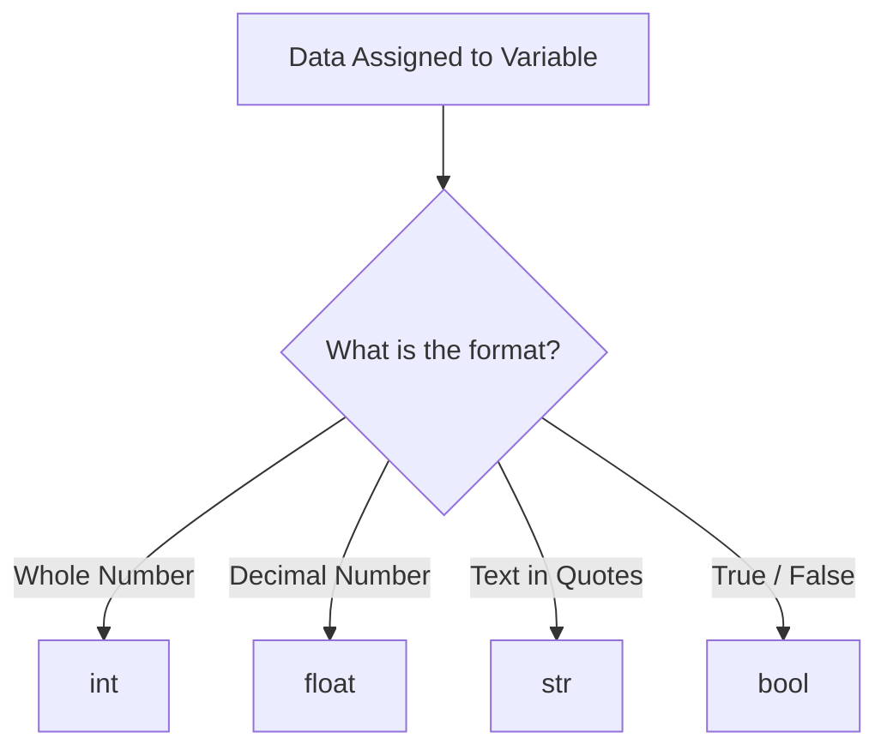

# Day 003: Primitive Data Types

> **Difficulty:** Beginner | **Topic:** Fundamentals | **Reading Time:** 12 mins

---

## 🎯 Learning Objectives
- Understand what primitive data types are and why they are the fundamental building blocks of Python programs.
- Differentiate between the core primitive types: Integers (`int`), Floating-Point Numbers (`float`), Strings (`str`), and Booleans (`bool`).
- Perform basic operations, type casting, and type checking using built-in functions like `type()`.
- Avoid common pitfalls related to data types and precision in Python.

---

## 📚 Theory & Concepts

Every piece of data stored in a computer's memory has a specific type. In Python, **primitive data types** are the most basic units of data provided directly by the language. Unlike complex data structures (like lists or dictionaries) that can hold multiple items, primitive data types represent a single, atomic value.

Think of primitive data types as the alphabet and grammar of the Python language. Without them, you cannot spell out numbers, text, or logical conditions.

### The Core Primitive Types in Python

| Data Type | Python Keyword | Description | Examples |
| :--- | :--- | :--- | :--- |
| **Integer** | `int` | Whole numbers, positive or negative, without decimals. | `42`, `-7`, `0` |
| **Float** | `float` | Numbers containing a decimal point. | `3.14`, `-0.001`, `2.0` |
| **String** | `str` | A sequence of characters enclosed in quotes. | `"Hello"`, `'Python 3.12'` |
| **Boolean** | `bool` | Represents truth values: absolute true or false. | `True`, `False` |

### How Python Handles Types (Dynamically Typed)
Python is a **dynamically typed** language. This means you do not need to explicitly declare the data type of a variable when you create it. Python automatically figures out the type based on the value assigned to the variable.



---

## 💻 Syntax & Structure

Here is how you declare variables of different primitive data types and check their types using the built-in `type()` function:

```python
# 1. Integer (int)
age = 25

# 2. Floating-point number (float)
temperature = 98.6

# 3. String (str) - can use single or double quotes
name = "Alice"

# 4. Boolean (bool) - Note the capital T and F
is_active = True

# Checking the type of any variable
variable_type = type(age)  # Returns <class 'int'>
```

### Type Casting (Conversion)
Often, you will need to convert data from one type to another (e.g., converting user input from a string to an integer). Python provides built-in casting functions:
- `int(x)`: Converts `x` to an integer.
- `float(x)`: Converts `x` to a float.
- `str(x)`: Converts `x` to a string.
- `bool(x)`: Converts `x` to a boolean.

---

## 🧪 Code Examples

Here is a comprehensive, runnable script demonstrating primitive data types, type checking, basic operations, and casting.

```python
# Day 3: Exploring Primitive Data Types in Python

print("=== 1. Demonstrating Primitive Types ===")
user_id = 1042                  # int
account_balance = 2540.75       # float
username = "CodeWizard99"       # str
is_verified = True              # bool

print("User ID:", user_id, "| Type:", type(user_id))
print("Balance:", account_balance, "| Type:", type(account_balance))
print("Username:", username, "| Type:", type(username))
print("Verified:", is_verified, "| Type:", type(is_verified))

print("\n=== 2. Basic Arithmetic & String Operations ===")
# Integers and floats support standard math
item_price = 19.99
quantity = 3
total_cost = item_price * quantity
print(f"Total Cost for {quantity} items: ${total_cost}")

# Strings support concatenation
greeting = "Hello"
full_greeting = greeting + ", " + username + "!"
print(full_greeting)

print("\n=== 3. Type Casting (Conversion) ===")
# Simulating input that comes in as a string
input_str_age = "30"
print("Original input type:", type(input_str_age))

# Convert string to integer for calculations
converted_age = int(input_str_age)
print("Converted age type:", type(converted_age))
print("Age next year:", converted_age + 1)

# Converting float to int (truncates the decimal)
pi_approx = 3.14159
integer_pi = int(pi_approx)
print(f"Float {pi_approx} cast to int becomes: {integer_pi}")
```

---

## 📊 Expected Output

```text
=== 1. Demonstrating Primitive Types ===
User ID: 1042 | Type: <class 'int'>
Balance: 2540.75 | Type: <class 'float'>
Username: CodeWizard99 | Type: <class 'str'>
Verified: <class 'bool'>

=== 2. Basic Arithmetic & String Operations ===
Total Cost for 3 items: $59.97
Hello, CodeWizard99!

=== 3. Type Casting (Conversion) ===
Original input type: <class 'str'>
Converted age type: <class 'int'>
Age next year: 31
Float 3.14159 cast to int becomes: 3
```

---

## 🌍 Real-World Applications

1. **Web Development & APIs**: When web servers receive data from forms or APIs (like JSON payloads), numbers and booleans are frequently transmitted as strings. Backend developers must use type casting (`int()`, `float()`) to process calculations correctly.
2. **Financial Systems**: Financial software relies heavily on precise floating-point arithmetic (or specialized decimal types) to handle currency, interest rates, and balances.
3. **User Authentication**: Booleans (`True`/`False`) form the bedrock of authorization logic, determining whether a user is logged in, has administrative privileges, or has completed a multi-factor authentication check.

---

## 💡 Best Practices

- **Use Descriptive Variable Names**: Name your variables clearly. Instead of `x = 25`, use `user_age = 25`.
- **Remember Case Sensitivity**: Booleans in Python **must** start with a capital letter (`True` and `False`). Writing `true` or `false` will cause a `NameError`.
- **Beware of Float Precision**: Computers store floats in binary, which can occasionally lead to tiny rounding errors (e.g., `0.1 + 0.2` equals `0.30000000000000004`). Keep this in mind when comparing floating-point numbers.
- **Common Pitfall**: Trying to concatenate a string and an integer directly (e.g., `"Age: " + 25`) raises a `TypeError`. Always cast the non-string to a string first using `str()`.

---

## 📝 Summary & Key Takeaways

Today you explored Python's foundational primitive data types: integers, floats, strings, and booleans. You learned how Python infers types dynamically, how to check a variable's type with `type()`, and how to convert between types using casting functions. 

Tomorrow, in **Day 4**, we will expand on these fundamentals by learning how to manipulate strings and perform advanced user input handling!
