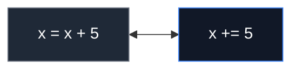

# Day 005: Operators in Python

> **Difficulty:** Beginner | **Topic:** Fundamentals | **Reading Time:** 15 mins

---

## 🎯 Learning Objectives

- Master all **7 major operator categories** in Python: Arithmetic, Assignment, Comparison, Logical, Identity, Membership, and Bitwise.
- Differentiate clearly between value equality (`==`) and object identity (`is`), as well as true division (`/`) and floor division (`//`).
- Utilize **short-circuit evaluation** in logical expressions to write safer, faster code.
- Apply **operator precedence** rules to build unambiguous, bug-free complex expressions.

---

## 📚 Theory & Concepts

An **operator** is a special symbol or keyword that tells the Python interpreter to perform a specific mathematical, logical, or relational operation on one or more inputs, known as **operands**.

```text
       Operand      Operator     Operand
          │            │            │
          ▼            ▼            ▼
          x            +            5
```

Python categorizes operators into seven distinct groups based on the nature of the operation they perform.

---

### 1. Arithmetic Operators
Used to perform standard mathematical calculations.

| Operator | Name | Example | Behavior / Description |
| :--- | :--- | :--- | :--- |
| `+` | Addition | `10 + 5` | Sums two operands (`15`) |
| `-` | Subtraction | `10 - 5` | Subtracts right from left (`5`) |
| `*` | Multiplication | `10 * 5` | Multiplies two operands (`50`) |
| `/` | True Division | `10 / 4` | Divides left by right; **always returns a float** (`2.5`) |
| `//` | Floor Division | `10 // 4` | Divides and rounds down to nearest integer (`2`) |
| `%` | Modulus | `10 % 3` | Returns the remainder of division (`1`) |
| `**` | Exponentiation | `2 ** 3` | Raises left operand to the power of right operand (`8`) |

> ⚠️ **Key Distinction:** True division (`/`) always produces a `float` in Python 3, even if the result is a whole number (e.g., `4 / 2` returns `2.0`). Floor division (`//`) truncates towards negative infinity.

---

### 2. Assignment Operators
Used to assign values to variables. Python supports **compound assignment operators** that perform an operation and reassign the result in a single step.



Common compound assignment operators include: `+=`, `-=`, `*=`, `/=`, `//=`, `%=`, and `**=`.

---

### 3. Comparison (Relational) Operators
Compare two values and evaluate to a Boolean result (`True` or `False`).

| Operator | Meaning | Example | Result (`a=10, b=20`) |
| :--- | :--- | :--- | :--- |
| `==` | Equal to | `a == b` | `False` |
| `!=` | Not equal to | `a != b` | `True` |
| `>` | Greater than | `a > b` | `False` |
| `<` | Less than | `a < b` | `True` |
| `>=` | Greater than or equal to | `a >= 10` | `True` |
| `<=` | Less than or equal to | `b <= 20` | `True` |

---

### 4. Logical Operators
Used to combine conditional statements.

```text
                     AND (both True)
             ┌──────────────┴──────────────┐
  True  and  True   ──►  True
  True  and  False  ──►  False
  
                      OR (any True)
             ┌──────────────┴──────────────┐
  True  or   False  ──►  True
  False or   False  ──►  False
  
                      NOT (invert)
             ┌──────────────┴──────────────┐
        not  True   ──►  False
```

#### Short-Circuit Evaluation
Python evaluates logical expressions from left to right and stops as soon as the outcome is guaranteed:
- **`and`**: If the first operand is `False`, Python returns `False` immediately without evaluating the second operand.
- **`or`**: If the first operand is `True`, Python returns `True` immediately without evaluating the second operand.

---

### 5. Identity Operators
Check if two variables reference the **exact same memory location** (object in memory), not merely whether their values are equal.

- **`is`**: Returns `True` if both variables point to the same object.
- **`is not`**: Returns `True` if both variables point to different objects.

```text
Memory Representation:

List A ──► [1, 2, 3]  (Address: 0x100)
List B ──► [1, 2, 3]  (Address: 0x200)
List C ──► List A     (Address: 0x100)

a == b  ──► True  (Same content)
a is b  ──► False (Different memory addresses)
a is c  ──► True  (Same memory address)
```

---

### 6. Membership Operators
Check for the presence of a sequence/element within containers (strings, lists, tuples, sets, dictionaries).

- **`in`**: Returns `True` if the value is found in the sequence.
- **`not in`**: Returns `True` if the value is not found in the sequence.

---

### 7. Bitwise Operators
Perform bit-by-bit operations on integer binary representations.

| Operator | Name | Description | Example (`6` = `0110`, `3` = `0011`) |
| :--- | :--- | :--- | :--- |
| `&` | AND | Sets bit to 1 if both bits are 1 | `6 & 3` → `2` (`0010`) |
| `\|` | OR | Sets bit to 1 if at least one bit is 1 | `6 \| 3` → `7` (`0111`) |
| `^` | XOR | Sets bit to 1 if only one bit is 1 | `6 ^ 3` → `5` (`0101`) |
| `~` | NOT | Inverts all bits (One's complement) | `~6` → `-7` |
| `<<` | Left Shift | Shifts bits left, padding with zeros | `6 << 1` → `12` (`1100`) |
| `>>` | Right Shift | Shifts bits right, discarding bits | `6 >> 1` → `3` (`0011`) |

---

### Operator Precedence Order (Highest to Lowest)

1. `()` — Parentheses (grouping)
2. `**` — Exponentiation
3. `+x`, `-x`, `~x` — Unary plus, Unary minus, Bitwise NOT
4. `*`, `/`, `//`, `%` — Multiplication, Divisions, Modulus
5. `+`, `-` — Addition, Subtraction
6. `<<`, `>>` — Bitwise Shifts
7. `&` — Bitwise AND
8. `^` — Bitwise XOR
9. `|` — Bitwise OR
10. `==`, `!=`, `>`, `>=`, `<`, `<=`, `is`, `is not`, `in`, `not in` — Comparisons, Identity, Membership
11. `not` — Logical NOT
12. `and` — Logical AND
13. `or` — Logical OR

---

## 💻 Syntax & Structure

Here is a quick structural overview of all operator categories in Python syntax:

```python
# 1. Arithmetic
sum_val = 10 + 5
floor_div = 17 // 3
remainder = 17 % 3

# 2. Assignment
count = 0
count += 1  # Equivalent to: count = count + 1

# 3. Comparison
is_equal = (10 == 10)
is_greater = (15 > 20)

# 4. Logical
can_access = has_token and is_active

# 5. Identity
is_same_object = obj_a is obj_b

# 6. Membership
is_member = "admin" in user_roles

# 7. Bitwise
flags = 0b0110 & 0b0011
```

---

## 🧪 Code Examples

Below is a complete, runnable script demonstrating all seven operator categories in practical scenarios.

```python
# day_005_operators.py

# ==========================================
# 1. Arithmetic & Compound Assignment
# ==========================================
print("=== 1. Arithmetic & Assignment ===")
item_price = 49.99
quantity = 3
shipping_cost = 5.00

# Calculate subtotal using multiplication
subtotal = item_price * quantity

# Apply a $10 discount using compound subtraction
subtotal -= 10.00

# Add shipping tax using compound addition
grand_total = subtotal + shipping_cost

# Floor division and modulus: Packaging calculations
items_per_box = 2
boxes_needed = quantity // items_per_box
remaining_items = quantity % items_per_box

print(f"Grand Total: ${grand_total:.2f}")
print(f"Boxes needed: {boxes_needed}, Leftover items: {remaining_items}")

# ==========================================
# 2. Comparison & Logical Operators
# ==========================================
print("\n=== 2. Comparison & Logical ===")
user_age = 22
has_license = True
has_criminal_record = False

# Evaluate rental eligibility
can_rent_car = (user_age >= 21) and has_license and (not has_criminal_record)
print(f"Eligible to rent car: {can_rent_car}")

# Demonstration of Short-Circuit Evaluation
def check_expensive_database():
    print("  [DB LOG] Heavy database query executed!")
    return True

# DB check is skipped because first condition is False!
is_admin = False
print("Testing Short-Circuit (AND):")
access_granted = is_admin and check_expensive_database()
print(f"Access granted: {access_granted}")

# ==========================================
# 3. Identity vs Equality Operators
# ==========================================
print("\n=== 3. Identity vs Equality ===")
list_one = [1, 2, 3]
list_two = [1, 2, 3]
list_three = list_one

print(f"list_one == list_two : {list_one == list_two}")  # True: Same contents
print(f"list_one is list_two : {list_one is list_two}")  # False: Different memory objects
print(f"list_one is list_three: {list_one is list_three}") # True: Point to exact same object

# Singleton comparison best practice
active_session = None
print(f"Is session None: {active_session is None}")

# ==========================================
# 4. Membership Operators
# ==========================================
print("\n=== 4. Membership Operators ===")
allowed_roles = ["admin", "developer", "maintainer"]
current_user_role = "developer"
banned_words = "spam, scam, phishing"

is_authorized = current_user_role in allowed_roles
contains_spam = "scam" in banned_words

print(f"User authorized: {is_authorized}")
print(f"Flagged content detected: {contains_spam}")

# ==========================================
# 5. Bitwise Operators & Precedence
# ==========================================
print("\n=== 5. Bitwise & Operator Precedence ===")
# User permissions stored as bitflags: READ(4), WRITE(2), EXECUTE(1)
READ_PERMISSION = 0b100  # 4
WRITE_PERMISSION = 0b010 # 2
EXECUTE_PERMISSION = 0b001 # 1

# Grant Read and Write permissions
user_permissions = READ_PERMISSION | WRITE_PERMISSION

# Check if user has WRITE permission
has_write = bool(user_permissions & WRITE_PERMISSION)
# Check if user has EXECUTE permission
has_execute = bool(user_permissions & EXECUTE_PERMISSION)

print(f"User Permissions Bitmask: {bin(user_permissions)}")
print(f"Has Write Permission: {has_write}")
print(f"Has Execute Permission: {has_execute}")

# Operator Precedence Demonstration
# Expression: 10 + 2 * 5 ** 2
# Evaluation: 5**2 = 25 -> 2*25 = 50 -> 10+50 = 60
precedence_result = 10 + 2 * 5 ** 2
explicit_parentheses = 10 + (2 * (5 ** 2))
print(f"Precedence Result: {precedence_result}")
print(f"Explicit Parentheses Match: {precedence_result == explicit_parentheses}")
```

---

## 📊 Expected Output

```text
=== 1. Arithmetic & Assignment ===
Grand Total: $144.97
Boxes needed: 1, Leftover items: 1

=== 2. Comparison & Logical ===
Eligible to rent car: True
Testing Short-Circuit (AND):
Access granted: False

=== 3. Identity vs Equality ===
list_one == list_two : True
list_one is list_two : False
list_one is list_three: True
Is session None: True

=== 4. Membership Operators ===
User authorized: True
Flagged content detected: True

=== 5. Bitwise & Operator Precedence ===
User Permissions Bitmask: 0b110
Has Write Permission: True
Has Execute Permission: False
Precedence Result: 60
Explicit Parentheses Match: True
```

---

## 🌍 Real-World Applications

1. **E-Commerce Checkout Engines**: Arithmetic and assignment operators calculate cart items, tax brackets, percentage coupons, shipping tiers, and final billing amounts.
2. **Role-Based Access Control (RBAC)**: Logical and membership operators verify if an incoming JWT payload contains required scopes (e.g., `'admin' in user_roles and is_authenticated`).
3. **High-Performance Bitmasks**: Bitwise operators handle system permissions, network subnetting calculations (CIDR masks), graphic rendering flags, and low-level IoT device registers.
4. **Data Cleansing Pipelines**: Identity operators (`is None`) filter missing or corrupted rows in incoming ETL (Extract, Transform, Load) pipelines safely without triggering dynamic conversion bugs.

---

## 💡 Best Practices

- **Always compare singletons with `is`**: Use `if val is None:` or `if val is not None:` instead of `if val == None:`.
- **Do NOT use `is` for value equality**: Never compare integers or strings with `is` (e.g., `x is 100`). Due to Python's internal string/integer interning, this might evaluate to `True` in some contexts and `False` in others.
- **Parenthesize complex expressions**: Do not rely on your memory of precedence rules. Explicit parentheses make code far easier to read and maintain.
  ```python
  # Hard to read / Error prone
  result = a or b and not c == d
  
  # Clear and self-documenting
  result = a or (b and (not (c == d)))
  ```
- **Leverage short-circuiting**: Order logical conditions so cheap/fast checks or guards run first before costly operations:
  ```python
  # Safe: If user is None, user.has_access() is never evaluated!
  if user is not None and user.has_access():
      ...
  ```

---

## 📝 Summary & Key Takeaways

Today you mastered the full spectrum of Python operators used to construct dynamic software logic:

- **Division Rules**: `/` always produces a `float`; `//` produces an integer (floored).
- **Equality vs Identity**: `==` checks **values**, whereas `is` checks **memory addresses**.
- **Efficiency**: Logical `and` and `or` perform **short-circuit evaluation**.
- **Bitwise Logic**: Operators like `&`, `|`, and `^` manipulate values down to the bit level.

### What's Next?
Tomorrow on **Day 006**, we will build on these operators to drive control flow using **Conditional Statements (`if`, `elif`, `else`) and Modern Pattern Matching (`match-case`)**!
