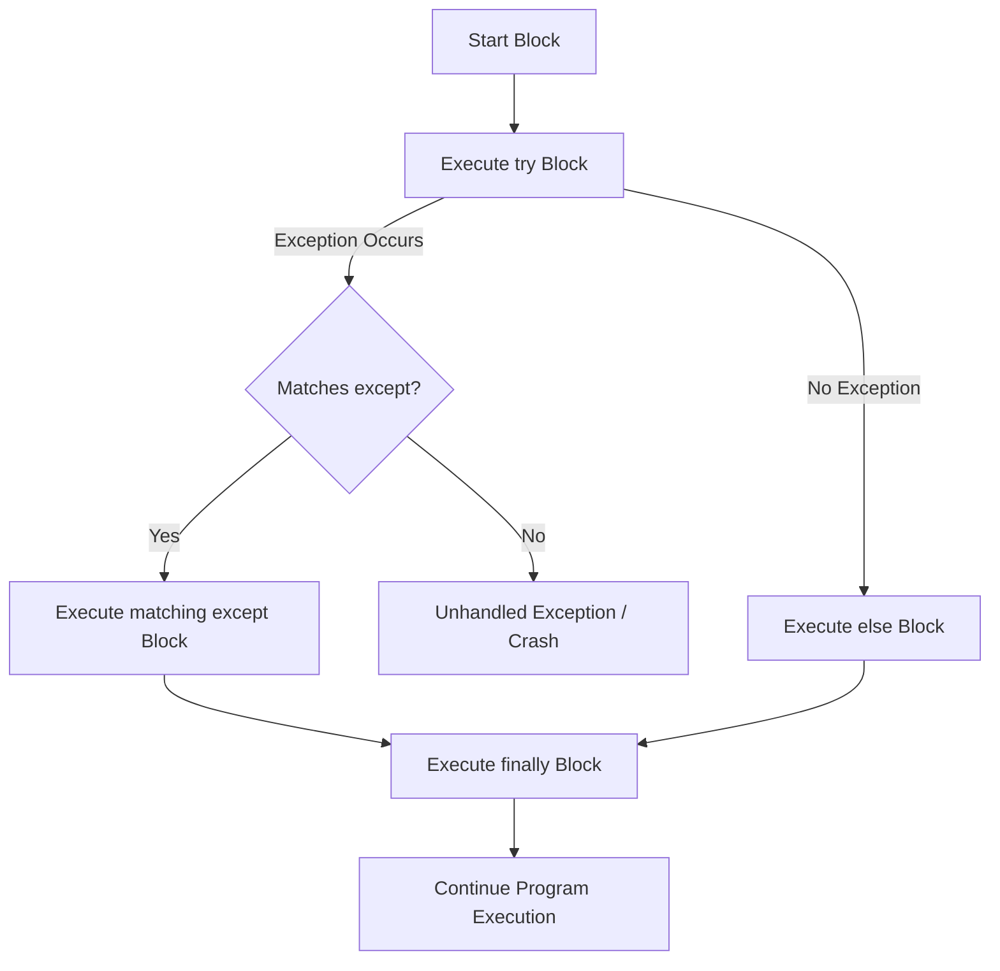

# Day 028: Exception Handling (try, except, else, finally)

> **Difficulty:** Intermediate | **Topic:** Error Handling | **Reading Time:** 15 mins

---

## 🎯 Learning Objectives

- Distinguish between **Syntax Errors** and **Runtime Exceptions** in Python.
- Understand the complete exception handling lifecycle using `try`, `except`, `else`, and `finally`.
- Intercept and process specific exceptions without causing application crashes.
- Apply the **EAFP** (*Easier to Ask Forgiveness than Permission*) design philosophy using clean exception structures.
- Ensure guaranteed resource cleanup (files, sockets, database locks) using `finally` blocks.

---

## 📚 Theory & Concepts

### 1. Syntax Errors vs. Runtime Exceptions

When running a Python script, errors generally fall into two distinct phases:

1. **Syntax Errors (Parsing Time):** Occur before the code executes. The Python interpreter parses the source file and finds invalid language grammar. These cannot be caught with `try-except` because the code fails to compile into bytecode.
2. **Runtime Exceptions (Execution Time):** Occur while the code is running. The syntax is perfectly valid, but an impossible or invalid operation is attempted (e.g., dividing by zero, reading a non-existent file, accessing an out-of-range index).

```python
# Syntax Error (Parsing Failure - Cannot be caught at runtime)
# if True print("Hello")  # SyntaxError: invalid syntax

# Runtime Exception (Execution Failure - Can be caught)
result = 10 / 0  # ZeroDivisionError: division by zero
```

---

### 2. The Python Exception Hierarchy

All standard exceptions in Python are arranged in a class hierarchy. At the root is `BaseException`. However, standard user code should almost always catch `Exception` or its specific subclasses.

```text
BaseException
 ├── SystemExit
 ├── KeyboardInterrupt
 ├── GeneratorExit
 └── Exception
      ├── ArithmeticError
      │    ├── FloatingPointError
      │    ├── OverflowError
      │    └── ZeroDivisionError
      ├── LookupError
      │    ├── IndexError
      │    └── KeyError
      ├── ValueError
      ├── TypeError
      └── FileNotFoundError
```

> **Warning:** Never catch `BaseException` directly unless you intentionally want to prevent standard keyboard interrupts (`Ctrl+C`) or system exits from working.

---

### 3. The Anatomy of a Full Exception Block

Python provides four keywords to manage execution flow when dealing with potential runtime errors:



* **`try`**: Wraps code that **might** raise an exception.
* **`except`**: Executes **only if** an exception occurs inside the `try` block.
* **`else`**: Executes **only if NO** exceptions were raised in the `try` block.
* **`finally`**: Executes **always**, regardless of whether an exception occurred or was handled.

---

## 💻 Syntax & Structure

### Basic Structure

```python
try:
    # Code that may cause an exception
    dangerous_operation()
except SpecificError as e:
    # Executed if SpecificError occurs
    handle_error(e)
else:
    # Executed ONLY if no exception occurred in the try block
    on_success()
finally:
    # Executed ALWAYS (cleanup actions)
    clean_up_resources()
```

---

### Catching Multiple Exceptions

You can handle different exceptions with separate `except` blocks or group them into a single block using a tuple.

```python
# Method A: Specific handling per exception type
try:
    value = int("abc")
except ValueError as e:
    print(f"Value Error: {e}")
except TypeError as e:
    print(f"Type Error: {e}")

# Method B: Grouped exception handling
try:
    data = load_data()
except (FileNotFoundError, PermissionError) as e:
    print(f"File Access Error: {e}")
```

---

## 🧪 Code Examples

Below is a complete script demonstrating exception handling across multiple execution scenarios.

```python
"""
Day 028: Exception Handling Demonstration
Author: Python 90 Days Mastery
"""

import sys

def parse_and_divide(input_str: str, divisor: float) -> float | None:
    """
    Parses a string into a float and divides it by a given divisor.
    Demonstrates try-except-else-finally logic cleanly.
    """
    print(f"\n--- Processing input: '{input_str}' with divisor: {divisor} ---")
    result: float | None = None

    try:
        # Step 1: Potentially dangerous operations
        print("[TRY] Attempting string conversion and division...")
        numerator = float(input_str)
        result = numerator / divisor

    except ValueError as exc:
        # Triggered if input_str cannot be converted to float
        print(f"[EXCEPT] Caught ValueError: '{input_str}' is not a valid number.")
        print(f"         Details: {exc}")

    except ZeroDivisionError as exc:
        # Triggered if divisor is 0
        print("[EXCEPT] Caught ZeroDivisionError: Cannot divide by zero.")
        print(f"         Details: {exc}")

    except Exception as exc:
        # Fallback for unexpected standard exceptions
        print(f"[EXCEPT] Caught unexpected exception: {type(exc).__name__}: {exc}")

    else:
        # Executes ONLY if try block succeeds without any exception
        print(f"[ELSE] Operations succeeded! Calculated result: {result}")

    finally:
        # Executes ALWAYS, whether an exception occurred or not
        print("[FINALLY] Resource cleanup complete. Execution phase ended.")

    return result

def main() -> None:
    # Scenario 1: Successful execution
    res1 = parse_and_divide("100.50", 2.0)

    # Scenario 2: Invalid numeric input (ValueError)
    res2 = parse_and_divide("invalid_num", 5.0)

    # Scenario 3: Division by zero (ZeroDivisionError)
    res3 = parse_and_divide("50.0", 0.0)

if __name__ == "__main__":
    main()
```

---

## 📊 Expected Output

```text

--- Processing input: '100.50' with divisor: 2.0 ---
[TRY] Attempting string conversion and division...
[ELSE] Operations succeeded! Calculated result: 50.25
[FINALLY] Resource cleanup complete. Execution phase ended.

--- Processing input: 'invalid_num' with divisor: 5.0 ---
[TRY] Attempting string conversion and division...
[EXCEPT] Caught ValueError: 'invalid_num' is not a valid number.
         Details: could not convert string to float: 'invalid_num'
[FINALLY] Resource cleanup complete. Execution phase ended.

--- Processing input: '50.0' with divisor: 0.0 ---
[TRY] Attempting string conversion and division...
[EXCEPT] Caught ZeroDivisionError: Cannot divide by zero.
         Details: float division by zero
[FINALLY] Resource cleanup complete. Execution phase ended.
```

---

## 🌍 Real-World Applications

### 1. Robust File Processing with Resource Cleanup

In real-world software engineering, external resources like file descriptors or network sockets must be closed reliably even if reading fails mid-way.

```python
def read_config_file(filepath: str) -> str | None:
    file_handle = None
    try:
        file_handle = open(filepath, "r", encoding="utf-8")
        content = file_handle.read()
    except FileNotFoundError:
        print(f"Configuration file missing: {filepath}")
        return None
    except PermissionError:
        print(f"Insufficient permissions to read: {filepath}")
        return None
    else:
        print("Config successfully loaded.")
        return content
    finally:
        if file_handle and not file_handle.closed:
            file_handle.close()
            print("File handle safely closed.")
```

---

### 2. Parsing External API / JSON Payload Safely

When receiving payloads from external networks, field types or presence cannot be guaranteed. Exception handling prevents bad server responses from crashing the entire process.

```python
import json

def Process_user_payload(raw_json: str) -> None:
    try:
        data = json.loads(raw_json)
        user_id = data["user"]["id"]
        age = int(data["user"]["age"])
    except json.JSONDecodeError:
        print("Failed to parse payload: Invalid JSON formatting.")
    except KeyError as e:
        print(f"Missing required key in JSON structure: {e}")
    except ValueError:
        print("User 'age' must be a valid integer.")
    else:
        print(f"Successfully processed User ID: {user_id}, Age: {age}")
```

---

## 💡 Best Practices

### Recommended Guidelines

1. **Be Specific with Exception Types**: Always catch specific exceptions (`ValueError`, `KeyError`) rather than a generic `except Exception:`.
2. **Keep `try` Blocks Small**: Place only the line(s) of code that can actually raise the intended exception inside the `try` block. This prevents catching unrelated bugs accidentally.
3. **Use `else` for Non-Risky Post-Processing**: Move code that depends on the `try` block succeeding into the `else` section so it doesn't accidentally suppress errors created within itself.
4. **Leverage `finally` for Guarantees**: Use `finally` to handle cleanup tasks like closing files, releasing database locks, or disconnecting sockets.

---

### ❌ Common Pitfalls to Avoid

#### 1. The Silencing Bare `except:`
Never use `except:` without specifying an exception class. It swallows **all** exceptions, including `KeyboardInterrupt` (`Ctrl+C`) and `SystemExit`, making debugging near impossible.

```python
# BAD PRACTICE
try:
    do_something()
except:  # Swallows ALL errors blindly!
    pass

# GOOD PRACTICE
try:
    do_something()
except SpecificError as e:
    logger.error("Failed due to: %s", e)
```

#### 2. Putting Everything Inside `try`
```python
# BAD PRACTICE
try:
    data = fetch_data()
    processed = process_data(data)
    save_to_database(processed)
    send_email_notification()
except Exception as e:
    print("Something failed!")  # Which step failed? Unclear!

# GOOD PRACTICE
try:
    data = fetch_data()
except FetchError:
    handle_fetch_error()
else:
    processed = process_data(data)
    save_to_database(processed)
```

---

## 📝 Summary & Key Takeaways

| Block | Purpose | Triggers When? |
| :--- | :--- | :--- |
| **`try`** | Encloses code that might fail. | Always runs first. |
| **`except`** | Handles specific errors gracefully. | Runs **only if** matching exception occurs in `try`. |
| **`else`** | Executes code requiring successful `try` completion. | Runs **only if NO** exception occurs in `try`. |
| **`finally`** | Cleanup operations (closing files/connections). | Runs **ALWAYS**, regardless of errors or returns. |

### Key Takeaways
- Exception handling maintains system availability and resilience when errors occur.
- **EAFP** (*Easier to Ask Forgiveness than Permission*) is the standard Pythonic style compared to explicit conditional checks (**LBYL** - *Look Before You Leap*).
- Use `else` to cleanly separate error-prone logic from standard processing flow.
- Use `finally` whenever you need guaranteed cleanup routines.

---

### ⏭️ Preview: Day 029
Tomorrow on **Day 029**, we will explore **Raising Custom Exceptions and Exception Chaining**, learning how to define custom domain-specific error types and preserve stack traces with `raise ... from ...`.
