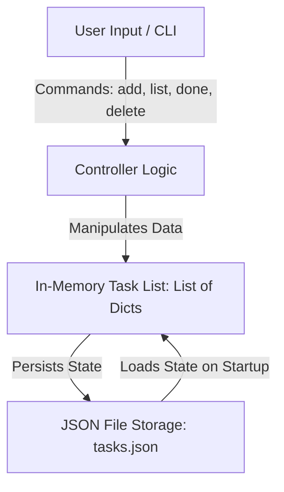

# Day 030: Milestone Project 1: CLI Task Manager

> **Difficulty:** Intermediate | **Topic:** Project | **Reading Time:** 20 mins

---

## 🎯 Learning Objectives
- Synthesize core Python concepts learned from Days 1 through 29 into a single production-grade application.
- Implement data persistence using Python's built-in `json` module to save and load state between sessions.
- Structure an interactive Command Line Interface (CLI) application using modular functions, input validation, and clean control flow.
- Apply defensive programming techniques to handle file I/O errors, invalid user choices, and malformed inputs gracefully.

---

## 📚 Theory & Concepts

Welcome to your first major milestone! Over the last 29 days, you have journeyed from basic data types and control flow to functions, error handling, file input/output, and working with complex data structures like lists of dictionaries. Today, we will fuse these foundational skills together to build a fully functional **Command Line Interface (CLI) Task Manager**.

A CLI Task Manager allows users to organize their daily workflows directly from the terminal. Behind its simple text-based interface lies a robust architectural pattern found in professional software engineering: **The Model-Storage-Controller Pattern**.



### Key Architectural Pillars:
1. **Data Representation**: Tasks are naturally modeled as dictionaries (containing keys like `id`, `title`, and `completed`) aggregated inside a Python list.
2. **Persistence**: Without a database, state would vanish when the script exits. We solve this by serializing our Python lists into JSON (JavaScript Object Notation) files and deserializing them back upon launch.
3. **User Experience (UX)**: Even in a terminal environment, user experience matters. We must provide clear menus, immediate feedback on actions, and robust input validation so an accidental keystroke doesn't crash the program.

---

## 💻 Syntax & Structure

When building a persistent CLI tool, we rely heavily on standard library modules such as `json` and `os`, alongside structural idioms like infinite loops with breakout options (`while True`), list comprehensions, and custom exception handling.

```python
import json
import os

# Defining structural constants and data paths
DATA_FILE = "tasks.json"

def save_tasks(tasks: list[dict]) -> None:
    """Serializes the task list to a JSON file on disk."""
    try:
        with open(DATA_FILE, "w", encoding="utf-8") as f:
            json.dump(tasks, f, indent=4)
    except IOError as e:
        print(f"Error: Failed to save tasks to disk. Details: {e}")

def load_tasks() -> list[dict]:
    """Deserializes tasks from disk if the file exists, otherwise returns empty list."""
    if not os.path.exists(DATA_FILE):
        return []
    try:
        with open(DATA_FILE, "r", encoding="utf-8") as f:
            return json.load(f)
    except (json.JSONDecodeError, IOError):
        print("Warning: Task data file is corrupted or unreadable. Starting fresh.")
        return []
```

---

## 🧪 Code Examples

Here is the complete, runnable Python code for our CLI Task Manager. It incorporates persistent storage, error handling, ID-based task tracking, and an interactive menu loop.

```python
import json
import os

DATA_FILE = "tasks.json"

def load_tasks() -> list[dict]:
    """Load tasks from JSON storage."""
    if not os.path.exists(DATA_FILE):
        return []
    try:
        with open(DATA_FILE, "r", encoding="utf-8") as file:
            return json.load(file)
    except (json.JSONDecodeError, IOError):
        print("[-] Error reading task file. Initializing empty task list.")
        return []

def save_tasks(tasks: list[dict]) -> None:
    """Save tasks to JSON storage."""
    try:
        with open(DATA_FILE, "w", encoding="utf-8") as file:
            json.dump(tasks, file, indent=4)
    except IOError as e:
        print(f"[-] Critical error writing to file: {e}")

def display_menu() -> None:
    """Renders the main navigation menu."""
    print("\n" + "=" * 40)
    print("         PYTHON TASK MANAGER")
    print("=" * 40)
    print("1. View All Tasks")
    print("2. Add a New Task")
    print("3. Mark Task as Complete")
    print("4. Delete a Task")
    print("5. Exit Application")
    print("=" * 40)

def list_tasks(tasks: list[dict]) -> None:
    """Displays all current tasks with formatting."""
    if not tasks:
        print("\n[!] No tasks found. Your to-do list is empty!")
        return
    
    print("\n--- YOUR TASK LIST ---")
    print(f"{'ID':<4} | {'Status':<10} | {'Title'}")
    print("-" * 35)
    for task in tasks:
        status = "[X]" if task["completed"] else "[ ]"
        print(f"{task['id']:<4} | {status:<10} | {task['title']}")
    print("-" * 35)

def add_task(tasks: list[dict]) -> None:
    """Prompts user for a task title and appends a new task."""
    title = input("\nEnter task description: ").strip()
    if not title:
        print("[-] Error: Task description cannot be empty.")
        return
    
    # Generate incremental ID
    new_id = max([t["id"] for t in tasks], default=0) + 1
    
    new_task = {
        "id": new_id,
        "title": title,
        "completed": False
    }
    tasks.append(new_task)
    save_tasks(tasks)
    print(f"[+] Success: Task '{title}' added with ID {new_id}.")

def complete_task(tasks: list[dict]) -> None:
    """Marks a specific task as complete by ID."""
    list_tasks(tasks)
    if not tasks:
        return
        
    raw_id = input("\nEnter the ID of the task to mark complete: ").strip()
    if not raw_id.isdigit():
        print("[-] Error: Please enter a valid numeric ID.")
        return
        
    task_id = int(raw_id)
    for task in tasks:
        if task["id"] == task_id:
            task["completed"] = True
            save_tasks(tasks)
            print(f"[+] Success: Task {task_id} marked as completed!")
            return
            
    print(f"[-] Error: No task found with ID {task_id}.")

def delete_task(tasks: list[dict]) -> None:
    """Deletes a task from the list by ID."""
    list_tasks(tasks)
    if not tasks:
        return
        
    raw_id = input("\nEnter the ID of the task to delete: ").strip()
    if not raw_id.isdigit():
        print("[-] Error: Please enter a valid numeric ID.")
        return
        
    task_id = int(raw_id)
    for i, task in enumerate(tasks):
        if task["id"] == task_id:
            removed = tasks.pop(i)
            save_tasks(tasks)
            print(f"[+] Success: Deleted task '{removed['title']}'.")
            return
            
    print(f"[-] Error: No task found with ID {task_id}.")

def main() -> None:
    """Main application entry point and control loop."""
    tasks = load_tasks()
    print("[*] Welcome back! Tasks successfully loaded from storage.")
    
    while True:
        display_menu()
        choice = input("Select an option (1-5): ").strip()
        
        if choice == "1":
            list_tasks(tasks)
        elif choice == "2":
            add_task(tasks)
        elif choice == "3":
            complete_task(tasks)
        elif choice == "4":
            delete_task(tasks)
        elif choice == "5":
            print("\n[*] Saving state and exiting. Have a productive day!")
            break
        else:
            print("[-] Invalid choice. Please enter a number between 1 and 5.")

if __name__ == "__main__":
    main()
```

---

## 📊 Expected Output

Running the script in your terminal will present an interactive menu loop resembling the session below:

```text
[*] Welcome back! Tasks successfully loaded from storage.

========================================
         PYTHON TASK MANAGER
========================================
1. View All Tasks
2. Add a New Task
3. Mark Task as Complete
4. Delete a Task
5. Exit Application
========================================
Select an option (1-5): 2

Enter task description: Finish Python Milestone Project

[+] Success: Task 'Finish Python Milestone Project' added with ID 1.

========================================
         PYTHON TASK MANAGER
========================================
1. View All Tasks
2. Add a New Task
3. Mark Task as Complete
4. Delete a Task
5. Exit Application
========================================
Select an option (1-5): 1

--- YOUR TASK LIST ---
ID   | Status     | Title
-----------------------------------
1    | [ ]        | Finish Python Milestone Project
-----------------------------------

========================================
         PYTHON TASK MANAGER
========================================
1. View All Tasks
2. Add a New Task
3. Mark Task as Complete
4. Delete a Task
5. Exit Application
========================================
Select an option (1-5): 3

--- YOUR TASK LIST ---
ID   | Status     | Title
-----------------------------------
1    | [ ]        | Finish Python Milestone Project
-----------------------------------

Enter the ID of the task to mark complete: 1
[+] Success: Task 1 marked as completed!

========================================
         PYTHON TASK MANAGER
========================================
1. View All Tasks
2. Add a New Task
3. Mark Task as Complete
4. Delete a Task
5. Exit Application
========================================
Select an option (1-5): 5

[*] Saving state and exiting. Have a productive day!
```

---

## 🌍 Real-World Applications

- **DevOps Scripting & Automation**: System administrators frequently write custom CLI tools to monitor server states, trigger log rotations, or manage deployments.
- **Embedded & IoT Devices**: Lightweight command-line utilities are ideal for managing configuration settings on resource-constrained devices like Raspberry Pis running headless Linux.
- **Internal Tooling**: Early-stage startups often rely on robust Python CLI tools for internal database migrations, customer lookups, and batch data processing before investing in web dashboards.

---

## 💡 Best Practices

- **Seperate Concerns**: Keep data persistence logic (`load_tasks`, `save_tasks`) completely separated from presentation logic (`display_menu`, `list_tasks`).
- **Defensive Input Handling**: Always validate user inputs (`isdigit()`, checking for empty strings) before applying them to core data models to prevent runtime crashes.
- **Atomic-like Operations**: Write to disk immediately after modifying state (adding, completing, or deleting tasks) so power outages or sudden crashes don't lose user data.
- **Common Pitfall to Avoid**: Do not mutate list elements while iterating over them directly with a standard `for` loop; use index tracking (like `enumerate`) or list comprehensions when filtering elements.

---

## 📝 Summary & Key Takeaways

Today you built your first complete, production-ready Python application from scratch. You successfully integrated functions, control flows, error management, and JSON file I/O into a clean, cohesive tool. 

Tomorrow, in **Day 31**, we transition into Object-Oriented Programming (OOP), expanding your software engineering toolkit to build classes and model real-world entities.
