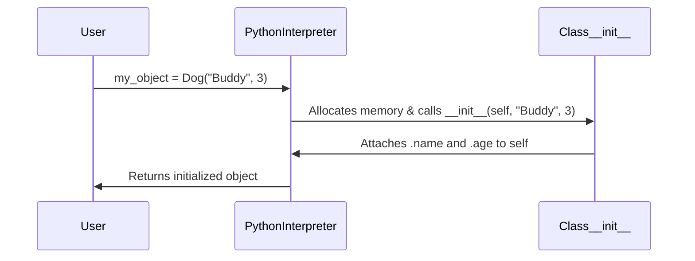

# Day 032: Constructors and __init__ Method

> **Difficulty:** Intermediate | **Topic:** OOP | **Reading Time:** 15 mins

---

## 🎯 Learning Objectives
- Understand what a constructor is and how it fits into the Object-Oriented Programming (OOP) lifecycle.
- Master the `__init__` method and the role of the `self` parameter in Python classes.
- Learn how to instantiate objects with custom initial states and default argument values.
- Differentiate between class instantiation and object initialization.

---

## 📚 Theory & Concepts

In the previous lesson (Day 31), we introduced the fundamentals of Object-Oriented Programming (OOP), learning how to define classes and create basic objects. However, those initial objects were blank slates. If we wanted to assign attributes to them, we had to do it manually after creation:

```python
class Dog:
    pass

my_dog = Dog()
my_dog.name = "Buddy"
my_dog.breed = "Golden Retriever"
```

Manual assignment is error-prone, repetitive, and violates the principles of clean software design. Enter the **constructor**.

### What is a Constructor?
A constructor is a special method in a class used to create and initialize an object of that class. In Python, the constructor is divided into two distinct phases handled by two separate magic (dunder) methods:
1. **`__new__`**: Creates the raw, uninitialized object in memory. (Rarely overridden by day-to-day developers).
2. **`__init__`**: Initializes the newly created object with state (attributes) before it is returned to the caller.

### The Role of `__init__`
The `__init__` method (short for "initialize") is automatically invoked immediately after an object is instantiated. You do not call it explicitly; Python calls it behind the scenes when you write `MyClass()`. Its primary purpose is to set up the object's instance variables (attributes).



### Understanding `self`
The first parameter of `__init__` is almost universally named `self`. 
- **What is `self`?** It is a reference to the specific instance of the object currently being created or operated upon. 
- **Why do we need it?** When you have multiple instances of a class (e.g., `dog1` and `dog2`), Python uses `self` to know *which* object's attributes to modify or read. When you call `dog1.bark()`, Python secretly translates it to `Dog.bark(dog1)`.

---

## 💻 Syntax & Structure

The syntax for defining an `__init__` constructor inside a Python class looks like this:

```python
class ClassName:
    def __init__(self, parameter1, parameter2=default_value):
        # Bind incoming parameters to instance attributes using 'self'
        self.attribute1 = parameter1
        self.attribute2 = parameter2
```

### Key Structural Rules:
- The method name must be strictly `__init__` (double underscores on both sides).
- `self` **must** be the first argument in the parameter list.
- You can accept positional arguments, keyword arguments, default arguments, and variable-length arguments (`*args`, `**kwargs`) inside `__init__`.
- `__init__` must **never** explicitly return a value (other than `None`). Returning anything else will raise a `TypeError`.

---

## 🧪 Code Examples

Let's look at a comprehensive, production-style script demonstrating standard constructors, default parameters, and dynamic attribute initialization.

```python
class Player:
    """Represents a video game player with customizable attributes."""
    
    # Class attribute shared across all instances
    game_server = "US-East-01"

    def __init__(self, username: str, character_class: str, health: int = 100):
        """
        Constructor method to initialize a new Player instance.
        """
        # Instance attributes
        self.username = username
        self.character_class = character_class
        self.health = health
        self.inventory = []  # Empty list initialized per instance
        self.is_active = True

        print(f"[LOG] Player '{self.username}' successfully spawned on {Player.game_server}!")

    def add_item(self, item_name: str) -> None:
        """Adds an item to the player's inventory."""
        self.inventory.append(item_name)
        print(f"{self.username} acquired a {item_name}!")

    def get_status(self) -> str:
        """Returns the current status summary of the player."""
        return f"Player: {self.username} | Class: {self.character_class} | HP: {self.health} | Inventory: {self.inventory}"

# --- Instantiation Examples ---

if __name__ == "__main__":
    print("--- Initializing Game Session ---")
    
    # 1. Using positional and default arguments
    player1 = Player("CodeNinja", "Mage")                  # Uses default health = 100
    
    # 2. Using explicit keyword arguments
    player2 = Player(username="ByteRider", character_class="Warrior", health=150)

    print("\n--- Interacting with Objects ---")
    player1.add_item("Magic Wand")
    player1.add_item("Health Potion")
    
    player2.add_item("Iron Shield")

    print("\n--- Final Player States ---")
    print(player1.get_status())
    print(player2.get_status())
```

---

## 📊 Expected Output

When you run the code example above, the terminal will produce the following output:

```text
--- Initializing Game Session ---
[LOG] Player 'CodeNinja' successfully spawned on US-East-01!
[LOG] Player 'ByteRider' successfully spawned on US-East-01!

--- Interacting with Objects ---
CodeNinja acquired a Magic Wand!
CodeNinja acquired a Health Potion!
ByteRider acquired a Iron Shield!

--- Final Player States ---
Player: CodeNinja | Class: Mage | HP: 100 | Inventory: ['Magic Wand', 'Health Potion']
Player: ByteRider | Class: Warrior | HP: 150 | Inventory: ['Iron Shield']
```

---

## 🌍 Real-World Applications

Constructors are foundational across every domain of software engineering where Python is applied:

1. **Database ORMs (e.g., SQLAlchemy, Django Models):** When mapping database rows to Python objects, constructors map table columns directly to instance attributes (`user = User(name="Alice", email="alice@example.com")`).
2. **API Clients & Configurations:** SDKs for cloud providers (like `boto3` for AWS) use constructors to initialize connection tokens, regions, and client sessions (`s3 = boto3.client('s3', region_name='us-west-2')`).
3. **Machine Learning Pipelines:** Frameworks like scikit-learn use constructors to set hyperparameters before training models (`model = RandomForestClassifier(n_estimators=100, max_depth=5)`).

---

## 💡 Best Practices

- **Keep `__init__` Lightweight:** Do not place heavy operations (like blocking network calls, massive file reads, or complex data processing) inside `__init__`. Initialize state variables only.
- **Avoid Mutable Default Arguments:** Never use mutable types (lists, dicts) as default values in method signatures (e.g., `def __init__(self, items=[])`). Instead, initialize them inside the body (`self.items = []`), as demonstrated in our code example, to prevent shared state bugs across instances.
- **Validate Input Early:** If an argument passed to `__init__` is invalid (e.g., negative health or an empty username), raise a `ValueError` immediately rather than letting the object enter a corrupt state.
- **Common Pitfall:** Forgetting the `self` parameter in the method definition signature or forgetting to use `self.` when assigning attributes inside the constructor.

---

## 📝 Summary & Key Takeaways
- The **constructor** pattern in Python is implemented via the `__init__` magic method.
- **`self`** is a reference to the current instance, allowing Python to track and manage instance-specific attributes.
- Constructors ensure objects are born with valid, ready-to-use states, eliminating manual post-instantiation setup.
- Tomorrow, in **Day 33**, we will build upon this foundation by exploring **Instance Methods, Class Methods, and Static Methods**, learning how to organize behaviors within our classes effectively.
