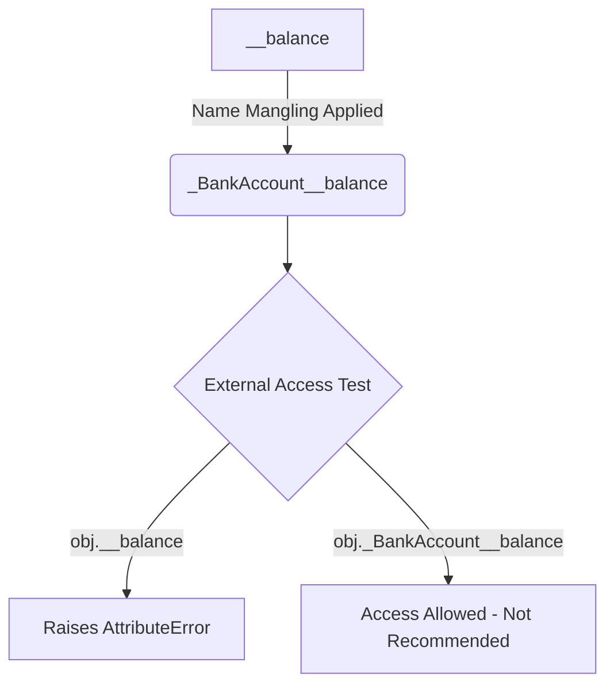

# Day 034: Encapsulation & Access Modifiers

> **Difficulty:** Intermediate | **Topic:** OOP | **Reading Time:** 15 mins

---

## 🎯 Learning Objectives

- **Understand Encapsulation**: Grasp how bundling data and methods inside a class protects data integrity and simplifies software design.
- **Master Python Access Naming Conventions**: Differentiate between Public, Protected (`_`), and Private (`__`) attributes and methods.
- **Demystify Name Mangling**: Learn how Python internally transforms private attributes and why it is used.
- **Implement Controlled Access**: Use getter and setter methods to inspect, validate, and update internal object states securely.

---

## 📚 Theory & Concepts

### What is Encapsulation?

**Encapsulation** is one of the four fundamental pillars of Object-Oriented Programming (OOP), alongside Abstraction, Inheritance, and Polymorphism. It refers to two primary concepts:

1. **Data Bundling**: Combining data (attributes) and the methods that operate on that data into a single cohesive unit (a class).
2. **Data Hiding**: Restricting direct external access to an object's internal state to prevent unauthorized modifications and logical bugs.

Think of a modern smart thermostat. You interact with simple external controls like buttons or a screen (the public interface). You do not manually adjust the raw wiring or circuit boards inside (internal implementation details). Encapsulation hides this complexity and protects internal mechanisms from external interference.

```
       +-------------------------------------------------+
       |                  BankAccount                    |
       |                                                 |
       |   Public Interface:                             |
       |     ├── deposit(amount)                         |
       |     ├── withdraw(amount)                        |
       |     └── get_balance()                           |
       |                                                 |
       |   Hidden Internal State:                        |
       |     ├── _account_type  (Protected)             |
       |     └── __balance       (Private)               |
       +-------------------------------------------------+
```

---

### Python's Access Control Philosophy

Unlike strict object-oriented languages like Java or C++, Python does not enforce hard access control at the compiler level. Guido van Rossum, Python’s creator, famously established the core design rule:

> *"We are all consenting adults here."*

Instead of strict keywords like `public`, `protected`, or `private`, Python uses naming conventions to signal intended usage levels to developers.

| Level | Naming Convention | Accessibility Intention | Python Behavior |
| :--- | :--- | :--- | :--- |
| **Public** | `attribute` | Accessible from anywhere | Standard access without restrictions. |
| **Protected** | `_attribute` | Internal to class & subclasses | Naming convention only; accessible but signals caution. |
| **Private** | `__attribute` | Strictly internal to defining class | Name mangling applied (`_ClassName__attribute`). |

---

### Understanding Name Mangling

When an attribute starts with two leading underscores (and no more than one trailing underscore), Python automatically renames it internally behind the scenes. This mechanism is called **Name Mangling**.

For instance, an attribute named `__balance` inside a class named `BankAccount` is dynamically renamed to `_BankAccount__balance`. This serves two key purposes:
1. Prevents direct unintended modification from outside the class.
2. Prevents accidental attribute name collisions in derived subclasses.



---

## 💻 Syntax & Structure

### Basic Access Modifier Syntax

```python
class DemoClass:
    def __init__(self, public_val: str, protected_val: str, private_val: str) -> None:
        # Public attribute: accessible anywhere
        self.public_var = public_val
        
        # Protected attribute: convention indicating internal/subclass use
        self._protected_var = protected_val
        
        # Private attribute: triggers name mangling
        self.__private_var = private_val

    # Public method
    def public_method(self) -> str:
        return f"Public method calling private: {self.__private_method()}"

    # Private method
    def __private_method(self) -> str:
        return "Internal process completed."
```

---

### Getter and Setter Methods

To safely manage access to protected or private attributes, Python programmers write explicit **getter** and **setter** methods that incorporate logic and data validation.

```python
class Student:
    def __init__(self, name: str, grade: float) -> None:
        self.name = name
        self._grade = 0.0
        self.set_grade(grade)  # Use setter during initialization for validation

    # Getter method
    def get_grade(self) -> float:
        return self._grade

    # Setter method with validation
    def set_grade(self, value: float) -> None:
        if 0.0 <= value <= 100.0:
            self._grade = value
        else:
            raise ValueError("Grade must be between 0.0 and 100.0")
```

---

## 🧪 Code Examples

Below is a complete, runnable script demonstrating encapsulation, access modifiers, name mangling, and validation through safe methods.

```python
class BankAccount:
    """Demonstrates Encapsulation and Access Control in Python."""

    def __init__(self, owner: str, initial_balance: float, pin: str) -> None:
        self.owner: str = owner            # Public
        self._account_type: str = "Savings" # Protected
        self.__balance: float = 0.0        # Private
        self.__pin: str = pin              # Private

        # Validate and set initial balance safely
        if initial_balance >= 0:
            self.__balance = initial_balance
        else:
            raise ValueError("Initial balance cannot be negative.")

    # --- Public API / Interface Methods ---

    def deposit(self, amount: float) -> None:
        """Public method to increase balance safely."""
        if amount > 0:
            self.__balance += amount
            print(f" Successfully deposited ${amount:,.2f}.")
        else:
            print(" Deposit amount must be greater than $0.00.")

    def withdraw(self, amount: float, pin: str) -> bool:
        """Public method to reduce balance after security checks."""
        if not self.__verify_pin(pin):
            print(" Unauthorized: Incorrect PIN.")
            return False

        if amount <= 0:
            print(" Withdrawal amount must be positive.")
            return False

        if amount > self.__balance:
            print(" Insufficient funds.")
            return False

        self.__balance -= amount
        print(f" Successfully withdrew ${amount:,.2f}.")
        return True

    def get_balance(self, pin: str) -> float | None:
        """Getter method providing controlled access to private balance."""
        if self.__verify_pin(pin):
            return self.__balance
        print(" Security Warning: Invalid PIN requested balance access.")
        return None

    # --- Private Utility Methods ---

    def __verify_pin(self, input_pin: str) -> bool:
        """Private helper method inaccessible directly from public instances."""
        return self.__pin == input_pin

# --- Subclass to demonstrate Protected attribute accessibility ---

class PremiumBankAccount(BankAccount):
    def print_account_details() -> None:
        pass  # Demonstrates relationship

    def display_type(self) -> None:
        # Subclasses can freely read protected attributes by convention
        print(f"Account Owner: {self.owner} | Category: {self._account_type}")

# --- Execution Flow ---
if __name__ == "__main__":
    print("=== 1. Instantiating Encapsulated Object ===")
    account = BankAccount(owner="Alice Smith", initial_balance=1000.0, pin="4321")

    print(f"Account Owner (Public): {account.owner}")
    print(f"Account Type (Protected Convention): {account._account_type}")

    print("\n=== 2. Testing Controlled Public Interface ===")
    account.deposit(500.0)
    
    current_balance = account.get_balance(pin="4321")
    print(f"Retrieved Balance via Getter: ${current_balance:,.2f}")

    account.withdraw(amount=200.0, pin="4321")

    print("\n=== 3. Testing Direct Access Restrictions ===")
    try:
        # Attempting direct access to private variable
        print(account.__balance)
    except AttributeError as e:
        print(f"Caught expected error: {e}")

    print("\n=== 4. Demonstrating Python Name Mangling ===")
    # Accessing mangled attribute directly (Not recommended in production)
    mangled_balance = getattr(account, "_BankAccount__balance")
    print(f"Direct access via mangled name (_BankAccount__balance): ${mangled_balance:,.2f}")

    print("\n=== 5. Subclass Protected Access ===")
    premium_acc = PremiumBankAccount(owner="Bob Jones", initial_balance=5000.0, pin="9999")
    premium_acc.display_type()
```

---

## 📊 Expected Output

```text
=== 1. Instantiating Encapsulated Object ===
Account Owner (Public): Alice Smith
Account Type (Protected Convention): Savings

=== 2. Testing Controlled Public Interface ===
 Successfully deposited $500.00.
Retrieved Balance via Getter: $1,500.00
 Successfully withdrew $200.00.

=== 3. Testing Direct Access Restrictions ===
Caught expected error: 'BankAccount' object has no attribute '__balance'

=== 4. Demonstrating Python Name Mangling ===
Direct access via mangled name (_BankAccount__balance): $1,300.00

=== 5. Subclass Protected Access ===
Account Owner: Bob Jones | Category: Savings
```

---

## 🌍 Real-World Applications

1. **Banking and Payment Gateways**: Protecting balances, encryption keys, and payment tokens from external modification while offering clean APIs (`charge()`, `refund()`).
2. **Database ORMs (e.g., SQLAlchemy, Django ORM)**: Encapsulating database connection strings, transaction pools, and queries behind clean high-level method models.
3. **Third-Party API SDKs**: Encapsulating internal network requests, authorization header formatting, and retry logic behind simple exposed functions like `client.get_user_profile()`.
4. **Game Engine State Management**: Encapsulating character statistics (e.g., health points, mana) so damage calculations must go through validation routines (e.g., applying armor modifiers) rather than direct manipulation.

---

## 💡 Best Practices

- **Default to Public, Protect Intentionally**: Keep attributes public by default unless validation logic or abstraction boundaries dictate otherwise.
- **Respect Single Underscore Conventions**: Treat `_protected` variables as private implementation details. Do not access or modify them outside their defining class or derived subclasses.
- **Use Double Underscores to Prevent Collisions**: Use `__private` attributes primarily when writing framework components or deeply inherited classes to avoid subclass variable overriding.
- **Never Rely on Name Mangling for Security**: Name mangling is an OOP structural safeguard, **not** a cryptography tool. Secret data like passwords should be hashed, encrypted, or kept out of memory.
- **Validate in Setters**: Always validate constraints (e.g., range bounds, type checks) inside setter methods before altering internal attributes.

---

## 📝 Summary & Key Takeaways

- **Encapsulation** bundles state and operations together while controlling external access to internal data.
- **Public attributes** (`self.data`) can be accessed and modified freely from anywhere.
- **Protected attributes** (`self._data`) serve as a convention warning developers: *"Internal implementation detail; do not touch outside this class tree."*
- **Private attributes** (`self.__data`) trigger Python's **Name Mangling**, changing internal key names to `_ClassName__data` to prevent accidental overriding.
- **Getters and Setters** allow controlled reading and updating of private state with built-in validation rules.

---

### 🔮 What's Next?
Tomorrow on **Day 035**, we will explore Python's **Properties & `@property` Decorator**, learning how to write cleaner Pythonic getters, setters, and computed attributes without explicit helper methods!
