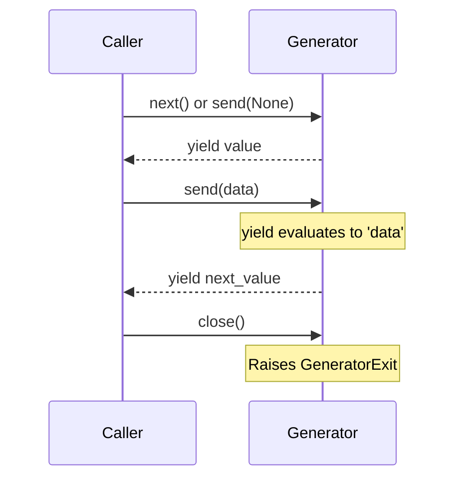

# Day 045: Advanced Generator Concepts (send, throw, close)

> **Difficulty:** Intermediate | **Topic:** Advanced Topics | **Reading Time:** 15 mins

---

## 🎯 Learning Objectives
- Understand how generators can act as bidirectional data consumers using the `.send()` method.
- Learn how to inject exceptions directly into a generator using `.throw()`.
- Master graceful generator termination and cleanup using the `.close()` method and `GeneratorExit`.
- Recognize how coroutines are built on top of advanced generator mechanics.

---

## 📚 Theory & Concepts

Up to this point, you have used generators primarily as data producers—functions that use the `yield` keyword to stream values lazily one by one. However, Python generators are actually powerful bidirectional communication channels. Not only can a generator *yield* a value out to the caller, but the caller can also *send* data back *into* the generator at the exact point of suspension.

This advanced capability transforms generators into lightweight stateful **coroutines**. Three core methods govern this advanced lifecycle:

1. **`generator.send(value)`**: Resumes the generator and sends `value` into it. The expression `yield` inside the generator evaluates to this injected `value`.
2. **`generator.throw(type[, value[, traceback]])`**: Resumes the generator by raising an exception at the point where it was suspended.
3. **`generator.close()`**: Raises a `GeneratorExit` exception inside the generator at the suspension point, allowing the generator to clean up resources (like files or database connections) before terminating.



---

## 💻 Syntax & Structure

To receive values sent from the outside, the `yield` statement must be wrapped in parentheses and assigned to a variable inside the generator function:

```python
def my_coroutine():
    while True:
        # The yielded value goes out; 
        # the value passed via .send() comes in and is assigned to 'received'.
        received = yield f"Ready for input"
        print(f"Received: {received}")
```

To interact with this generator:
```python
gen = my_coroutine()
print(next(gen))            # Prime the generator (must run until first yield)
print(gen.send("Hello!"))   # Send data in and get the next yield out
gen.close()                 # Terminate the generator
```

---

## 🧪 Code Examples

Below is a complete, runnable script demonstrating `.send()`, `.throw()`, and `.close()` working together in a data-processing pipeline.

```python
def running_average_accumulator():
    """
    A stateful generator that calculates a running average.
    It accepts new numbers via .send(), handles custom resets via .throw(),
    and cleans up gracefully via .close().
    """
    total = 0.0
    count = 0
    print("Coroutine initialized. Waiting for numbers...")
    
    try:
        while True:
            # Yield current average, and wait for a new number to be sent in
            current_avg = total / count if count > 0 else 0.0
            value = yield current_avg
            
            if value is None:
                continue
                
            total += value
            count += 1
            
    except ZeroDivisionError:
        print("Caught division reset condition!")
        
    except GeneratorExit:
        print("Generator is closing. Performing final cleanup...")
        # Final summary metrics could be logged here
        print(f"Final stats before exit -> Total items: {count}, Total sum: {total}")
        raise  # Re-raising GeneratorExit is standard practice
        
    finally:
        print("Cleanup complete. Generator shutdown successful.")

# --- Execution Simulation ---
if __name__ == "__main__":
    # 1. Instantiate the generator
    avg_gen = running_average_accumulator()
    
    # 2. Prime the generator using next() (or .send(None))
    initial_average = next(avg_gen)
    print(f"Initial Yield: {initial_average}\n")
    
    # 3. Use .send() to push values into the generator
    print(f"Sending 10 -> New Average: {avg_gen.send(10)}")
    print(f"Sending 20 -> New Average: {avg_gen.send(20)}")
    print(f"Sending 30 -> New Average: {avg_gen.send(30)}")
    print()
    
    # 4. Use .throw() to inject an exception (e.g., ValueError or custom condition)
    try:
        avg_gen.throw(ValueError, "Critical threshold reached! Aborting current batch.")
    except ValueError as e:
        print(f"Caller caught exception from generator: {e}")
        
    # Re-instantiate to demonstrate .close() cleanly
    print("\n--- Re-instantiating for .close() demo ---")
    avg_gen = running_average_accumulator()
    print(f"Initial Yield: {next(avg_gen)}")
    print(f"Sending 50 -> New Average: {avg_gen.send(50)}")
    
    # 5. Terminate the generator using .close()
    avg_gen.close()
```

---

## 📊 Expected Output

```text
Coroutine initialized. Waiting for numbers...
Initial Yield: 0.0

Sending 10 -> New Average: 10.0
Sending 20 -> New Average: 15.0
Sending 30 -> New Average: 20.0

Caller caught exception from generator: ValueError: Critical threshold reached! Aborting current batch.

--- Re-instantiating for .close() demo ---
Coroutine initialized. Waiting for numbers...
Initial Yield: 0.0
Sending 50 -> New Average: 50.0
Generator is closing. Performing final cleanup...
Final stats before exit -> Total items: 1, Total sum: 50.0
Cleanup complete. Generator shutdown successful.
```

---

## 🌍 Real-World Applications

1. **Event-Driven Architectures:** Coroutine-based generators are used to build lightweight event loops where events are pushed into handlers via `.send()`.
2. **Data Streaming & Transformation Pipelines:** ETL (Extract, Transform, Load) pipelines use sendable generators to filter or enrich stream chunks on-the-fly without keeping massive datasets in memory.
3. **Database Transactions & Resource Management:** Using `.close()` and `try...finally` blocks ensures that open database cursors, file handlers, or network sockets are safely released even if the consumer stops reading prematurely.

---

## 💡 Best Practices

- **Always Prime Generators:** Remember that a newly created generator must always be advanced to its first `yield` statement using `next()` or `.send(None)` before you can call `.send(value)`. Failing to do this raises a `TypeError`.
- **Handle `GeneratorExit` Properly:** When writing custom cleanup logic inside a generator, catch `GeneratorExit` or use `try...finally`. If you catch `GeneratorExit`, make sure to either return normally or re-raise it; suppressing it entirely violates Python specifications.
- **Keep State Encapsulated:** Use advanced generators to maintain private state locally without polluting global namespaces or requiring heavy class boilerplate.
- **Common Pitfall:** Sending values to a generator that is *not* suspended at a `yield` statement will raise a `TypeError: can't send non-None value to a just-started generator`.

---

## 📝 Summary & Key Takeaways
Today you unlocked the bidirectional nature of Python generators:
- You learned how `.send()` allows callers to pass data directly into suspended generator execution frames.
- You discovered how `.throw()` lets you inject exceptions right where the generator paused.
- You mastered `.close()` and resource management via `GeneratorExit` and `finally` blocks.

Tomorrow, in **Day 046**, we will dive into **Generator Expressions vs List Comprehensions and Memory Profiling**, analyzing performance trade-offs in real-world memory footprints!
