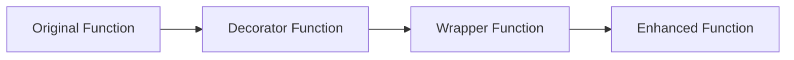

# Day 046: Decorators - Basics & Function Wrappers

> **Difficulty:** Intermediate | **Topic:** Advanced Topics | **Reading Time:** 15 mins

---

## 🎯 Learning Objectives
- Understand Python's first-class functions and how functions can accept or return other functions.
- Master the underlying mechanics of closures and variable scoping within nested functions.
- Learn the syntax and execution flow of writing basic function decorators.
- Apply wrappers to modify or extend function behavior without altering source code.

---

## 📚 Theory & Concepts

Welcome to Day 46 of your Python Mastery journey! Today, we explore **Decorators**, one of the most powerful and elegant features in Python. If you have ever wondered how frameworks like Flask, Django, or Pytest modify behavior using simple `@` syntax above functions, today unlocks that exact mystery.

To understand decorators, we must first recall that **functions in Python are first-class objects**. This means functions can be:
1. Assigned to variables.
2. Passed as arguments to other functions.
3. Returned from other functions.
4. Stored in data structures.

### What is a Decorator?
At its core, a **decorator** is a design pattern that allows a user to add new functionality to an existing object (in this case, a function or method) without modifying its structure. A decorator takes a function as an argument, adds some functionality, and returns a *new* or *wrapped* function.



### The Anatomy of a Decorator
A standard decorator relies on three key programming concepts:
- **First-Class Functions**: Passing functions around seamlessly.
- **Nested Functions (Inner Functions)**: Defining a function inside another function.
- **Closures**: An inner function that remembers and has access to variables in the local namespace of its outer enclosing function, even after the outer function has finished execution.

---

## 💻 Syntax & Structure

The syntactic sugar `@decorator_name` placed right above a function definition is simply a shorthand way of passing that function into the decorator and re-binding the name.

Consider these two equivalent blocks of code:

### Standard Syntax Using `@` Sugar
```python
def my_decorator(func):
    def wrapper():
        # Do something before original function
        func()
        # Do something after original function
    return wrapper

@my_decorator
def say_hello():
    print("Hello!")

say_hello()
```

### Manual Syntax (Under the Hood)
```python
def say_hello():
    print("Hello!")

# Equivalent to the @ syntax above:
say_hello = my_decorator(say_hello)
say_hello()
```

---

## 🧪 Code Examples

Let's build a practical, comprehensive example demonstrating a timing decorator that measures how long a function takes to execute.

```python
import time
from functools import wraps

def timing_decorator(func):
    """A decorator that prints the execution time of a function."""
    @wraps(func)  # Preserves metadata like function name and docstring
    def wrapper(*args, **kwargs):
        start_time = time.perf_counter()
        
        # Execute the actual function
        result = func(*args, **kwargs)
        
        end_time = time.perf_counter()
        duration = end_time - start_time
        print(f"[LOG] Function '{func.__name__}' executed in {duration:.6f} seconds.")
        
        return result
    return wrapper

@timing_decorator
def compute_heavy_task(n: int) -> int:
    """Simulates a CPU-heavy mathematical summation task."""
    total = 0
    for i in range(n):
        total += i
    return total

@timing_decorator
def greet_user(name: str, greeting: str = "Hello") -> None:
    """Greets a user with a customized message."""
    time.sleep(0.1) # Simulate network or I/O delay
    print(f"{greeting}, {name}!")

if __name__ == "__main__":
    print("--- Starting Execution ---")
    
    # Test task 1
    sum_result = compute_heavy_task(10_000_000)
    print(f"Computed Sum Result: {sum_result}\n")
    
    # Test task 2
    greet_user("Alice", greeting="Welcome")
```

---

## 📊 Expected Output

When you run the script above, the console will display the output below, showing how the wrapper intercepts execution to measure time while preserving original function signatures and return values:

```text
--- Starting Execution ---
[LOG] Function 'compute_heavy_task' executed in 0.284512 seconds.
Computed Sum Result: 49999995000000

Welcome, Alice!
[LOG] Function 'greet_user' executed in 0.102345 seconds.
```

---

## 🌍 Real-World Applications

Decorators are ubiquitous in production-grade software engineering:
1. **Web Frameworks**: Routing endpoints in Flask (`@app.route('/')`) or defining views in Django.
2. **Access Control & Authentication**: Securing API endpoints by checking user tokens or permission roles before allowing function execution (`@login_required`).
3. **Caching & Memoization**: Storing expensive function return values in memory to avoid redundant calculations (`@functools.lru_cache`).
4. **Logging & Auditing**: Automatically tracking method calls, execution times, and payload inputs for telemetry pipelines.
5. **Input Validation**: Sanitizing or type-checking function arguments prior to execution.

---

## 💡 Best Practices

- **Always Use `functools.wraps`**: When writing custom decorators, always import `wraps` from `functools` and decorate your inner wrapper function. This preserves the original function's `__name__` and `__doc__` attributes, which are vital for debugging and documentation.
- **Support `*args` and `**kwargs`**: Design your wrapper functions to accept arbitrary positional and keyword arguments (`*args, **kwargs`) so your decorators remain generic and reusable across functions with varying signatures.
- **Keep Decorators Focused**: Follow the Single Responsibility Principle. A decorator should ideally do *one* thing well (e.g., only log, only time, or only check permissions).
- **Common Pitfall**: Forgetting to `return` the result of `func(*args, **kwargs)` inside your wrapper. If the original function returns a value, your wrapper must pass it back to the caller!

---

## 📝 Summary & Key Takeaways

Today we demystified **Decorators and Function Wrappers**. You learned how functions act as first-class citizens in Python, how closures capture lexical scope, and how the `@` syntax sugar simplifies wrapping functions. 

Tomorrow, in **Day 047**, we will step further into advanced decorator patterns by learning how to write **Decorators with Arguments** and stacking multiple decorators on a single function! Keep practicing and see you tomorrow!
