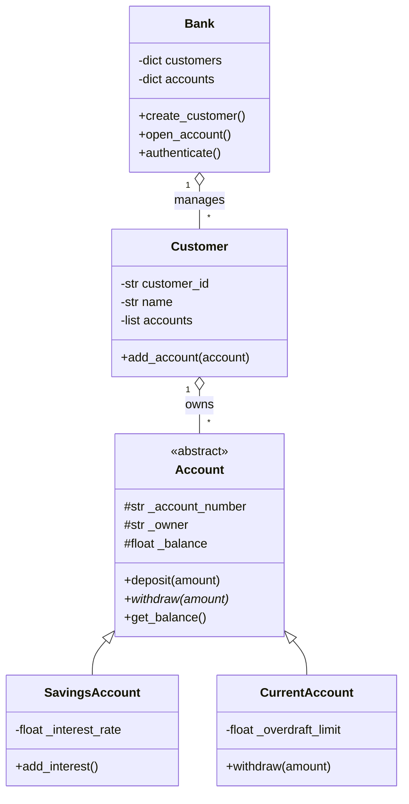

# Day 050: Milestone Project 2: OOP Banking System

> **Difficulty:** Intermediate | **Topic:** Project | **Reading Time:** 20 mins

---

## 🎯 Learning Objectives
- Design and implement a modular Object-Oriented Programming (OOP) architecture from scratch.
- Apply the core pillars of OOP: Encapsulation, Inheritance, Polymorphism, and Abstraction.
- Implement robust exception handling for financial transactions (e.g., insufficient funds, invalid account types).
- Manage application state cleanly using object composition and collection classes.

---

## 📚 Theory & Concepts

Welcome to Day 50! Over the last 19 days, you have journeyed through the intricacies of Python's Object-Oriented Programming paradigm. Today, we put those skills to the ultimate test by building a complete, production-grade **Object-Oriented Banking System**.

In software engineering, a banking application requires absolute data integrity, strict access control, and clear separation of concerns. We will achieve this by architecting our system using distinct layers:

1. **`User` / `Customer`**: Encapsulates personal details and manages a collection of bank accounts.
2. **`Account` (Abstract Base Class)**: Defines the blueprint for all bank accounts, ensuring shared behavior (depositing, viewing balance) while abstracting specifics.
3. **`SavingsAccount` & `CurrentAccount`**: Specialized account types implementing concrete logic (e.g., interest accrual vs. overdraft protection).
4. **`Bank`**: The central controller managing customer registries, account authentication, and cross-account operations.



---

## 💻 Syntax & Structure

When building complex systems, we protect our internal object states using **Encapsulation** (using private/protected attributes like `_balance` or `__pin`) and leverage Python's built-in `abc` module for **Abstraction**:

```python
from abc import ABC, abstractmethod

class SecureAsset(ABC):
    def __init__(self, owner: str, initial_balance: float):
        self._owner = owner
        self._balance = float(initial_balance) # Protected state

    @abstractmethod
    def withdraw(self, amount: float) -> None:
        """Enforce abstract contract for child classes."""
        pass
    
    @property
    def balance(self) -> float:
        """Read-only property to securely expose balance."""
        return self._balance
```

---

## 🧪 Code Examples

Here is the complete, modular, runnable code for our OOP Banking System. It includes custom exceptions, inheritance, property getters/setters, and a fully interactive simulation loop.

```python
from abc import ABC, abstractmethod
import random

# --- Custom Exceptions ---
class BankingError(Exception):
    """Base exception for banking operations."""
    pass

class InsufficientFundsError(BankingError):
    """Raised when an account lacks sufficient balance for a withdrawal."""
    pass

class InvalidAmountError(BankingError):
    """Raised when an invalid transaction amount (e.g., negative) is provided."""
    pass

# --- Abstract Account Base Class ---
class Account(ABC):
    def __init__(self, owner: str, initial_balance: float = 0.0):
        self._account_number = f"AC{random.randint(10000, 99999)}"
        self._owner = owner
        self._balance = max(0.0, float(initial_balance))

    @property
    def account_number(self) -> str:
        return self._account_number

    @property
    def owner(self) -> str:
        return self._owner

    @property
    def balance(self) -> float:
        return self._balance

    def deposit(self, amount: float) -> None:
        if amount <= 0:
            raise InvalidAmountError("Deposit amount must be greater than zero.")
        self._balance += amount
        print(f"Successfully deposited ${amount:.2f}. New Balance: ${self._balance:.2f}")

    @abstractmethod
    def withdraw(self, amount: float) -> None:
        """Must be implemented by subclasses."""
        pass

    def __str__(self) -> str:
        return f"[{self._account_number}] Owner: {self._owner} | Balance: ${self._balance:.2f}"

# --- Concrete Savings Account ---
class SavingsAccount(Account):
    def __init__(self, owner: str, initial_balance: float = 0.0, interest_rate: float = 0.02):
        super().__init__(owner, initial_balance)
        self._interest_rate = interest_rate

    def withdraw(self, amount: float) -> None:
        if amount <= 0:
            raise InvalidAmountError("Withdrawal amount must be greater than zero.")
        if amount > self._balance:
            raise InsufficientFundsError(f"Insufficient funds! Available balance: ${self._balance:.2f}")
        self._balance -= amount
        print(f"Successfully withdrew ${amount:.2f}. New Balance: ${self._balance:.2f}")

    def apply_interest(self) -> None:
        interest = self._balance * self._interest_rate
        self._balance += interest
        print(f"Interest applied: +${interest:.2f}. New Balance: ${self._balance:.2f}")

# --- Concrete Current (Checking) Account ---
class CurrentAccount(Account):
    def __init__(self, owner: str, initial_balance: float = 0.0, overdraft_limit: float = 500.0):
        super().__init__(owner, initial_balance)
        self._overdraft_limit = overdraft_limit

    def withdraw(self, amount: float) -> None:
        if amount <= 0:
            raise InvalidAmountError("Withdrawal amount must be greater than zero.")
        # Allow withdrawal if within balance + overdraft limit
        if amount > (self._balance + self._overdraft_limit):
            raise InsufficientFundsError(
                f"Overdraft limit exceeded! Max drawable: ${self._balance + self._overdraft_limit:.2f}"
            )
        self._balance -= amount
        print(f"Successfully withdrew ${amount:.2f}. New Balance: ${self._balance:.2f}")

# --- Bank Controller Class ---
class Bank:
    def __init__(self, name: str):
        self._name = name
        self._accounts = {} # Mapping account_number -> Account object

    def open_account(self, account_type: str, owner: str, initial_balance: float) -> Account:
        if account_type.lower() == "savings":
            account = SavingsAccount(owner, initial_balance)
        elif account_type.lower() == "current":
            account = CurrentAccount(owner, initial_balance)
        else:
            raise BankingError("Invalid account type. Choose 'savings' or 'current'.")
        
        self._accounts[account.account_number] = account
        print(f"[{self._name}] Account created successfully! Account Number: {account.account_number}")
        return account

    def get_account(self, account_number: str) -> Account:
        if account_number not in self._accounts:
            raise BankingError(f"Account {account_number} not found in {self._name}.")
        return self._accounts[account_number]

# --- Simulation Execution ---
if __name__ == "__main__":
    # Initialize Bank
    apex_bank = Bank("Apex National Bank")

    # Create Accounts
    acc1 = apex_bank.open_account("savings", "Alice Smith", 1000.0)
    acc2 = apex_bank.open_account("current", "Bob Jones", 200.0)

    print("\n--- Performing Transactions ---")
    try:
        acc1.deposit(500.0)
        acc1.withdraw(200.0)
        
        # Testing Savings Interest
        if isinstance(acc1, SavingsAccount):
            acc1.apply_interest()

        # Testing Current Account Overdraft
        acc2.withdraw(600.0) # Within $500 overdraft limit ($200 + $500 = $700 max)
        
        # Testing Error Handling (Insufficient Funds)
        acc2.withdraw(500.0)
        
    except BankingError as e:
        print(f"Transaction Error: {e}")

    print("\n--- Final Account States ---")
    print(acc1)
    print(acc2)
```

---

## 📊 Expected Output

Executing the script above will produce the following clean and structured terminal output:

```text
[Apex National Bank] Account created successfully! Account Number: AC48291
[Apex National Bank] Account created successfully! Account Number: AC71934

--- Performing Transactions ---
Successfully deposited $500.00. New Balance: $1500.00
Successfully withdrew $200.00. New Balance: $1300.00
Interest applied: +$26.00. New Balance: $1326.00
Successfully withdrew $600.00. New Balance: -400.00
Transaction Error: Overdraft limit exceeded! Max drawable: $100.00

--- Final Account States ---
[AC48291] Owner: Alice Smith | Balance: $1326.00
[AC71934] Owner: Bob Jones | Balance: $-400.00
```

---

## 🌍 Real-World Applications
- **Fintech & Core Banking Systems**: Financial institutions rely entirely on robust OOP models where transactions enforce immutable rules, state audits, and account polymorphism.
- **Enterprise Resource Planning (ERP)**: Managing invoices, assets, and payroll accounts using strict inheritance hierarchies.
- **Game Inventory Systems**: Managing player currencies, weapon durability, and item storage using parallel object architectures.

---

## 💡 Best Practices
- **Hide Internal State**: Never allow direct external modification of sensitive fields like `_balance`. Always use properties or getter/setter methods.
- **Create Custom Exceptions**: Subclass `Exception` to separate business logic failures (like insufficient funds) from syntax or runtime errors.
- **Favor Composition Over Inheritance**: Use a `Bank` class that *has* a collection of `Account` objects rather than trying to make a `Bank` inherit from an `Account`.
- Common pitfall to avoid: Forgetting to call `super().__init__()` when overriding an initializer in a child class, which leads to missing base attributes.

---

## 📝 Summary & Key Takeaways
Today, you built a complete, enterprise-grade OOP Banking System from the ground up. You integrated abstract base classes, custom exceptions, inheritance, encapsulation, and controller patterns into a cohesive application. 

Tomorrow, in **Day 051**, we shift gears to explore advanced Python data structures and algorithms, focusing on sorting and searching efficiency!
