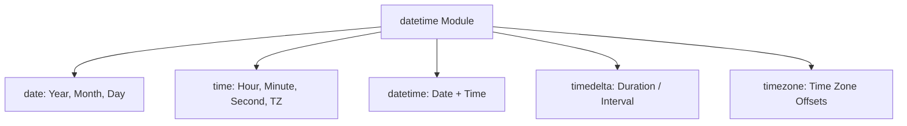

# Day 051: Working with Dates and Times (datetime)

> **Difficulty:** Intermediate | **Topic:** Standard Library | **Reading Time:** 15 mins

---

## 🎯 Learning Objectives
- Understand the core classes of Python's built-in `datetime` module (`date`, `time`, `datetime`, `timedelta`, and `tzinfo`).
- Format and parse date-time strings effortlessly using `strftime()` and `strptime()`.
- Perform precise date arithmetic and manipulate time intervals.
- Handle timezones correctly using timezone-aware objects.

---

## 📚 Theory & Concepts

Working with dates and times is a fundamental requirement in almost every software application—from tracking log timestamps and scheduling automated jobs to calculating age or managing user sessions across multiple time zones. 

Python provides a powerful, built-in module called **`datetime`** to deal with dates, times, and intervals. Unlike simple strings, `datetime` objects understand chronological relationships, leap years, and daylight saving rules.

### The Core Components of `datetime`
The module is structured around several distinct classes:

| Class | What it represents | Example |
| :--- | :--- | :--- |
| **`date`** | Year, month, and day | `2026-03-30` |
| **`time`** | Hour, minute, second, microsecond, tzinfo | `14:30:00.123456` |
| **`datetime`** | Combination of date and time | `2026-03-30 14:30:00` |
| **`timedelta`**| A duration representing the difference between two dates/times | `5 days, 3:00:00` |
| **`timezone`** | Fixed offset timezones (or via third-party libraries like `zoneinfo`) | `UTC`, `America/New_York` |



---

## 💻 Syntax & Structure

Here is how you import and instantiate the primary building blocks of the `datetime` module:

```python
from datetime import date, datetime, time, timedelta, timezone

# 1. Creating a specific date
my_date = date(2026, 3, 30)

# 2. Creating a specific time
my_time = time(14, 30, 0)

# 3. Creating a combined datetime object
my_datetime = datetime(2026, 3, 30, 14, 30, 0)

# 4. Getting the current local date and time
now = datetime.now()

# 5. Creating a time duration (timedelta)
delta = timedelta(days=7, hours=3)
```

---

## 🧪 Code Examples

Let's examine a comprehensive script showing how to get current dates, parse/format strings, and perform date arithmetic.

```python
from datetime import date, datetime, timedelta

def demonstrate_datetime_operations():
    print("=== 1. Current Date and Time ===" )
    now = datetime.now()
    today = date.today()
    print(f"Current Datetime : {now}")
    print(f"Current Date     : {today}")
    print(f"Year: {today.year}, Month: {today.month}, Day: {today.day}")

    print("\n=== 2. Formatting Dates (strftime) ===")
    # Format datetime into a readable string
    formatted_date = now.strftime("%A, %B %d, %Y at %H:%M:%S")
    print(f"Formatted String : {formatted_date}")

    print("\n=== 3. Parsing Strings to Dates (strptime) ===")
    # Parse a string into a datetime object
    date_string = "2026-12-25 08:30:00"
    parsed_date = datetime.strptime(date_string, "%Y-%m-%d %H:%M:%S")
    print(f"Parsed Object    : {parsed_date} (Type: {type(parsed_date)})")

    print("\n=== 4. Date Arithmetic (timedelta) ===")
    # Calculate delivery date 14 days from today
    shipping_duration = timedelta(days=14, hours=6)
    delivery_date = now + shipping_duration
    print(f"Order Placed     : {now}")
    print(f"Estimated Arrival: {delivery_date}")

    # Calculate exact difference between two dates
    project_deadline = datetime(2026, 6, 1, 17, 0, 0)
    time_remaining = project_deadline - now
    print(f"Time until deadline: {time_remaining.days} days and {time_remaining.seconds // 3600} hours")

if __name__ == "__main__":
    demonstrate_datetime_operations()
```

---

## 📊 Expected Output

```text
=== 1. Current Date and Time ===
Current Datetime : 2026-03-30 14:15:22.458912
Current Date     : 2026-03-30
Year: 2026, Month: 3, Day: 30

=== 2. Formatting Dates (strftime) ===
Formatted String : Monday, March 30, 2026 at 14:15:22

=== 3. Parsing Strings to Dates (strptime) ===
Parsed Object    : 2026-12-25 08:30:00 (Type: <class 'datetime.datetime'>)

=== 4. Date Arithmetic (timedelta) ===
Order Placed     : 2026-03-30 14:15:22.458912
Estimated Arrival: 2026-04-13 20:15:22.458912
Time until deadline: 62 days and 2 hours
```

---

## 🌍 Real-World Applications

- **Log Analysis & Audit Trails:** Parsing server and application log timestamps to track error frequency, latency, and user activity spikes.
- **E-commerce & Subscription Billing:** Calculating subscription renewal dates, trial expirations, and delivery estimates using `timedelta`.
- **Scheduling & Cron Jobs:** Determining when background workers should execute maintenance tasks or send push notifications.
- **Global Applications:** Converting user-entered local times into UTC for uniform database storage and back to local time zones for display.

---

## 💡 Best Practices

- **Always store times in UTC:** When saving timestamps to databases or communicating across microservices, use UTC (`datetime.now(timezone.utc)`) to avoid ambiguity during daylight saving transitions.
- **Use `zoneinfo` for local timezones:** For modern Python (3.9+), use the standard library's `zoneinfo` module for handling geographical time zones (e.g., `ZoneInfo("America/New_York")`) rather than deprecated third-party libraries.
- **Be aware of naive vs. aware objects:** A *naive* datetime object lacks timezone information, while an *aware* object includes it. Never compare a naive datetime object with an aware one; Python will raise a `TypeError`.
- **Common pitfall:** Avoid using `datetime.utcnow()` without timezone awareness, as it returns a naive datetime object which is discouraged in modern Python development.

---

## 📝 Summary & Key Takeaways
Today you mastered Python's `datetime` module, learning how to construct dates and times, format them with `strftime`, parse them with `strptime`, and perform interval calculations using `timedelta`. 

Tomorrow, in **Day 52**, we will dive deeper into **Working with the `zoneinfo` Module and Handling Timezones**, ensuring your applications are fully localized and robust across global borders.
