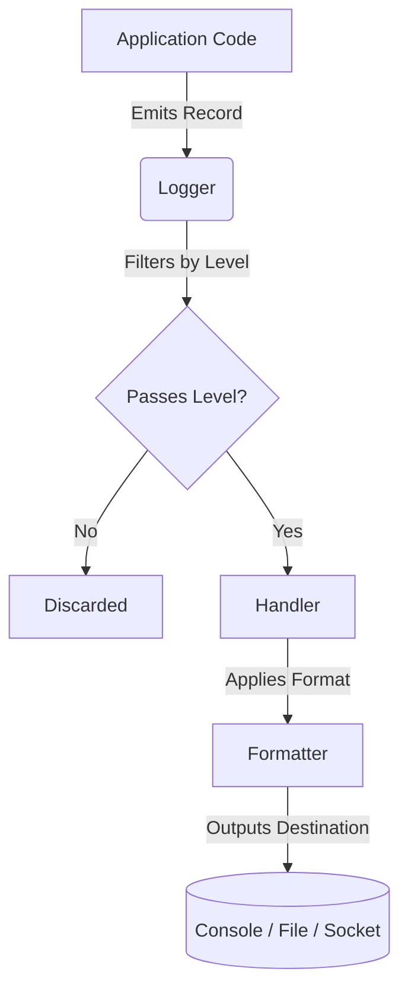

# Day 056: Python Logging System (logging module)

> **Difficulty:** Intermediate | **Topic:** Standard Library | **Reading Time:** 15 mins

---

## 🎯 Learning Objectives
- Understand why `print()` is insufficient for production applications and why structured logging is essential.
- Master the six standard logging severity levels (`DEBUG`, `INFO`, `WARNING`, `ERROR`, `CRITICAL`).
- Configure and use the built-in `logging` module with custom formatters, handlers, and loggers.
- Implement file rotation using `RotatingFileHandler` to prevent log files from exhausting disk space.

---

## 📚 Theory & Concepts

When you begin writing Python scripts, debugging usually starts with the `print()` function. While `print()` is great for quick sanity checks, it falls apart in production environments. It lacks timestamps, does not distinguish between a casual status update and a system-crashing exception, and writes directly to standard output without offering a way to redirect logs to files, rotation policies, or network sockets.

Python’s built-in `logging` module is a production-ready framework designed to solve these problems. It provides a standardized way to emit log messages from applications and libraries.

### The Anatomy of Logging



1. **Loggers**: The objects you interact with in your code. They expose methods like `logger.info()` or `logger.error()`.
2. **Log Levels**: Severity tags that dictate whether a message should be processed or ignored.
3. **Handlers**: Objects responsible for dispatching the log records to their ultimate destinations (e.g., console, file, syslog).
4. **Formatters**: Define the exact layout of the log record (e.g., timestamp, module name, severity, message).

### Standard Log Levels

| Level | Numeric Value | When to Use |
| :--- | :--- | :--- |
| `DEBUG` | 10 | Detailed information, typically of interest only when diagnosing problems. |
| `INFO` | 20 | Confirmation that things are working as expected. |
| `WARNING` | 30 | An indication that something unexpected happened, or indicative of some problem in the near future (e.g., 'disk space low'). The software is still working as expected. |
| `ERROR` | 40 | Due to a more serious problem, the software has not been able to perform some function. |
| `CRITICAL` | 50 | A serious error, indicating that the program itself may be unable to continue running. |

---

## 💻 Syntax & Structure

The basic usage of the `logging` module involves configuring the root logger or creating custom logger instances.

```python
import logging

# Basic configuration (sets root logger level and format)
logging.basicConfig(
    level=logging.DEBUG,
    format="%(asctime)s - %(name)s - %(levelname)s - %(message)s",
    datefmt="%Y-%m-%d %H:%M:%S",
)

# Emitting log messages
logging.debug("This is a debug message")
logging.info("Application started successfully")
logging.warning("Configuration file missing; using defaults")
logging.error("Failed to connect to database")
logging.critical("System out of memory! Shutting down.")
```

For advanced applications, avoid `logging.basicConfig()` and explicitly construct handlers, formatters, and loggers.

```python
import logging

# Create a custom logger
logger = logging.getLogger("my_application")
logger.setLevel(logging.INFO)

# Create a file handler
file_handler = logging.FileHandler("app.log")
file_handler.setLevel(logging.INFO)

# Create a formatter and add it to the handler
formatter = logging.Formatter(
    "%(asctime)s [%(levelname)s] %(name)s: %(message)s"
)
file_handler.setFormatter(formatter)

# Add handler to the logger
logger.addHandler(file_handler)
```

---

## 🧪 Code Examples

Here is a complete, runnable script demonstrating best-practice logging structure, including console output, file logging, and file rotation.

```python
import logging
from logging.handlers import RotatingFileHandler
import os

def configure_logging():
    """Configures the application logger with console and file handlers."""
    # Create logs directory if it doesn't exist
    os.makedirs("logs", exist_ok=True)
    log_file = os.path.join("logs", "app_execution.log")

    # Root application logger
    logger = logging.getLogger("DataProcessor")
    logger.setLevel(logging.DEBUG)

    # Prevent logs from propagating to the root logger (avoids duplicate printing)
    logger.propagate = False

    # Define standard format
    log_format = logging.Formatter(
        "%(asctime)s | %(levelname)-8s | %(name)s | %(filename)s:%(lineno)d | %(message)s",
        datefmt="%Y-%m-%d %H:%M:%S",
    )

    # 1. Console Handler (INFO and above)
    console_handler = logging.StreamHandler()
    console_handler.setLevel(logging.INFO)
    console_handler.setFormatter(log_format)

    # 2. Rotating File Handler (DEBUG and above, max 2MB per file, max 3 backups)
    file_handler = RotatingFileHandler(
        log_file, maxBytes=2 * 1024 * 1024, backupCount=3, encoding="utf-8"
    )
    file_handler.setLevel(logging.DEBUG)
    file_handler.setFormatter(log_format)

    # Attach handlers to logger
    logger.addHandler(console_handler)
    logger.addHandler(file_handler)

    return logger

def process_data(data_list):
    logger = logging.getLogger("DataProcessor")
    logger.info("Starting data processing pipeline...")

    for index, item in enumerate(data_list):
        logger.debug(f"Processing item index {index}: {item}")
        try:
            if item == 0:
                raise ValueError("Zero division hazard detected.")
            result = 100 / item
            logger.info(f"Successfully processed item {item}. Result: {result:.2f}")
        except ZeroDivisionError as zde:
            logger.error(
                f"Division error encountered at index {index}: {zde}", exc_info=True
            )
        except Exception as e:
            logger.critical(f"Unexpected failure on item {item}: {e}", exc_info=True)

    logger.info("Data processing pipeline completed.")

if __name__ == "__main__":
    app_logger = configure_logging()
    app_logger.info("Application initialization complete.")

    sample_data = [10, 25, 0, 5, 50]
    process_data(sample_data)
```

---

## 📊 Expected Output

When you run the script above, the console will display the following structured logs (note that `DEBUG` logs are omitted from the console due to the `INFO` threshold set on the `console_handler`, but they *will* be written to `logs/app_execution.log`):

```text
2026-03-30 14:10:00 | INFO     | DataProcessor | logging_lesson.py:59 | Application initialization complete.
2026-03-30 14:10:00 | INFO     | DataProcessor | logging_lesson.py:38 | Starting data processing pipeline...
2026-03-30 14:10:00 | INFO     | DataProcessor | logging_lesson.py:46 | Successfully processed item 10. Result: 10.00
2026-03-30 14:10:00 | INFO     | DataProcessor | logging_lesson.py:46 | Successfully processed item 25. Result: 4.00
2026-03-30 14:10:00 | ERROR    | DataProcessor | logging_lesson.py:49 | Division error encountered at index 2: Zero division hazard detected.
Traceback (most recent call last):
  File "logging_lesson.py", line 44, in process_data
    result = 100 / item
ZeroDivisionError: division by zero
2026-03-30 14:10:00 | INFO     | DataProcessor | logging_lesson.py:46 | Successfully processed item 5. Result: 20.00
2026-03-30 14:10:00 | INFO     | DataProcessor | logging_lesson.py:46 | Successfully processed item 50. Result: 2.00
2026-03-30 14:10:00 | INFO     | DataProcessor | logging_lesson.py:54 | Data processing pipeline completed.
```

---

## 🌍 Real-World Applications

- **Microservices & Web APIs**: Web frameworks like FastAPI and Django use logging to track incoming HTTP requests, response status codes, execution times, and unhandled middleware exceptions.
- **Background Workers & ETL Pipelines**: Systems processing millions of records nightly (e.g., Celery tasks, Apache Airflow nodes) depend entirely on file rotation and persistent log streams to audit data processing failures.
- **Security Auditing**: Authentication systems log failed login attempts, IP addresses, and privilege escalations with `WARNING` or `ERROR` tags to flag potential brute-force intrusions.

---

## 💡 Best Practices

- **Never use `print()` for production code**: Always use `logging` so logs can be filtered, rotated, and sent to centralized log aggregators (like ELK stack, Datadog, or CloudWatch).
- **Use lazy evaluation via string formatting**: Pass parameters as arguments to log methods (`logger.info("User %s logged in", username)`) instead of using f-strings (`logger.info(f"User {username} logged in")`). This avoids expensive string concatenation when the logging level is turned off.
- **Include Stack Traces**: When logging caught exceptions, pass `exc_info=True` or use `logger.exception()` to capture full stack traces.
- **Avoid Root Logger Configuration in Libraries**: If you are writing a reusable package, never call `logging.basicConfig()` or add handlers to the root logger. Let the consuming application manage handler configuration.

---

## 📝 Summary & Key Takeaways

Today you learned how to transition away from fragile `print()` statements and embrace Python's robust standard `logging` module. You explored log levels, formatters, custom handlers, and rotating file strategies to manage disk footprints safely. 

Tomorrow, in **Day 57**, we will explore **Python Unit Testing with `unittest`**, where we will learn how to write automated test suites and mock dependencies for bulletproof applications.
