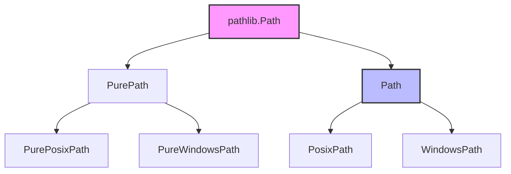

# Day 057: Path Manipulation with pathlib Module

> **Difficulty:** Intermediate | **Topic:** Standard Library | **Reading Time:** 15 mins

---

## 🎯 Learning Objectives
- Master the transition from the legacy `os.path` module to the modern, object-oriented `pathlib` module.
- Navigate file systems, inspect file metadata, and manipulate paths seamlessly across different operating systems.
- Read and write file contents efficiently using `pathlib.Path` native methods.
- Implement robust, cross-platform file system automation scripts following industry best practices.

---

## 📚 Theory & Concepts

For years, Python developers handled file system paths using strings and functions scattered across the `os`, `os.path`, and `glob` modules. This approach often led to brittle code, especially when transitioning between Windows (using backslashes `\`) and POSIX systems (Linux/macOS using forward slashes `/`). 

Introduced in PEP 428 and enhanced significantly in Python 3.4+, the `pathlib` module offers an **object-oriented** approach to handling file system paths. Instead of treating paths as raw, mutable strings, `pathlib` encapsulates paths as rich objects with methods and properties designed to make file system interactions intuitive and safe.

### Why `pathlib` Matters
1. **Cross-Platform Compatibility:** `pathlib` automatically uses the correct path separator for the host operating system (`\` vs `/`), eliminating manual string concatenation bugs.
2. **Operator Overloading:** It uses the division operator (`/`) to join path segments intuitively.
3. **Fluent Interface:** Common operations—like checking if a file exists, reading text, or finding matching files—are methods directly attached to the path object.



---

## 💻 Syntax & Structure

To use `pathlib`, you first import the `Path` class. You can instantiate paths using strings or by combining existing path objects.

```python
from pathlib import Path

# Creating paths
current_dir = Path(".")
home_dir = Path.home()
file_path = Path("data") / "logs" / "app.log"

# Inspecting path properties
print(file_path.name)      # 'app.log'
print(file_path.stem)      # 'app'
print(file_path.suffix)    # '.log'
print(file_path.parent)    # WindowsPath('data/logs') or PosixPath('data/logs')

# Checking existence and type
if file_path.exists():
    is_file = file_path.is_file()
    is_dir = file_path.is_dir()
```

---

## 🧪 Code Examples

Here is a comprehensive script demonstrating directory creation, path manipulation, file writing, reading, and globbing using `pathlib`.

```python
from pathlib import Path

def demonstrate_pathlib():
    # 1. Define base project directory using pathlib
    base_dir = Path("demo_project")
    
    # Create directory (and missing parents) if it doesn't exist
    base_dir.mkdir(parents=True, exist_ok=True)
    print(f"Directory created/verified at: {base_dir.resolve()}")

    # 2. Define subdirectories and file paths using the '/' operator
    logs_dir = base_dir / "logs"
    logs_dir.mkdir(exist_ok=True)
    
    log_file = logs_dir / "server_output.log"
    config_file = base_dir / "config.json"

    # 3. Writing data using pathlib's built-in methods
    log_file.write_text("INFO: Server started successfully.\nWARNING: High memory usage detected.\n", encoding="utf-8")
    config_file.write_text('{"host": "localhost", "port": 8080}', encoding="utf-8")
    print("Files successfully written.")

    # 4. Reading data back
    print("\n--- Reading Log File Contents ---")
    content = log_file.read_text(encoding="utf-8")
    print(content, end="")

    # 5. Iterating through directories and globbing
    print("\n--- Searching for .log files ---")
    # Search recursively for log files
    for path in base_dir.rglob("*.log"):
        print(f"Found log file: {path.name} (Size: {path.stat().st_size} bytes)")

    # 6. Path manipulation and renaming
    backup_file = log_file.with_suffix(".bak")
    log_file.replace(backup_file)
    print(f"\nRenamed {log_file.name} to {backup_file.name}")

    # Cleanup demonstration files
    for p in base_dir.rglob("*"):
        if p.is_file():
            p.unlink()
    for p in sorted(base_dir.rglob("*"), reverse=True):
        if p.is_dir():
            p.rmdir()
    base_dir.rmdir()
    print("\nCleanup completed successfully.")

if __name__ == "__main__":
    demonstrate_pathlib()
```

---

## 📊 Expected Output

```text
Directory created/verified at: /home/user/workspace/demo_project
Files successfully written.

--- Reading Log File Contents ---
INFO: Server started successfully.
WARNING: High memory usage detected.

--- Searching for .log files ---
Found log file: server_output.log (Size: 73 bytes)

Renamed server_output.log to server_output.bak

Cleanup completed successfully.
```

---

## 🌍 Real-World Applications

- **Build Systems and Task Runners:** Tools like automated test runners, linters, and bundlers use `pathlib` to scan deeply nested project directories for source code files matching specific patterns.
- **Data Engineering Pipelines:** Extract, Transform, Load (ETL) scripts use `pathlib` to ingest data files from incoming directories, process them, and archive them into processed folders safely across different operating systems.
- **Web Application Asset Management:** Static site generators and web frameworks use `pathlib` to locate templates, configuration files, and static assets regardless of whether the server runs on Windows Server or Linux containers.

---

## 💡 Best Practices

- **Use the `/` operator:** Always prefer the division operator (`path / "subfolder" / "file.txt"`) over string concatenation (`path + "/subfolder"`) or `os.path.join()`.
- **Prefer `pathlib` over `os.path`:** For new Python codebases (Python 3.4+), abandon legacy string-based path operations in favor of `pathlib.Path`.
- **Handle Exceptions:** File system operations are inherently volatile. Wrap file read/write operations in appropriate exception handling blocks (`FileNotFoundError`, `PermissionError`).
- **Common Pitfall:** Do not mix raw path strings with incompatible OS formats manually; let `pathlib` handle normalization via `.resolve()` or `.absolute()`.

---

## 📝 Summary & Key Takeaways

Today you mastered `pathlib`, Python's modern standard library module for object-oriented path manipulation. You learned how to instantiate paths cleanly, traverse file trees, read and write files natively, and manage file system entries safely across operating systems. 

Tomorrow, on **Day 58**, we will dive into advanced file I/O operations and serialization formats like JSON and CSV to handle complex data persistence!
