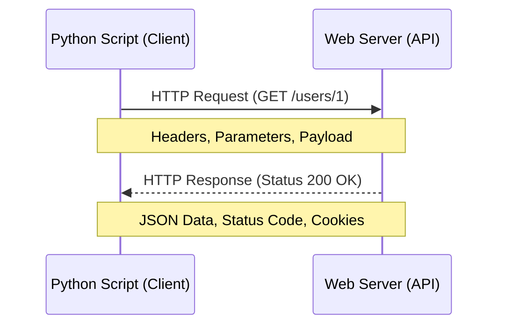

# Day 058: HTTP Requests with requests Library

> **Difficulty:** Intermediate | **Topic:** Networking | **Reading Time:** 15 mins

---

## 🎯 Learning Objectives
- Understand the fundamentals of HTTP (Hypertext Transfer Protocol) and RESTful API communication.
- Master the installation and core methods of the third-party `requests` library in Python.
- Handle different types of HTTP requests (`GET`, `POST`, `PUT`, `DELETE`) with query parameters and JSON payloads.
- Implement robust error handling for network requests using built-in exceptions.

---

## 📚 Theory & Concepts

In modern software engineering, applications rarely live in isolation. They communicate with other services, databases, and microservices over the web. This communication is predominantly driven by **HTTP (Hypertext Transfer Protocol)**.

Python includes a built-in `urllib` module, but it is notoriously verbose, cumbersome, and difficult to work with for everyday tasks. To solve this, Kenneth Reitz created **`requests`**, an Apache2-licensed HTTP library that embraces the Pythonic philosophy (*"Human-Friendly HTTP"*).

### The Client-Server Architecture
When working with web APIs, your Python script acts as the **Client**, and the remote server acts as the **Responder**.



### Key HTTP Concepts
- **Methods (Verbs):** Tell the server what action to perform.
  - `GET`: Retrieve data from a server.
  - `POST`: Send data to a server to create a resource.
  - `PUT`: Update an existing resource completely.
  - `DELETE`: Remove a resource from the server.
- **Status Codes:** Numeric indicators of request health.
  - `2xx` (e.g., `200 OK`, `201 Created`): Success.
  - `4xx` (e.g., `400 Bad Request`, `404 Not Found`): Client error.
  - `5xx` (e.g., `500 Internal Server Error`): Server error.

---

## 💻 Syntax & Structure

Before using `requests`, you must install it via pip:
```bash
pip install requests
```

Here is the fundamental syntax structure for sending basic requests:

```python
import requests

# Making a basic GET request
response = requests.get("https://api.example.com/data")

# Accessing response properties
status_code = response.status_code
json_data = response.json()
text_data = response.text
```

Passing query parameters and custom headers:
```python
import requests

url = "https://api.example.com/search"
params = {"q": "python programming", "page": 1}
headers = {"Authorization": "Bearer YOUR_API_KEY"}

response = requests.get(url, params=params, headers=headers)
```

---

## 🧪 Code Examples

Below is a comprehensive, production-grade example that demonstrates making a `GET` request with query parameters, parsing JSON, handling errors gracefully, and executing a `POST` request to send payload data.

```python
import requests
from requests.exceptions import HTTPError, ConnectionError, Timeout

def fetch_user_todos(user_id: int):
    """Fetches to-do items for a specific user from JSONPlaceholder API."""
    base_url = "https://jsonplaceholder.typicode.com/todos"
    params = {"userId": user_id}
    
    try:
        print(f"-> Sending GET request to {base_url} with params {params}...")
        response = requests.get(base_url, params=params, timeout=5)
        
        # Raise an exception for HTTP error status codes (4xx and 5xx)
        response.raise_for_status()
        
        todos = response.json()
        print(f"[Success] Successfully retrieved {len(todos)} tasks for User {user_id}.\n")
        return todos

    except HTTPError as http_err:
        print(f"[Error] HTTP error occurred: {http_err}")
    except ConnectionError as conn_err:
        print(f"[Error] Error connecting to the server: {conn_err}")
    except Timeout as time_err:
        print(f"[Error] The request timed out: {time_err}")
    except Exception as err:
        print(f"[Error] An unexpected error occurred: {err}")
    return None

def create_new_post():
    """Sends a POST request to create a new resource on the server."""
    url = "https://jsonplaceholder.typicode.com/posts"
    payload = {
        "title": "Mastering Python Requests",
        "body": "Learning how to interact with REST APIs efficiently using Python.",
        "userId": 42
    }
    
    headers = {
        "Content-Type": "application/json; charset=UTF-8"
    }

    try:
        print(f"-> Sending POST request to {url}...")
        response = requests.post(url, json=payload, headers=headers, timeout=5)
        response.raise_for_status()
        
        response_data = response.json()
        print(f"[Success] Resource created successfully with ID: {response_data.get('id')}")
        print(f"Server Response Payload: {response_data}\n")

    except HTTPError as http_err:
        print(f"[Error] Failed to create post: {http_err}")
    except Exception as err:
        print(f"[Error] An unexpected error occurred: {err}")

if __name__ == "__main__":
    # 1. Test GET request with query parameters
    user_todos = fetch_user_todos(user_id=1)
    if user_todos:
        print("First task preview:", user_todos[0])
        print("-" * 50)
        
    # 2. Test POST request with JSON payload
    create_new_post()
```

---

## 📊 Expected Output

```text
-> Sending GET request to https://jsonplaceholder.typicode.com/todos with params {'userId': 1}...
[Success] Successfully retrieved 20 tasks for User 1.

First task preview: {'userId': 1, 'id': 1, 'title': 'delectus aut autem', 'completed': False}
--------------------------------------------------
-> Sending POST request to https://jsonplaceholder.typicode.com/posts...
[Success] Resource created successfully with ID: 101
Server Response Payload: {'title': 'Mastering Python Requests', 'body': 'Learning how to interact with REST APIs efficiently using Python.', 'userId': 42, 'id': 101}
```

---

## 🌍 Real-World Applications

- **Consuming Third-Party APIs:** Integrating payment gateways (Stripe, PayPal), weather data providers, or AI inference endpoints (OpenAI, Anthropic) into backend systems.
- **Microservices Communication:** Enabling internal services within a distributed architecture to speak with one another synchronously via REST endpoints.
- **Web Scraping & Automation:** Downloading raw HTML pages or interacting with undocumented web APIs to aggregate public data feeds.
- **Health Checks & Monitoring:** Writing cron jobs or scripts that periodically ping endpoints to ensure production web servers and APIs are up and responding properly.

---

## 💡 Best Practices

- Always use the `timeout` parameter in your requests (`requests.get(url, timeout=10)`) to prevent your application from hanging indefinitely if a server becomes unresponsive.
- Call `response.raise_for_status()` immediately after a request to ensure non-200 status codes trigger exceptions instead of failing silently downstream.
- Use the `json=` parameter instead of `data=` when sending Python dictionaries in `POST`/`PUT` requests; `requests` will automatically serialize the dictionary to a JSON string and set the appropriate `Content-Type` header.
- Store sensitive API keys, tokens, and credentials in environment variables or configuration files rather than hardcoding them into source code.
- Common pitfall: Forgetting that `response.json()` parses the raw body string into Python objects; calling it on an endpoint that returns non-JSON text will raise a `JSONDecodeError`.

---

## 📝 Summary & Key Takeaways

Today you learned how to bridge your Python applications to the outside world using the powerful `requests` library. You mastered sending `GET` and `POST` methods, attaching query parameters and payloads, parsing JSON data structures, and implementing defensive network error handling. 

Tomorrow, in **Day 59**, we will take your networking skills further as we explore **Working with JSON and APIs**, diving deeper into data serialization, parsing nested JSON responses, and handling API authentication schemas.
