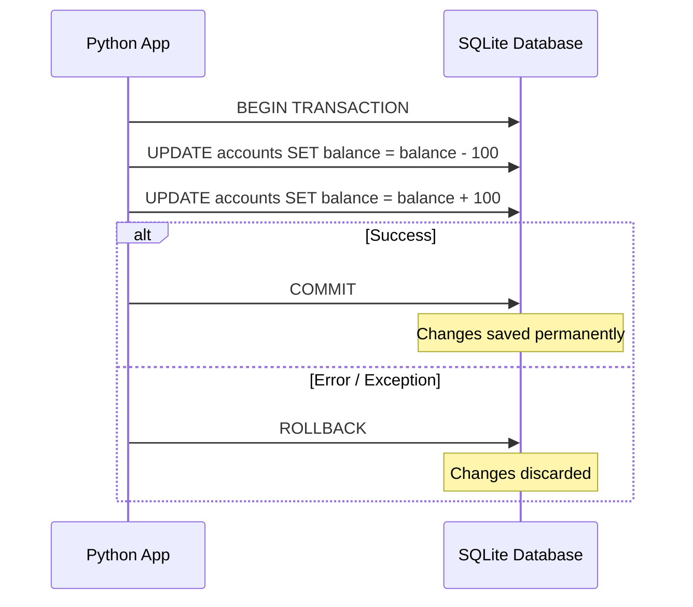

# Day 060: SQLite Advanced Operations & Transactions

> **Difficulty:** Intermediate | **Topic:** Databases | **Reading Time:** 15 mins

---

## 🎯 Learning Objectives
- Master explicit transaction management (`BEGIN`, `COMMIT`, `ROLLBACK`) in Python's `sqlite3` module.
- Implement savepoints for granular transaction control and nested error recovery.
- Leverage SQLite Row factories to fetch database records as dictionary-like objects instead of tuples.
- Write robust, concurrency-aware database operations that prevent data corruption and race conditions.

---

## 📚 Theory & Concepts

When building robust Python applications, interacting with a database requires more than just executing simple `INSERT` or `SELECT` statements. In Day 59, you learned how to establish connections, create tables, and execute basic queries. Today, we elevate your database engineering skills by focusing on **Transactions** and **Advanced Retrieval Patterns**.

### What is a Transaction?
A transaction is a sequence of one or more SQL operations executed as a single, atomic unit of work. The core principles governing transactions are known as **ACID**:
- **Atomicity:** All operations succeed, or none of them do. If a failure occurs midway, the database must roll back to its state prior to the transaction.
- **Consistency:** Transactions take the database from one valid state to another, preserving structural invariants and foreign key constraints.
- **Isolation:** Concurrent transactions execute without interfering with one another.
- **Durability:** Once committed, changes are permanent, even in the event of a system crash.



### Implicit vs. Explicit Transactions in Python
By default, the Python standard library's `sqlite3` module operates in an **implicit transaction management mode**. Whenever you execute an SQL statement that modifies data (`INSERT`, `UPDATE`, `DELETE`), Python automatically issues a `BEGIN` statement behind the scenes if a transaction is not already active. 

However, relying entirely on implicit transactions can lead to unpredictable behavior in complex workflows where multiple statements must succeed or fail together. **Explicit transactions** give you absolute control over when changes are committed or abandoned.

### Savepoints
Sometimes, you want to roll back only a portion of a transaction rather than the entire operation. SQLite supports **Savepoints**, which act as markers within a transaction, allowing you to `ROLLBACK TO <savepoint_name>` without losing prior work in the same transaction block.

### Row Factories
By default, `sqlite3.Cursor` returns query results as tuples. While lightweight, tuples require you to access columns by integer indices (`row[0]`, `row[1]`), which makes code brittle when schema changes occur. By assigning `sqlite3.Row` to the connection's `row_factory`, you can access columns via dictionary keys (`row['username']`) and attributes while retaining tuple performance.

---

## 💻 Syntax & Structure

Review the fundamental syntax for managing transactions explicitly, utilizing savepoints, and configuring row factories:

```python
import sqlite3

# 1. Establishing connection and setting the Row Factory
conn = sqlite3.connect("enterprise.db")
conn.row_factory = sqlite3.Row  # Enables dictionary-like access

cursor = conn.cursor()

try:
    # 2. Explicit Transaction Control
    cursor.execute("BEGIN TRANSACTION;")

    cursor.execute(
        "INSERT INTO accounts (name, balance) VALUES (?, ?)", ("Alice", 500)
    )

    # 3. Using a Savepoint for granular recovery
    cursor.execute("SAVEPOINT sp1;")

    try:
        cursor.execute(
            "UPDATE accounts SET balance = balance - 1000 WHERE name = 'Alice'"
        )
        # Imagine a business rule violation occurs here
        if True:  # Simulated error condition
            raise ValueError("Insufficient funds for overdraft!")
    except ValueError as e:
        print(f"Partial failure caught: {e}. Rolling back to savepoint.")
        cursor.execute("ROLLBACK TO sp1;")

    # Commit the outer transaction (Alice's initial insert remains intact)
    conn.commit()

except sqlite3.Error as e:
    print(f"Database error occurred: {e}")
    conn.rollback()  # Rollback entire transaction on critical failure
finally:
    conn.close()
```

---

## 🧪 Code Examples

The following comprehensive, runnable script demonstrates an enterprise-grade banking ledger scenario. It initializes a database, applies strict transaction management, uses savepoints to handle partial execution errors, and retrieves data using `sqlite3.Row`.

```python
import sqlite3
import os

DB_NAME = "banking_system.db"

def initialize_database(cursor):
    """Sets up the initial schema with constraints."""
    cursor.execute("DROP TABLE IF EXISTS accounts;")
    cursor.execute("""
        CREATE TABLE accounts (
            id INTEGER PRIMARY KEY AUTOINCREMENT,
            holder_name TEXT NOT NULL UNIQUE,
            balance REAL NOT NULL CHECK(balance >= 0.0)
        );
    """)
    print("Database schema initialized successfully.\n")

def execute_fund_transfer(conn, sender, receiver, amount):
    """
    Executes an atomic money transfer between two accounts 
    using explicit transactions and savepoints.
    """
    cursor = conn.cursor()
    
    try:
        # Begin explicit transaction
        cursor.execute("BEGIN TRANSACTION;")
        
        # Step 1: Deduct funds from sender
        cursor.execute(
            "UPDATE accounts SET balance = balance - ? WHERE holder_name = ?",
            (amount, sender)
        )
        
        # Create a savepoint after deduction
        cursor.execute("SAVEPOINT transfer_step;")
        
        # Step 2: Add funds to receiver
        try:
            # Check if receiver exists first by attempting update
            cursor.execute(
                "UPDATE accounts SET balance = balance + ? WHERE holder_name = ?",
                (amount, receiver)
            )
            
            # Verify if receiver actually existed (rows affected check)
            if cursor.rowcount == 0:
                raise ValueError(f"Receiver account '{receiver}' does not exist.")
                
        except ValueError as sub_err:
            print(f" [Warning] Sub-operation failed: {sub_err}. Reverting receiver step.")
            cursor.execute("ROLLBACK TO transfer_step;")
            # We can choose to re-raise or handle gracefully. Let's abort the whole transfer.
            raise sub_err

        # If everything succeeded, commit the transaction
        conn.commit()
        print(f"Success: Transferred ${amount:.2f} from {sender} to {receiver}.\n")

    except sqlite3.Error as db_err:
        conn.rollback()
        print(f" [Database Error]: Transaction rolled back. Details: {db_err}\n")
    except Exception as err:
        conn.rollback()
        print(f" [Application Error]: Transaction rolled back. Details: {err}\n")

def display_accounts(conn):
    """Demonstrates sqlite3.Row factory usage for clean dictionary-style access."""
    cursor = conn.cursor()
    cursor.execute("SELECT id, holder_name, balance FROM accounts ORDER BY id;")
    rows = cursor.fetchall()
    
    print("--- Current Account Balances ---")
    for row in rows:
        # Accessing columns by dictionary keys thanks to row_factory
        print(f"ID: {row['id']} | Holder: {row['holder_name']:<10} | Balance: ${row['balance']:.2f}")
    print("-" * 32 + "\n")

if __name__ == "__main__":
    # Clean up previous run if exists
    if os.path.exists(DB_NAME):
        os.remove(DB_NAME)

    # Establish connection
    connection = sqlite3.connect(DB_NAME)
    
    # Configure Row Factory
    connection.row_factory = sqlite3.Row
    
    cursor = connection.cursor()
    
    # Initialize data
    initialize_database(cursor)
    
    # Insert initial records
    cursor.execute("INSERT INTO accounts (holder_name, balance) VALUES ('Alice', 1000.00);")
    cursor.execute("INSERT INTO accounts (holder_name, balance) VALUES ('Bob', 500.00);")
    connection.commit()
    
    display_accounts(connection)
    
    # Scenario 1: Successful Transfer
    print("Executing Scenario 1: Valid Transfer (Alice -> Bob, $200)...")
    execute_fund_transfer(connection, "Alice", "Bob", 200.00)
    display_accounts(connection)
    
    # Scenario 2: Transfer to Non-Existent Account (Triggers Savepoint Rollback)
    print("Executing Scenario 2: Transfer to Invalid Account (Alice -> Charlie, $100)...")
    execute_fund_transfer(connection, "Alice", "Charlie", 100.00)
    display_accounts(connection)
    
    # Scenario 3: Constraint Violation (Overdraft attempt)
    print("Executing Scenario 3: Overdraft Attempt (Bob -> Alice, $10000)...")
    execute_fund_transfer(connection, "Bob", "Alice", 10000.00)
    display_accounts(connection)

    # Close connection cleanly
    connection.close()
```

---

## 📊 Expected Output

```text
Database schema initialized successfully.

--- Current Account Balances ---
ID: 1 | Holder: Alice      | Balance: $1000.00
ID: 2 | Holder: Bob        | Balance: $500.00
--------------------------------

Executing Scenario 1: Valid Transfer (Alice -> Bob, $200)...
Success: Transferred $200.00 from Alice to Bob.

--- Current Account Balances ---
ID: 1 | Holder: Alice      | Balance: $800.00
ID: 2 | Holder: Bob        | Balance: $700.00
--------------------------------

Executing Scenario 2: Transfer to Invalid Account (Alice -> Charlie, $100)...
 [Warning] Sub-operation failed: Receiver account 'Charlie' does not exist. Reverting receiver step.
 [Application Error]: Transaction rolled back. Details: Receiver account 'Charlie' does not exist.

--- Current Account Balances ---
ID: 1 | Holder: Alice      | Balance: $800.00
ID: 2 | Holder: Bob        | Balance: $700.00
--------------------------------

Executing Scenario 3: Overdraft Attempt (Bob -> Alice, $10000)...
 [Database Error]: Transaction rolled back. Details: CHECK constraint failed: balance >= 0.0

--- Current Account Balances ---
ID: 1 | Holder: Alice      | Balance: $800.00
ID: 2 | Holder: Bob        | Balance: $700.00
--------------------------------
```

---

## 🌍 Real-World Applications

Advanced SQLite operations and transaction management are crucial across numerous industrial software engineering domains:
- **Financial Ledger & E-Commerce Systems:** Ensuring atomicity during checkout workflows where inventory counts must decrement only when payment processing succeeds.
- **Local-First Desktop & Mobile Apps:** Applications (like note-taking tools, offline document editors, or IDEs) that batch multiple local changes and commit them cleanly upon saving or closing.
- **Data Migration & ETL Pipelines:** Processing large batches of raw data where a failure halfway through a batch must trigger a rollback to prevent half-imported, corrupted datasets.
- **Embedded IoT Devices:** Managing configuration states and logging sensor telemetry securely without risking file corruption during unexpected power cuts.

---

## 💡 Best Practices

- **Always Handle Exceptions with `rollback()`:** Wrap database write operations in `try...except` blocks and explicitly invoke `conn.rollback()` inside the `except` block to release locks and maintain data integrity.
- **Leverage `sqlite3.Row` for Maintainability:** Avoid magic number indices (`row[1]`). Use row factories so your data retrieval code remains readable and resilient to column reordering.
- **Keep Transactions Short:** Long-running transactions hold locks on database files, hindering concurrency and increasing the risk of database lockouts in multi-threaded environments.
- **Common Pitfall to Avoid:** Forgetting that DDL statements (`CREATE TABLE`, `DROP TABLE`) cause an implicit commit in SQLite. Mixing schema modifications inside data transactions can produce unintended persistence behavior.

---

## 📝 Summary & Key Takeaways
Today, you advanced your database engineering toolkit by mastering explicit transaction boundaries, granular savepoint rollbacks, and clean dictionary-based data retrieval using `sqlite3.Row`. You now know how to safeguard data consistency even when complex execution paths encounter runtime errors.

Tomorrow, in **Day 061**, we will transition from raw SQL execution to **Object-Relational Mapping (ORM) with SQLAlchemy**, bridging the gap between Python classes and relational database tables!
