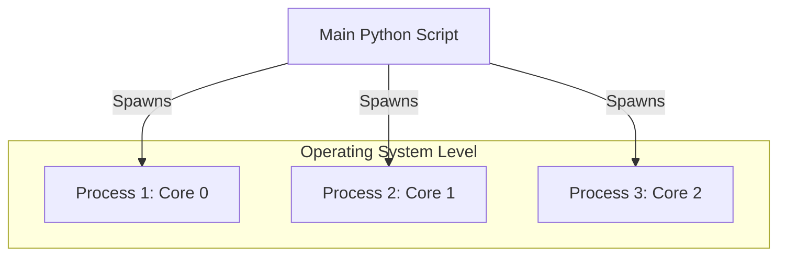

# Day 062: Concurrency - Multiprocessing (multiprocessing)

> **Difficulty:** Advanced | **Topic:** Concurrency | **Reading Time:** 15 mins

---

## 🎯 Learning Objectives
- Understand the Global Interpreter Lock (GIL) and why CPU-bound tasks require multiprocessing instead of multithreading.
- Master the creation and lifecycle management of independent processes using Python's built-in `multiprocessing` module.
- Safely share state and exchange data between distinct processes using `Queue` and `Pipe` primitives.
- Synchronize concurrent process execution effectively utilizing `Lock` and `Pool` patterns.

---

## 📚 Theory & Concepts

In Python, the standard implementation (CPython) utilizes a mechanism known as the **Global Interpreter Lock (GIL)**. The GIL is a mutual-exclusion lock that prevents multiple native threads from executing Python bytecodes at once. While this simplifies memory management and C-extension integration, it renders standard multithreading (`threading` module) useless for accelerating **CPU-bound operations** (such as heavy numerical calculations, image processing, or data crunching), because threads take turns running on a single CPU core.

To bypass the GIL and achieve true parallelism across multiple CPU cores, we must use **multiprocessing**. 

### The Multiprocessing Model
Instead of threads sharing the same memory space, the `multiprocessing` module spawns **independent child processes**. Each process gets its own:
- Private memory space.
- Distinct Python interpreter instance.
- Dedicated GIL.



Because memory is isolated between processes, data cannot be shared implicitly via normal variables. Instead, processes communicate via explicit inter-process communication (IPC) mechanisms like **Queues**, **Pipes**, or shared memory structures (`Value`, `Array`).

---

## 💻 Syntax & Structure

The fundamental building block for creating a process is the `Process` class. A target function is passed to the process, which is then started via `.start()` and joined back via `.join()`.

```python
import multiprocessing
import os

def worker_function(name: str) -> None:
    """A sample worker function executing in a separate process."""
    print(f"Process {name} started with PID: {os.getpid()}")

if __name__ == "__main__":
    # Always protect the entry point in multiprocessing scripts
    p = multiprocessing.Process(target=worker_function, args=("Alpha",))
    
    p.start() # Launch the process
    p.join()  # Wait for the process to finish execution
    print("Main process exiting.")
```

For high-level data parallelism, the `Pool` class manages a worker pool of processes, allowing tasks to be distributed seamlessly using methods like `.map()` or `.apply_async()`.

```python
from multiprocessing import Pool

def square(n: int) -> int:
    return n * n

if __name__ == "__main__":
    with Pool(processes=4) as pool:
        results = pool.map(square, [1, 2, 3, 4, 5])
    print(results)
```

---

## 🧪 Code Examples

Below is a comprehensive script demonstrating process creation, inter-process communication via `multiprocessing.Queue`, and parallel CPU-bound work dispatch via `multiprocessing.Pool`.

```python
import multiprocessing
import os
import time

def compute_factorial(number: int, queue: multiprocessing.Queue) -> None:
    """Computes factorial of a number and puts the result in a thread-safe Queue."""
    print(f"[PID {os.getpid()}] Calculating factorial for {number}...")
    
    # Simulate CPU-heavy work
    result = 1
    for i in range(1, number + 1):
        result *= i
        time.sleep(0.01) # Simulated delay
        
    # Send tuple (input, result) back through the queue
    queue.put((number, result))
    print(f"[PID {os.getpid()}] Finished factorial for {number}.")

def cpu_bound_task(x: int) -> int:
    """A helper function for Pool mapping."""
    return x ** 2

if __name__ == "__main__":
    # Crucial guard for Windows and macOS start methods ('spawn' or 'forkserver')
    multiprocessing.freeze_support()
    
    print("=== PART 1: Manual Process & Queue IPC ===")
    task_queue = multiprocessing.Queue()
    numbers_to_process = [5, 7, 10]
    processes = []

    # Spawn individual processes
    for num in numbers_to_process:
        p = multiprocessing.Process(
            target=compute_factorial, 
            args=(num, task_queue)
        )
        processes.append(p)
        p.start()

    # Wait for all processes to complete
    for p in processes:
        p.join()

    # Retrieve results from the Queue
    while not task_queue.empty():
        num, res = task_queue.get()
        print(f"Result -> Factorial of {num} is {res}")

    print("\n=== PART 2: Using multiprocessing.Pool ===")
    data = [1, 2, 3, 4, 5, 6, 7, 8]
    
    # Create a process pool utilizing available CPU cores
    with multiprocessing.Pool(processes=os.cpu_count()) as pool:
        squared_results = pool.map(cpu_bound_task, data)
        
    print(f"Original data: {data}")
    print(f"Squared data via Pool: {squared_results}")
    
    print("\nAll multiprocessing tasks completed successfully.")
```

---

## 📊 Expected Output

```text
=== PART 1: Manual Process & Queue IPC ===
[PID 14201] Calculating factorial for 5...
[PID 14202] Calculating factorial for 7...
[PID 14203] Calculating factorial for 10...
[PID 14201] Finished factorial for 5...
[PID 14202] Finished factorial for 7...
[PID 14203] Finished factorial for 10...
Result -> Factorial of 5 is 120
Result -> Factorial of 7 is 5040
Result -> Factorial of 10 is 3628800

=== PART 2: Using multiprocessing.Pool ===
Original data: [1, 2, 3, 4, 5, 6, 7, 8]
Squared data via Pool: [1, 4, 9, 16, 25, 36, 49, 64]

All multiprocessing tasks completed successfully.
```

---

## 🌍 Real-World Applications
1. **Data Science and Machine Learning Data Pipelines:** Pre-processing large arrays, tokenizing text corpora, or augmenting image datasets across multiple CPU cores prior to neural network ingestion.
2. **Web Scraping and Crawling:** Running isolated browser instances or scraping routines concurrently to scrape millions of pages without blocking the main event loop.
3. **Scientific Simulations:** Executing Monte Carlo simulations, numerical integrations, or physics calculations that demand intensive CPU cycles.
4. **Image and Video Processing:** Encoding video files, rendering frames, or applying heavy filters by splitting a video file into chunks processed by separate CPU cores.

---

## 💡 Best Practices
- Always wrap execution code blocks with `if __name__ == '__main__':` to prevent infinite recursive process spawning on operating systems that use the `spawn` start method (like Windows and macOS).
- Prefer high-level abstractions like `multiprocessing.Pool` or `concurrent.futures.ProcessPoolExecutor` over raw `Process` objects for cleaner syntax and automated worker management.
- Minimize data serialization overhead. Transferring massive objects between processes via Queues creates performance bottlenecks due to `pickle` serialization costs.
- Avoid shared state where possible ("*Do not communicate by sharing memory; instead, share memory by communicating*"). Use Queues or Pipes rather than global variables with locks.

---

## 📝 Summary & Key Takeaways
Today you learned how to bypass Python's Global Interpreter Lock (GIL) by utilizing the `multiprocessing` module to run heavy tasks in parallel across multiple CPU cores. You explored manual process management, inter-process communication using `Queue`, and simplified data parallelism via process pools. 

Tomorrow, on **Day 63**, we will explore **Asynchronous Programming with `asyncio`**, diving into event loops, coroutines, and non-blocking I/O operations!
