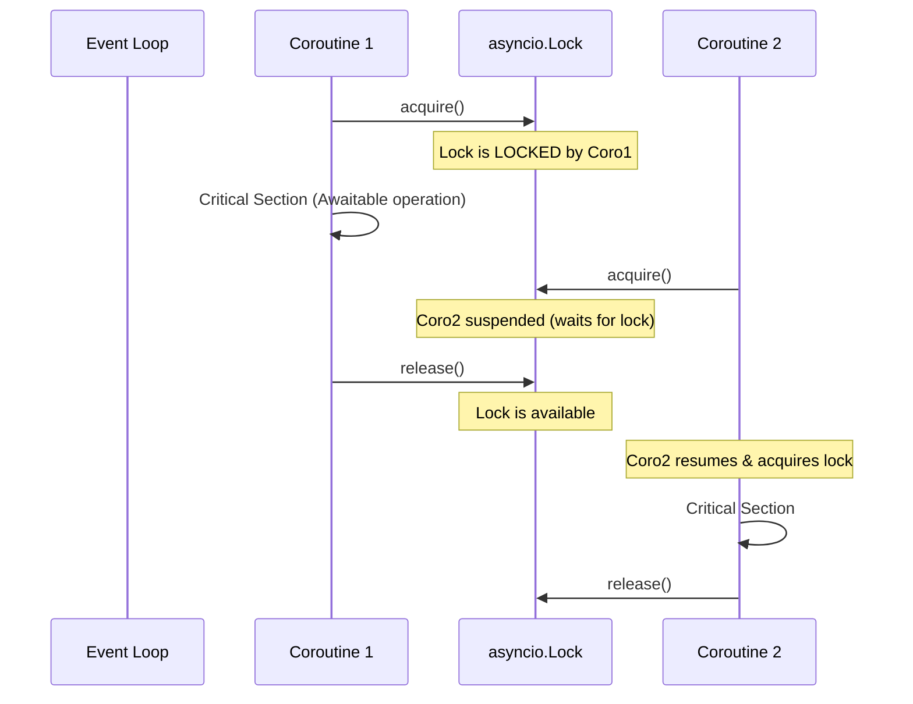

# Day 064: Asynchronous Programming (asyncio) - Part 2

> **Difficulty:** Advanced | **Topic:** Async Python | **Reading Time:** 15 mins

---

## 🎯 Learning Objectives
- Master concurrent task execution using `asyncio.gather()` and `asyncio.TaskGroup`.
- Understand how to protect critical sections and coordinate coroutines using `asyncio.Lock`.
- Implement robust timeout management and task cancellation strategies with `asyncio.wait_for()`.
- Scale asynchronous workflows safely while avoiding common concurrency hazards.

---

## 📚 Theory & Concepts

Building upon the foundational concepts of event loops, coroutines, and `await` keywords from Day 63, today we explore the advanced orchestration of asynchronous tasks in Python. 

In real-world applications, running coroutines sequentially defeats the purpose of async programming. We need structured ways to launch multiple tasks concurrently, aggregate their results, protect shared resources from race conditions, and gracefully handle timeouts or cancellations.

### Concurrency Primitives: `gather` vs. `TaskGroup`
Python provides multiple mechanisms to run operations concurrently:
1. **`asyncio.gather(*aws, return_exceptions=False)`**: Takes an arbitrary number of awaitables and runs them concurrently. If `return_exceptions=False` (default), the first raised exception immediately propagates, cancelling remaining tasks. If `return_exceptions=True`, exceptions are treated like successful results and returned in the final list.
2. **`asyncio.TaskGroup` (Python 3.11+)**: The modern, structured concurrency approach. A task group acts as an asynchronous context manager. If any task within the group raises an exception, the context manager cancels all remaining active tasks and re-raises an `ExceptionGroup`. This prevents orphaned background tasks.

### Synchronization: `asyncio.Lock`
Even though Python's single-threaded event loop prevents traditional multi-threading race conditions, context switches happen at `await` boundaries. If two coroutines read, mutate, and write to a shared state across an `await` statement, data corruption can occur. An `asyncio.Lock` ensures mutual exclusion over critical sections.



---

## 💻 Syntax & Structure

Here is how you structure structured task groups, gather calls, and locks in modern Python:

```python
import asyncio

async def worker(lock: asyncio.Lock, name: str):
    async with lock:
        # Critical section protected against concurrent access
        print(f"{name} acquired the lock")
        await asyncio.sleep(0.1)
    print(f"{name} released the lock")

async def main():
    lock = asyncio.Lock()
    
    # Structured Concurrency using TaskGroup (Python 3.11+)
    async with asyncio.TaskGroup() as tg:
        task1 = tg.create_task(worker(lock, "Task-A"))
        task2 = tg.create_task(worker(lock, "Task-B"))

asyncio.run(main())
```

---

## 🧪 Code Examples

Below is a comprehensive script demonstrating concurrent API requests, structured error handling via `TaskGroup`, resource synchronization with `asyncio.Lock`, and timeout management with `asyncio.wait_for()`.

```python
import asyncio
import time

# Simulated database or counter to demonstrate resource locking
class SharedCounter:
    def __init__(self):
        self.value = 0
        self.lock = asyncio.Lock()

    async def increment(self, amount: int):
        async def _modify():
            # Simulating an async IO delay during a read/modify/write cycle
            current = self.value
            await asyncio.sleep(0.05) 
            self.value = current + amount
            print(f"Updated counter to: {self.value}")

        # Protect the critical section using asyncio.Lock
        async with self.lock:
            await _modify()

async def fetch_mock_data(endpoint_id: int, delay: float) -> str:
    """Simulates a network call with variable latency."""
    print(f"Fetching from endpoint {endpoint_id}...")
    await asyncio.sleep(delay)
    if endpoint_id == 3:
        raise ConnectionError(f"Endpoint {endpoint_id} failed!")
    return f"Data from endpoint {endpoint_id}"

async def process_with_timeout():
    """Demonstrates handling timeouts using asyncio.wait_for."""
    try:
        # This will raise asyncio.TimeoutError because sleep exceeds timeout
        await asyncio.wait_for(asyncio.sleep(1.0), timeout=0.2)
    except asyncio.TimeoutError:
        print("Operation timed out gracefully!")

async def main():
    start_time = time.perf_counter()
    counter = SharedCounter()

    print("--- 1. Concurrent Execution with TaskGroup & Exception Handling ---")
    try:
        async with asyncio.TaskGroup() as tg:
            # Launching multiple tasks concurrently
            t1 = tg.create_task(fetch_mock_data(1, 0.2))
            t2 = tg.create_task(fetch_mock_data(2, 0.3))
            # Task 3 will fail, which cancels t1 and t2 automatically in Python 3.11+
            t3 = tg.create_task(fetch_mock_data(3, 0.1))
    except Exception as e:
        print(f"Caught exception from TaskGroup: type={type(e).__name__}, details={e}")

    print("\n--- 2. Using asyncio.gather with return_exceptions=True ---")
    # Gather results while capturing exceptions individually without crashing whole batch
    results = await asyncio.gather(
        fetch_mock_data(1, 0.1),
        fetch_mock_data(3, 0.1), # Fails
        return_exceptions=True
    )
    for idx, res in enumerate(results, start=1):
        if isinstance(res, Exception):
            print(f"Task {idx} failed with: {res}")
        else:
            print(f"Task {idx} succeeded with: {res}")

    print("\n--- 3. Mutating Shared State with asyncio.Lock ---")
    # Launch concurrent increments to verify lock synchronization
    async with asyncio.TaskGroup() as tg:
        for i in range(5):
            tg.create_task(counter.increment(10))

    print("\n--- 4. Timeout Management ---")
    await process_with_timeout()

    elapsed = time.perf_counter() - start_time
    print(f"\nAll operations completed in {elapsed:.2f} seconds.")

if __name__ == "__main__":
    asyncio.run(main())
```

---

## 📊 Expected Output

```text
--- 1. Concurrent Execution with TaskGroup & Exception Handling ---
Fetching from endpoint 1...
Fetching from endpoint 2...
Fetching from endpoint 3...
Caught exception from TaskGroup: type=ExceptionGroup, details=unhandled errors in a TaskGroup (1 sub-exception)

--- 2. Using asyncio.gather with return_exceptions=True ---
Fetching from endpoint 1...
Fetching from endpoint 3...
Task 1 succeeded with: Data from endpoint 1
Task 2 failed with: Endpoint 3 failed!

--- 3. Mutating Shared State with asyncio.Lock ---
Updated counter to: 10
Updated counter to: 20
Updated counter to: 30
Updated counter to: 40
Updated counter to: 50

--- 4. Timeout Management
Operation timed out gracefully!

All operations completed in 0.58 seconds.
```

---

## 🌍 Real-World Applications
- **Asynchronous Web Crawlers & Scrapers**: Fetching thousands of URLs concurrently using `asyncio.TaskGroup` while throttling requests through shared locks or semaphores to respect rate limits.
- **Microservice API Gateways**: Aggregating downstream responses from multiple independent services simultaneously using `asyncio.gather()`, with rigorous timeout handlers to prevent blocked threads when a downstream service hangs.
- **Real-time Data Streaming**: Processing inbound WebSocket frames or MQTT messages where multiple workers concurrently mutate an in-memory session store protected by `asyncio.Lock`.

---

## 💡 Best Practices
- **Prefer `asyncio.TaskGroup` over `asyncio.gather()`** in Python 3.11+ because it provides structured concurrency semantics, ensuring child tasks never escape their scope and exceptions are propagated cleanly.
- **Always handle `asyncio.TimeoutError`** when invoking external network calls or database queries wrapped in `asyncio.wait_for()`.
- **Keep Critical Sections Short**: When using `asyncio.Lock`, minimize the code inside the `async with lock:` block. Never perform heavy CPU-bound computations or blocking network I/O inside a lock without an `await`.
- **Avoid Blocking Calls**: Never call synchronous blocking libraries (like standard `time.sleep()` or blocking database drivers like `sqlite3` or legacy `requests`) directly inside coroutines; offload them using `asyncio.to_thread()`.

---

## 📝 Summary & Key Takeaways
Today we elevated our asynchronous Python capabilities by mastering advanced concurrency patterns. We learned how `asyncio.TaskGroup` brings modern structured concurrency to Python, how `asyncio.gather` handles batch collection with exception shielding, and how `asyncio.Lock` protects shared state against concurrency bugs. 

Tomorrow, in **Day 065**, we will explore asynchronous network programming and build high-performance TCP/UDP servers and clients using `asyncio` streams. See you there!
