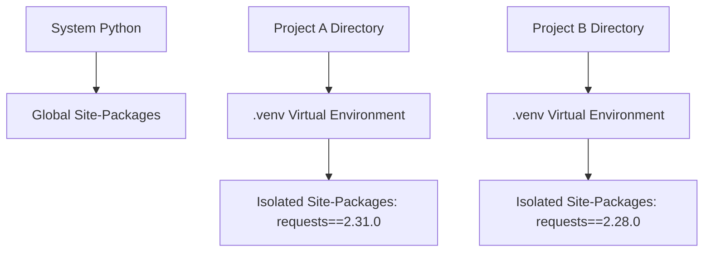

# Day 066: Virtual Environments & Package Management (pip)

> **Difficulty:** Intermediate | **Topic:** DevOps & Tooling | **Reading Time:** 15 mins

---

## 🎯 Learning Objectives
- Understand the architectural need for virtual environments and isolated dependency scopes in modern Python projects.
- Master the creation, activation, and management of virtual environments using the built-in `venv` module.
- Effectively utilize `pip` to install, upgrade, uninstall, and lock third-party packages.
- Generate and consume standard `requirements.txt` configuration files for reproducible deployments.

---

## 📚 Theory & Concepts

When developing Python applications, you will inevitably rely on third-party libraries (e.g., `requests`, `pandas`, `fastapi`). By default, Python installs all packages into a shared global system directory (e.g., `/usr/local/lib/python3.12/site-packages`). 

This global approach introduces severe engineering challenges:
1. **Version Conflicts:** Project A requires `django==3.2`, while Project B requires `django==4.2`. A global installation forces you to choose only one, breaking the other project.
2. **System Stability:** Operating systems (like Ubuntu or macOS) rely on system Python packages. Altering global environments can break critical OS tooling.
3. **Reproducibility Issues:** Without knowing the exact versions of all installed packages, deploying code to production or sharing it with team members leads to the dreaded *"It works on my machine"* phenomenon.

### The Virtual Environment Solution

A **Virtual Environment** is a self-contained directory tree that contains a specific Python interpreter and a private set of site-packages. When active, any package installed via `pip` goes exclusively into that isolated directory, leaving your system Python and other projects completely untouched.



---

## 💻 Syntax & Structure

Virtual environments are managed natively using the built-in `venv` module. Below is the standard command-line syntax for creating, activating, and managing environments and dependencies.

```bash
# 1. Create a virtual environment named '.venv' in the current directory
python -m venv .venv

# 2. Activate the virtual environment
# On macOS / Linux:
source .venv/bin/activate
# On Windows (Command Prompt):
.venv\Scripts\activate.bat
# On Windows (PowerShell):
.venv\Scripts\Activate.ps1

# 3. Upgrade pip inside the environment
python -m pip install --upgrade pip

# 4. Install a package
pip install requests==2.31.0

# 5. Export installed packages to a requirements file
pip freeze > requirements.txt

# 6. Install packages from a requirements file
pip install -r requirements.txt

# 7. Deactivate the virtual environment
deactivate
```

---

## 🧪 Code Examples

Since package management and virtual environments are managed primarily via the terminal rather than execution scripts, this demonstration walks through a programmatic simulation of checking environment isolation using Python's standard library, alongside how a production script consumes managed dependencies.

```python
# check_env.py
import sys
import os
import importlib.metadata

def inspect_python_environment():
    """Inspects the current runtime environment to verify isolation."""
    print("=" * 60)
    print("PYTHON ENVIRONMENT DIAGNOSTICS")
    print("=" * 60)
    
    # Path to the current Python interpreter executable
    print(f"Interpreter Path : {sys.executable}")
    
    # Check if running inside a virtual environment
    is_virtual = hasattr(sys, 'real_prefix') or (
        hasattr(sys, 'base_prefix') and sys.base_prefix != sys.prefix
    )
    print(f"Is Virtual Env?  : {is_virtual}")
    
    if is_virtual:
        print(f"Base Prefix      : {sys.base_prefix}")
        print(f"Virtual Prefix   : {sys.prefix}")
    
    print("-" * 60)
    print("INSTALLED PACKAGES IN THIS SCOPE:")
    print("-" * 60)
    
    # List all distributions installed in the active environment
    distributions = sorted(
        [(dist.metadata['Name'], dist.version) for dist in importlib.metadata.distributions()],
        key=lambda x: x[0].lower()
    )
    
    for name, version in distributions:
        print(f" - {name} ({version})")
        
    print("=" * 60)

if __name__ == "__main__":
    inspect_python_environment()
```

---

## 📊 Expected Output

When you run the script above inside an activated virtual environment containing a few managed dependencies, your terminal output will look like this:

```text
============================================================
PYTHON ENVIRONMENT DIAGNOSTICS
============================================================
Interpreter Path : /home/developer/my_project/.venv/bin/python
Is Virtual Env?  : True
Base Prefix      : /usr
Virtual Prefix   : /home/developer/my_project/.venv
------------------------------------------------------------
INSTALLED PACKAGES IN THIS SCOPE:
------------------------------------------------------------
 - certifi (2023.11.17)
 - charset-normalizer (3.3.2)
 - idna (3.6)
 - pip (23.3.1)
 - requests (2.31.0)
 - urllib3 (2.1.0)
============================================================
```

---

## 🌍 Real-World Applications

- **Microservices Architecture:** A single developer workstation might run a Flask API requiring `SQLAlchemy 1.4` and a FastAPI service requiring `SQLAlchemy 2.0`. Virtual environments allow side-by-side development without dependency collisions.
- **CI/CD Pipelines & Docker Containers:** Automated build servers create fresh virtual environments on every commit, executing `pip install -r requirements.txt` to guarantee that production builds match local testing configurations precisely.
- **Security & Auditing:** Isolating dependencies makes it straightforward to audit packages for vulnerabilities using tools like `pip-audit` without scanning irrelevant global machine libraries.

---

## 💡 Best Practices

- **Always use `.venv`:** Name your virtual environment directory `.venv` so it is easily recognized by IDEs (like VS Code or PyCharm) and automatically ignored by `.gitignore`.
- **Never commit `.venv`:** Virtual environments contain machine-specific binaries and absolute paths. Do not check them into Git repositories; instead, commit `requirements.txt` or `pyproject.toml`.
- **Pin your dependencies:** Always specify exact package versions in production (`requests==2.31.0` rather than just `requests`) to prevent unexpected breakage when upstream packages release breaking changes.
- **Common Pitfall:** Forgetting to activate your virtual environment before running `pip install`, which inadvertently pollutes your global system Python environment.

---

## 📝 Summary & Key Takeaways

Today you learned how to isolate Python project dependencies using virtual environments via `venv` and manage external code libraries using `pip`. You now possess the foundational DevOps knowledge required to maintain clean, reproducible, and conflict-free Python projects.

Tomorrow, in **Day 067**, we will explore **Advanced Package Management & Poetry**, taking dependency resolution and publishing to the next level!
