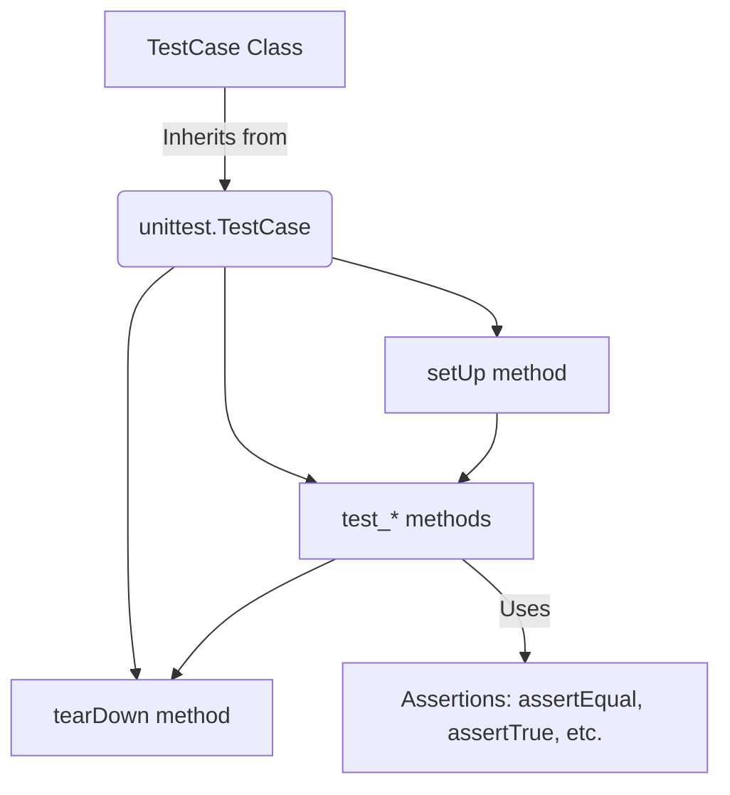

# Day 067: Unit Testing with unittest Framework

> **Difficulty:** Intermediate | **Topic:** Testing | **Reading Time:** 15 mins

---

## 🎯 Learning Objectives
- Understand the fundamental concepts of software testing and why unit testing is crucial for maintainable code.
- Master the built-in Python `unittest` framework, including test cases, test suites, and assertions.
- Write robust, isolated unit tests for functions and classes following industry best practices.
- Automate test execution and interpret test results and failure reports effectively.

---

## 📚 Theory & Concepts

As your Python applications grow from simple scripts into complex systems, ensuring that your code behaves as expected becomes a monumental task. Manually testing every function after a change is tedious, error-prone, and unsustainable. This is where **Unit Testing** comes in.

A **unit test** is a piece of code written by a developer to verify that a small, specific piece of code (usually a function or a method) works correctly in isolation. 

### Why Unit Testing Matters
1. **Regression Prevention:** Ensures that new code changes do not break existing functionality.
2. **Living Documentation:** Well-written tests serve as concrete examples of how your functions and classes are meant to be used.
3. **Design Improvement:** Code that is easy to test is usually modular, decoupled, and cleanly designed.

### The `unittest` Framework
Python comes with a built-in testing framework inspired by Java's JUnit, appropriately named `unittest`. It provides a rich set of tools for constructing and running tests.



Key components of `unittest`:
- **Test Fixture (`setUp` and `tearDown`):** Code executed before and after every test method to set up and clean up states (like opening database connections or creating temporary files).
- **Test Case:** The individual unit of testing encapsulated by inheriting from `unittest.TestCase`.
- **Assertions:** Methods provided by `unittest.TestCase` (e.g., `assertEqual()`, `assertTrue()`, `assertRaises()`) to check if conditions are met.

---

## 💻 Syntax & Structure

To write a unit test using `unittest`, you create a class that inherits from `unittest.TestCase` and define methods whose names start with the prefix `test_`.

```python
import unittest

# The code we want to test
def add(a, b):
    return a + b

# Our Unit Test Class
class TestMathOperations(unittest.TestCase):

    def setUp(self):
        # Optional: Initialize data before each test method
        pass

    def tearDown(self):
        # Optional: Clean up after each test method
        pass

    def test_add_positive_numbers(self):
        # Test core functionality
        result = add(2, 3)
        self.assertEqual(result, 5)

    def test_add_negative_numbers(self):
        result = add(-1, -1)
        self.assertEqual(result, -2)

if __name__ == "__main__":
    unittest.main()
```

---

## 🧪 Code Examples

Let's build a real-world example. We will create a `BankAccount` class that handles deposits, withdrawals, and overdraft protections, and then write a comprehensive test suite for it using `unittest`.

```python
# bank_account.py
class InsufficientFundsError(Exception):
    """Raised when an account has insufficient funds for a withdrawal."""

    pass

class BankAccount:

    def __init__(self, owner: str, balance: float = 0.0):
        self.owner = owner
        self.balance = balance

    def deposit(self, amount: float) -> float:
        if amount <= 0:
            raise ValueError("Deposit amount must be positive.")
        self.balance += amount
        return self.balance

    def withdraw(self, amount: float) -> float:
        if amount <= 0:
            raise ValueError("Withdrawal amount must be positive.")
        if amount > self.balance:
            raise InsufficientFundsError(
                f"Attempted to withdraw {amount} with balance {self.balance}"
            )
        self.balance -= amount
        return self.balance
```

Now, let's write the test suite in a separate file or block:

```python
# test_bank_account.py
import unittest
from bank_account import BankAccount, InsufficientFundsError

class TestBankAccount(unittest.TestCase):
    """Test suite for the BankAccount class."""

    def setUp(self):
        """Set up a fresh BankAccount instance before each test."""
        self.account = TestBankAccount.create_default_account()

    @staticmethod
    def create_default_account():
        return BankAccount("Alice", 100.0)

    def test_initial_balance(self):
        self.assertEqual(self.account.balance, 100.0)
        self.assertEqual(self.account.owner, "Alice")

    def test_deposit_valid_amount(self):
        new_balance = self.account.deposit(50.0)
        self.assertEqual(new_balance, 150.0)
        self.assertEqual(self.account.balance, 150.0)

    def test_deposit_invalid_amount(self):
        with self.assertRaises(ValueError):
            self.account.deposit(-10.0)

    def test_withdraw_valid_amount(self):
        new_balance = self.account.withdraw(40.0)
        self.assertEqual(new_balance, 60.0)
        self.assertEqual(self.account.balance, 60.0)

    def test_withdraw_insufficient_funds(self):
        with self.assertRaises(InsufficientFundsError):
            self.account.withdraw(200.0)

    def test_withdraw_invalid_amount(self):
        with self.assertRaises(ValueError):
            self.account.withdraw(0.0)

if __name__ == "__main__":
    unittest.main()
```

---

## 📊 Expected Output

When you run the test file from your terminal using Python's test runner, you will see output indicating the test status:

```text
$ python -m unittest test_bank_account.py
......
----------------------------------------------------------------------
Ran 6 tests in 0.001s

OK
```

If you introduce a bug—for instance, if `withdraw` accidentally adds money instead of subtracting—the test runner will output a detailed failure report:

```text
$ python -m unittest test_bank_account.py
.F....
======================================================================
FAIL: test_withdraw_valid_amount (test_bank_account.TestBankAccount)
----------------------------------------------------------------------
Traceback (mostional/file details...)
    self.assertEqual(new_balance, 60.0)
AssertionError: 140.0 != 60.0

----------------------------------------------------------------------
Ran 6 tests in 0.002s

FAILED (failures=1)
```

---

## 🌍 Real-World Applications

- **Financial Systems:** Verifying that banking transactions, interest calculations, and ledger balances round correctly and never lose precision.
- **API Development:** Ensuring that endpoint response payloads, status codes, and query parameters match expected interface contracts.
- **Data Engineering Pipelines:** Validating data transformation functions to make sure null values, missing columns, or malformed records do not crash downstream jobs.
- **CI/CD Pipelines:** Automated test execution on platforms like GitHub Actions or GitLab CI before any pull request can be merged into production.

---

## 💡 Best Practices

- **Keep Tests Independent:** Each test method should run in complete isolation. Never rely on the side effects or execution order of other tests.
- **Descriptive Naming:** Name your test methods clearly using the pattern `test_[feature]_[condition]_[expected_result]` (e.g., `test_withdraw_insufficient_funds_raises_error`).
- **Test Edge Cases:** Do not just test happy paths. Always test boundary values, zero values, negative inputs, and type errors.
- **Common Pitfall:** Avoid hardcoding complex business logic inside your tests. Tests should be straightforward and declarative.
- **Common Pitfall:** Do not use `print()` statements for assertions; always utilize built-in assertion methods like `self.assertEqual()` or `self.assertTrue()`.

---

## 📝 Summary & Key Takeaways

Today you learned how to harness Python's built-in `unittest` framework to write reliable and structured unit tests. You explored how `unittest.TestCase` structures test execution, how `setUp` and `tearDown` help manage state, and how context managers like `self.assertRaises()` verify exception handling. 

Tomorrow, we will level up our testing knowledge by exploring **Test-Driven Development (TDD)** and advanced mocking techniques to test code that interacts with external APIs and databases!
