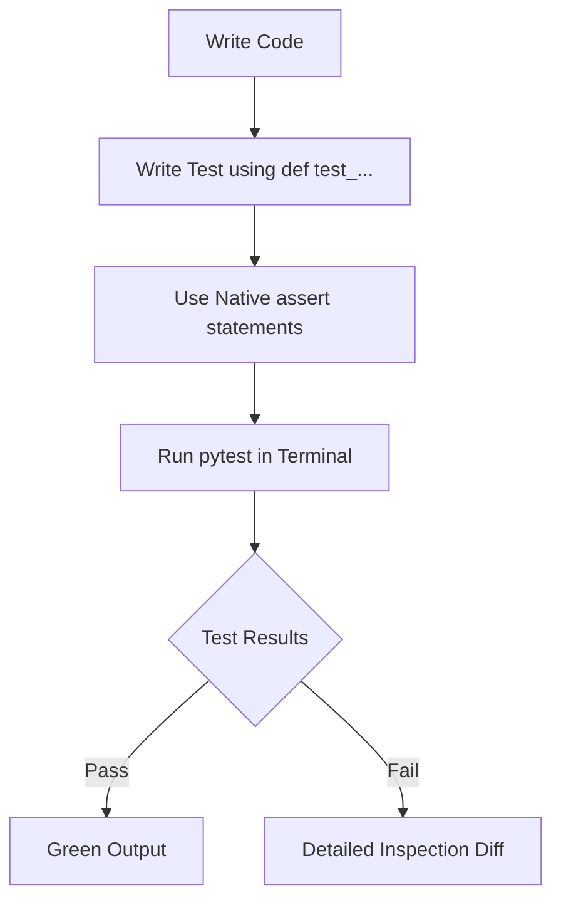

# Day 068: Modern Testing with pytest

> **Difficulty:** Intermediate | **Topic:** Testing | **Reading Time:** 15 mins

---

## 🎯 Learning Objectives
- Understand the benefits of `pytest` over traditional testing frameworks like `unittest`.
- Master the writing of idiomatic test functions and assertions using standard `assert` statements.
- Utilize fixtures for clean setup and teardown management in test suites.
- Parameterize tests to eliminate code duplication and test multiple scenarios efficiently.
- Handle expected exceptions cleanly using `pytest.raises`.

---

## 📚 Theory & Concepts

Software testing is an essential pillar of professional Python development. While Python includes a built-in testing framework called `unittest`, the `pytest` library has become the industry standard for modern Python applications due to its simplicity, scalability, and rich plugin ecosystem.

### Why `pytest`?
Traditional testing frameworks often require object-oriented boilerplate—forcing developers to create classes that inherit from `unittest.TestCase` and use specialized assertion methods like `self.assertEqual()` or `self.assertTrue()`. 

`pytest` radically streamlines this by leveraging Python's native `assert` keyword. It intelligently inspects the expressions inside failed assertions, automatically outputting detailed inspection data about the variables involved without needing explicit error messages.



### Core Concepts in `pytest`
1. **Discovery Rules:** `pytest` automatically discovers tests by looking for files starting with `test_` or ending with `_test.py`, and functions/methods starting with `test_`.
2. **Fixtures:** Reusable components that supply data, database connections, or mock objects to tests. They replace complex class-based `setUp` and `tearDown` methods with a clean, dependency-injection approach using function arguments.
3. **Parameterization:** A decorator-based mechanism (`@pytest.mark.parametrize`) that runs a single test function multiple times with different sets of inputs and expected outputs.

---

## 💻 Syntax & Structure

The syntax of `pytest` is minimalist. A test function is simply a standard Python function prefixed with `test_`.

```python
# Basic syntax structure for a pytest function
def test_addition():
    # Arrange
    x = 5
    y = 10
    
    # Act
    result = x + y
    
    # Assert (using standard Python assert)
    assert result == 15
```

When using fixtures, you pass the fixture name as an argument to the test function:

```python
import pytest

@pytest.fixture
def sample_data():
    return [1, 2, 3, 4, 5]

def test_sum(sample_data):
    assert sum(sample_data) == 15
```

---

## 🧪 Code Examples

Below is a complete, real-world example demonstrating how to structure a module under test and its corresponding test file using `pytest`.

### 1. The Source Code (`calculator.py`)
```python
# calculator.py

class InsufficientFundsError(Exception):
    """Raised when an account lacks sufficient funds for a withdrawal."""
    pass

class BankAccount:
    def __init__(self, owner: str, balance: float = 0.0):
        self.owner = owner
        self.balance = balance

    def deposit(self, amount: float) -> float:
        if amount <= 0:
            raise ValueError("Deposit amount must be positive.")
        self.balance += amount
        return self.balance

    def withdraw(self, amount: float) -> float:
        if amount <= 0:
            raise ValueError("Withdrawal amount must be positive.")
        if amount > self.balance:
            raise InsufficientFundsError("Attempted to overdraw account.")
        self.balance -= amount
        return self.balance
```

### 2. The Test Suite (`test_calculator.py`)
```python
# test_calculator.py
import pytest
from calculator import BankAccount, InsufficientFundsError

# Fixture to provide a pre-populated bank account for testing
@pytest.fixture
def fresh_account():
    return BankAccount(owner="Alice", balance=100.0)

def test_initial_balance(fresh_account):
    assert fresh_account.owner == "Alice"
    assert fresh_account.balance == 100.0

def test_deposit_valid(fresh_account):
    new_balance = fresh_account.deposit(50.0)
    assert new_balance == 150.0
    assert fresh_account.balance == 150.0

@pytest.mark.parametrize("invalid_amount", [0, -10.0, -100.5])
def test_deposit_invalid_raises_error(fresh_account, invalid_amount):
    with pytest.raises(ValueError, match="Deposit amount must be positive."):
        fresh_account.deposit(invalid_amount)

def test_withdraw_valid(fresh_account):
    remaining = fresh_account.withdraw(40.0)
    assert remaining == 60.0

def test_withdraw_overdraft_raises_error(fresh_account):
    with pytest.raises(InsufficientFundsError, match="Attempted to overdraw account."):
        fresh_account.withdraw(200.0)
```

---

## 📊 Expected Output

Running the command `pytest -v` in the terminal where your files are located produces the following output:

```text
$ pytest -v
============================= test session starts ==============================
platform darwin -- Python 3.12.0, pytest-7.4.3, pluggy-1.3.0 -- /usr/bin/python3
cachedir: .pytest_cache
rootdir: /path/to/project
collected 7 items

test_calculator.py::test_initial_balance PASSED                          [ 14%]
test_calculator.py::test_deposit_valid PASSED                            [ 28%]
test_calculator.py::test_deposit_invalid_raises_error[0] PASSED          [ 42%]
test_calculator.py::test_deposit_invalid_raises_error[-10.0] PASSED      [ 57%]
test_calculator.py::test_deposit_invalid_raises_error[-100.5] PASSED     [ 71%]
test_calculator.py::test_withdraw_valid PASSED                           [ 85%]
test_calculator.py::test_withdraw_overdraft_raises_error PASSED          [ 100%]

============================== 7 passed in 0.04s ===============================
```

---

## 🌍 Real-World Applications

- **API Development:** Testing Flask, FastAPI, or Django endpoints using `pytest` alongside testing clients (`TestClient`) to verify JSON responses, status codes, and security headers.
- **Data Engineering:** Validating data transformation pipelines to ensure edge cases (e.g., null values, schema mismatches, empty datasets) do not crash downstream jobs.
- **CI/CD Pipelines:** Integrating `pytest` checks into GitHub Actions, GitLab CI, or Jenkins to automatically block merging or deployment if unit/integration tests fail.

---

## 💡 Best Practices

- **Descriptive Naming:** Name test files `test_*.py` and test functions `test_[behavior]_[condition]` so test reports read like documentation.
- **AAA Pattern:** Structure test bodies logically into **Arrange** (setup), **Act** (execute), and **Assert** (verify) phases.
- **Single Assertion Focus:** Keep tests focused on a single logical concept or behavior to make debugging easier when a test fails.
- **Common Pitfalls to Avoid:**
  - Avoid hidden test dependencies where one test relies on state modified by a previous test. Each test must be entirely independent.
  - Avoid complex logic (loops, `if` statements) inside test functions; keep tests declarative and straightforward.

---

## 📝 Summary & Key Takeaways

Today you unlocked modern Python testing using `pytest`. You learned how native `assert` statements provide clear inspection output, how fixtures eliminate setup code duplication, and how parameterization allows for comprehensive input coverage. 

Tomorrow, in **Day 069**, we will elevate your testing architecture further by exploring **Mocking and Patching in Python**, allowing you to isolate tests from external dependencies like databases, file systems, and network APIs.
