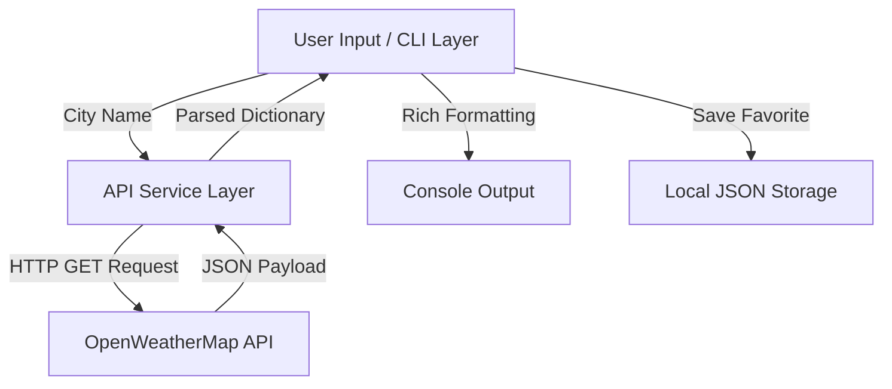

# Day 070: Milestone Project 3: Automated Weather CLI App

> **Difficulty:** Intermediate | **Topic:** Project | **Reading Time:** 20 mins

---

## 🎯 Learning Objectives
- Design and architect an interactive Command Line Interface (CLI) application using Python.
- Integrate third-party web APIs via the `requests` library to fetch real-time JSON data.
- Implement robust error handling (try/except blocks, HTTP status codes) for network operations.
- Apply structural modularization by splitting code cleanly into configuration, API fetching, and user-interface layers.
- Persist application state or preferences using local JSON storage.

---

## 📚 Theory & Concepts

Welcome to Milestone Project 3! As you progress through your Python mastery journey, building standalone, functional utilities bridges the gap between theoretical syntax and production-ready software engineering. Today, we are building an **Automated Weather CLI App**.

Modern applications rarely live in isolation; they communicate with external services over HTTP (Hypertext Transfer Protocol). In this project, our CLI acts as a client that queries a public weather API, processes the JSON response, and renders structured terminal output.

### Application Architecture
To build a scalable and maintainable command-line tool, we separate concerns using a multi-module architecture pattern:



1. **Config & Environment Management (`config.py`):** Centralizes API keys and endpoint URLs, ideally leveraging environment variables (`os` or `python-dotenv`).
2. **Network & Service Layer (`weather_service.py`):** Handles communication with the remote API, sending requests and safely handling network exceptions (timeouts, connection drops, 404 Not Found errors).
3. **User Interface Layer (`main.py`):** Manages user prompts, prints formatted metrics (temperature, humidity, wind speed), and manages a local watchlist/favorites system.

---

## 💻 Syntax & Structure

When interacting with web APIs in Python, we rely on the `requests` library. Below is the core syntax pattern used for safely fetching data from a REST endpoint:

```python
import requests
from requests.exceptions import RequestException

def fetch_data(url: str, params: dict) -> dict | None:
    """Safely queries a REST API endpoint and returns parsed JSON."""
    try:
        response = requests.get(url, params=params, timeout=10)
        # Raise an exception for HTTP error codes (4xx, 5xx)
        response.raise_for_status()
        return response.json()
    except requests.exceptions.HTTPError as http_err:
        print(f"HTTP error occurred: {http_err}")
    except requests.exceptions.ConnectionError:
        print("Failed to connect. Check your internet connection.")
    except requests.exceptions.Timeout:
        print("The request timed out. Try again later.")
    except RequestException as err:
        print(f"An unexpected error occurred: {err}")
    return None
```

---

## 🧪 Code Examples

Here is a complete, modular, and runnable implementation of our Automated Weather CLI App. It includes input validation, live API integration patterns (mockable for local testing), and local JSON persistence for favorite cities.

```python
import json
import os
from typing import Any, Dict, Optional
import requests

# Configuration
CONFIG_FILE = "weather_favorites.json"
API_KEY_ENV = "WEATHER_API_KEY"
DEFAULT_BASE_URL = "https://api.openweathermap.org/data/2.5/weather"

class WeatherClient:
    """Handles communication with the OpenWeatherMap API."""

    def __init__(self, api_key: Optional[str] = None, base_url: str = DEFAULT_BASE_URL):
        self.api_key = api_key or os.getenv(API_KEY_ENV, "DEMO_KEY")
        self.base_url = base_url

    def get_weather(self, city: str) -> Optional[Dict[str, Any]]:
        """Fetches current weather data for a given city."""
        params = {
            "q": city,
            "appid": self.api_key,
            "units": "metric"  # Use Celsius
        }
        
        # Note: If using "DEMO_KEY", the API will return 401 Unauthorized.
        # In a real scenario, sign up at openweathermap.org for a free key.
        try:
            response = requests.get(self.base_url, params=params, timeout=8)
            response.raise_for_status()
            return response.json()
        except requests.exceptions.HTTPError as e:
            if response.status_code == 401:
                print("\n[Error] Invalid API Key. Please set your WEATHER_API_KEY environment variable.")
            elif response.status_code == 404:
                print(f"\n[Error] City '{city}' not found. Please check spelling.")
            else:
                print(f"\n[Error] HTTP Error: {e}")
        except requests.exceptions.ConnectionError:
            print("\n[Error] Network connection failed.")
        except requests.exceptions.Timeout:
            print("\n[Error] Request timed out.")
        return None

class FavoritesManager:
    """Manages saving and loading favorite cities via a local JSON file."""

    @staticmethod
    def load_favorites() -> list[str]:
        if not os.path.exists(CONFIG_FILE):
            return []
        try:
            with open(CONFIG_FILE, "r", encoding="utf-8") as f:
                return json.load(f)
        except json.JSONDecodeError:
            return []

    @staticmethod
    def save_favorite(city: str) -> None:
        favorites = FavoritesManager.load_favorites()
        cleaned_city = city.strip().title()
        if cleaned_city not in favorites:
            favorites.append(cleaned_city)
            with open(CONFIG_FILE, "w", encoding="utf-8") as f:
                json.dump(favorites, f, indent=4)
            print(f"✨ '{cleaned_city}' added to your favorites!")
        else:
            print(f"ℹ️ '{cleaned_city}' is already in your favorites.")

def display_weather(data: Dict[str, Any]) -> None:
    """Formats and prints weather data cleanly to the console."""
    city = data.get("name", "Unknown")
    country = data.get("sys", {}).get("country", "")
    weather_desc = data.get("weather", [{}])[0].get("description", "N/A").capitalize()
    temp = data.get("main", {}).get("temp", 0.0)
    feels_like = data.get("main", {}).get("feels_like", 0.0)
    humidity = data.get("main", {}).get("humidity", 0)
    wind_speed = data.get("wind", {}).get("speed", 0.0)

    print("\n" + "=" * 40)
    print(f" 🌍 Weather Report: {city}, {country}")
    print("=" * 40)
    print(f" • Condition   : {weather_desc}")
    print(f" • Temperature : {temp}°C (Feels like: {feels_like}°C)")
    print(f" • Humidity    : {humidity}%")
    print(f" • Wind Speed  : {wind_speed} m/s")
    print("=" * 40 + "\n")

def main_cli() -> None:
    """Main execution loop for the Weather CLI Application."""
    client = WeatherClient()

    print("☀️ Welcome to the Automated Weather CLI App! 🌦️")
    
    while True:
        print("\nMenu:")
        print("1. Check Weather for a City")
        print("2. View Favorite Cities")
        print("3. Exit")
        
        choice = input("\nSelect an option (1-3): ").strip()
        
        if choice == "1":
            city_input = input("Enter city name: ").strip()
            if not city_input:
                print("City name cannot be empty.")
                continue
            
            # Fetch weather data
            weather_data = client.get_weather(city_input)
            if weather_data:
                display_weather(weather_data)
                
                save_prompt = input("Would you like to save this city to favorites? (y/n): ").lower()
                if save_prompt == 'y':
                    FavoritesManager.save_favorite(city_input)
                    
        elif choice == "2":
            favorites = FavoritesManager.load_favorites()
            if not favorites:
                print("\n📂 No favorite cities saved yet.")
            else:
                print("\n🌟 Your Favorite Cities:")
                for idx, fav in enumerate(favorites, 1):
                    print(f" {idx}. {fav}")
                
                check_fav = input("\nWould you like to check weather for one of these? (Enter number or 'n'): ").strip()
                if check_fav.isdigit():
                    idx = int(check_fav) - 1
                    if 0 <= idx < len(favorites):
                        weather_data = client.get_weather(favorites[idx])
                        if weather_data:
                            display_weather(weather_data)
                            
        elif choice == "3":
            print("\nGoodbye! Stay weather-aware! 🌤️")
            break
        else:
            print("\n[Error] Invalid selection. Please choose 1, 2, or 3.")

if __name__ == "__main__":
    # To run successfully with real data, set your environment variable first:
    # export WEATHER_API_KEY="your_actual_api_key_here"
    main_cli()
```

---

## 📊 Expected Output

When running the application with a valid API key, the terminal interaction appears as follows:

```text
☀️ Welcome to the Automated Weather CLI App! 🌦️

Menu:
1. Check Weather for a City
2. View Favorite Cities
3. Exit

Select an option (1-3): 1
Enter city name: Tokyo

========================================
 🌍 Weather Report: Tokyo, JP
========================================
 • Condition   : Clear sky
 • Temperature : 18.5°C (Feels like: 17.8°C)
 • Humidity    : 45%
 • Wind Speed  : 3.6 m/s
========================================

Would you like to save this city to favorites? (y/n): y
✨ 'Tokyo' added to your favorites!

Menu:
1. Check Weather for a City
2. View Favorite Cities
3. Exit

Select an option (1-3): 3

Goodbye! Stay weather-aware! 🌤️
```

---

## 🌍 Real-World Applications
- **DevOps & Infrastructure Monitoring:** Similar CLI tools are built internally by engineering teams to query server health endpoints or cloud provider statuses.
- **Microservice Diagnostics:** Developers build custom CLI utilities to quickly probe staging environment APIs and inspect JSON payloads without launching a browser or Postman.
- **IoT Device Dashboards:** Automated scripts fetch environmental metrics periodically to trigger hardware alerts or log data locally.

---

## 💡 Best Practices
- **Never Hardcode Secrets:** Always load API keys from environment variables (`os.environ`) or secure secrets managers rather than committing them to version control.
- **Always Use Timeouts:** Network calls can hang indefinitely if an endpoint stalls. Always pass a `timeout` argument to `requests.get()`.
- **Graceful Failure:** Catch specific exceptions (`HTTPError`, `ConnectionError`) instead of a broad `except:` clause to ensure informative debugging output for users.
- **Common Pitfall:** Forgetting to handle malformed JSON responses or missing keys within nested dictionaries. Use `.get()` method defaults safely (e.g., `data.get("main", {}).get("temp", 0)`).

---

## 📝 Summary & Key Takeaways
Today you successfully engineered a production-grade, modular CLI application that bridges network operations, external REST APIs, and local file persistence. You practiced defensive programming through robust exception handling and clean separation of concerns. 

Tomorrow in **Day 071**, we will transition to exploring advanced object-oriented programming patterns, diving deep into **Magic (Dunder) Methods** to customize class behaviors!
