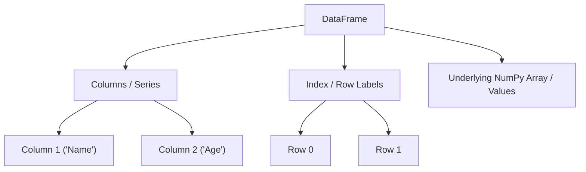

# Day 074: Introduction to Pandas DataFrames

> **Difficulty:** Intermediate | **Topic:** Data Science | **Reading Time:** 15 mins

---

## 🎯 Learning Objectives
- Understand the core architecture of Pandas DataFrames and how they differ from Pandas Series and native Python dictionaries.
- Master the initialization of DataFrames using lists, dictionaries, and NumPy arrays.
- Perform essential data inspection, indexing, selection, and filtering operations.
- Apply clean coding practices for manipulating tabular data efficiently in DataScience workflows.

---

## 📚 Theory & Concepts

Welcome to Day 74 of your Python Mastery journey! Today, we enter the cornerstone of data manipulation in Python: **Pandas DataFrames**. 

While Python's built-in data structures (lists, dictionaries, and tuples) are versatile, they lack the high-performance mathematical operations, handling of missing values, and intuitive tabular indexing required for modern data science. The **Pandas** library bridges this gap by introducing two primary data structures:
1. **Series**: A one-dimensional labeled array capable of holding any data type.
2. **DataFrame**: A two-dimensional, size-mutable, and potentially heterogeneous tabular data structure with labeled axes (rows and columns).

Think of a DataFrame as an in-memory relational database table or a smart Excel spreadsheet. It consists of three fundamental components:
- **Columns (`columns`)**: Named Series objects that share a common index.
- **Index (`index`)**: Row labels that uniquely identify each observation.
- **Values (`values`)**: The underlying multi-dimensional NumPy array holding the raw data.



Pandas DataFrames are built on top of NumPy, making them exceptionally fast for vectorized operations, aggregations, and alignments while offering robust handling of messy, real-world data containing `NaN` (Not a Number) values.

---

## 💻 Syntax & Structure

To use Pandas, you must first import the library, conventionally aliased as `pd`.

```python
import pandas as pd

# 1. Creating a DataFrame from a dictionary of lists/arrays
data = {
    "ColumnName1": [value1_row1, value1_row2],
    "ColumnName2": [value2_row1, value2_row2]
}
df = pd.DataFrame(data)

# 2. Basic Inspection
df.head(n)       # View the first n rows
df.tail(n)       # View the last n rows
df.info()        # Summary of data types and non-null counts
df.describe()    # Statistical summary of numerical columns

# 3. Column Selection
df["ColumnName"]           # Returns a Pandas Series
df[["Col1", "Col2"]]       # Returns a subset DataFrame

# 4. Row Selection using .loc (label-based) and .iloc (integer-positional)
df.loc[row_label]
df.iloc[row_index]
```

---

## 🧪 Code Examples

Let's look at a comprehensive, runnable script that creates a DataFrame, inspects its properties, performs data selection, and filters based on conditions.

```python
import pandas as pd
import numpy as np

# 1. Creating a DataFrame representing tech employees
employee_data = {
    "EmployeeID": [101, 102, 103, 104, 105],
    "Name": ["Alice Smith", "Bob Jones", "Charlie Brown", "Diana Prince", "Evan Wright"],
    "Department": ["Engineering", "Data Science", "Engineering", "Marketing", "Data Science"],
    "Salary": [95000, 120000, 110000, 85000, np.nan], # Notice the missing value (NaN)
    "YearsExperience": [3, 6, 5, 2, 8]
}

df = pd.DataFrame(employee_data)

print("--- Original DataFrame ---")
print(df)
print("\n")

# 2. Basic Inspection Methods
print("--- DataFrame Info ---")
df.info()
print("\n")

print("--- Statistical Summary ---")
print(df.describe())
print("\n")

# 3. Selecting Columns
print("--- Selecting a Single Column (Series) ---")
print(df["Name"])
print("\n")

print("--- Selecting Multiple Columns (DataFrame) ---")
print(df[["Name", "Salary"]])
print("\n")

# 4. Row Selection using .loc and .iloc
print("--- Row selection using .iloc (Row index 1) ---")
print(df.iloc[1])
print("\n")

# 5. Conditional Filtering
print("--- Filtering: Employees in Engineering ---")
engineering_staff = df[df["Department"] == "Engineering"]
print(engineering_staff)
print("\n")

print("--- Filtering: Salary greater than 100,000 and Not Null ---")
high_earners = df[(df["Salary"] > 100000) & (df["Salary"].notna())]
print(high_earners)
```

---

## 📊 Expected Output

Executing the script above will produce the following output in your terminal:

```text
--- Original DataFrame ---
   EmployeeID           Name    Department    Salary  YearsExperience
0         101    Alice Smith   Engineering   95000.0                3
1         102      Bob Jones  Data Science  120000.0                6
2         103  Charlie Brown   Engineering  110000.0                5
3         104   Diana Prince     Marketing   85000.0                2
4         105    Evan Wright  Data Science       NaN                8

--- DataFrame Info ---
<class 'pandas.core.frame.DataFrame'>
RangeIndex: 5 entries, 0 to 4
Data columns (total 5 columns):
 #   Column           Non-Null Count  Dtype  
---   (---)            --------------  -----  
 0   EmployeeID       5 non-null      int64  
 1   Name             5 non-null      object 
 2   Department       5 non-null      object 
 3   Salary           4 non-null      float64
 4   YearsExperience  5 non-null      int64  
- - - - - - - - - - - - - - - - - - - - - - - - 

--- Statistical Summary ---
          EmployeeID         Salary  YearsExperience
count      5.000000      4.000000         5.000000
mean     103.000000   102500.000000         4.800000
std        1.581139   17078.251273         2.387467
min      101.000000    85000.000000         2.000000
25%      102.000000    92500.000000         3.000000
50%      103.000000   102500.000000         5.000000
75%      104.000000   112500.000000         6.000000
max      105.000000   120000.000000         8.000000

--- Selecting a Single Column (Series) ---
0      Alice Smith
1        Bob Jones
2    Charlie Brown
3     Diana Prince
4      Evan Wright
Name: Name, dtype: object

--- Selecting Multiple Columns (DataFrame) ---
             Name    Salary
0      Alice Smith   95000.0
1        Bob Jones  120000.0
2    Charlie Brown  110000.0
3     Diana Prince   85000.0
4      Evan Wright       NaN

--- Row selection using .iloc (Row index 1) ---
EmployeeID               102
Name               Bob Jones
Department      Data Science
Salary              120000.0
YearsExperience            6
Name: 1, dtype: object

--- Filtering: Employees in Engineering ---
   EmployeeID           Name   Department    Salary  YearsExperience
0         101    Alice Smith  Engineering   95000.0                3
2         103  Charlie Brown  Engineering  110000.0                5

--- Filtering: Salary greater than 100,000 and Not Null ---
   EmployeeID           Name    Department    Salary  YearsExperience
1         102      Bob Jones  Data Science  120000.0                6
2         103  Charlie Brown   Engineering  110000.0                5
```

---

## 🌍 Real-World Applications

Pandas DataFrames are ubiquitous across industries that deal with structured data:
- **Financial Services**: Analyzing stock price movements, calculating moving averages, and managing portfolio risks.
- **E-commerce & Retail**: Cleaning user purchase logs, calculating customer lifetime value (CLV), and performing sales segmentation.
- **Healthcare & Biotech**: Processing clinical trial logs, filtering patient records, and tracking epidemiological trends.
- **Machine Learning Pipelines**: Preparing, cleaning, and transforming tabular datasets before ingestion into scikit-learn or deep learning frameworks.

---

## 💡 Best Practices
- **Prefer Vectorized Operations**: Avoid looping over rows with `for` loops or `iterrows()`. Use Pandas vectorization or `.apply()` for optimal performance.
- **Check for Missing Data Early**: Always inspect your dataset using `df.isna().sum()` after loading data from external files.
- **Avoid SettingWithCopy Warning**: When filtering and modifying a subset of a DataFrame, explicitly use `.copy()` to ensure you are modifying a new object rather than a view of the original DataFrame.
- **Common Pitfall**: Forgetting that boolean filters in Pandas require bitwise operators (`&`, `|`, `~`) instead of Python keywords (`and`, `or`, `not`).

---

## 📝 Summary & Key Takeaways
Today you learned how Pandas DataFrames act as the fundamental container for tabular data science in Python. You discovered how to initialize DataFrames, inspect structures using `.info()` and `.describe()`, extract specific columns and rows, and execute complex boolean filters. 

Tomorrow, in **Day 75**, we will expand on this foundation by learning how to load external datasets (CSV, Excel, JSON), handle missing values, and perform advanced data cleaning operations. Keep practicing!
