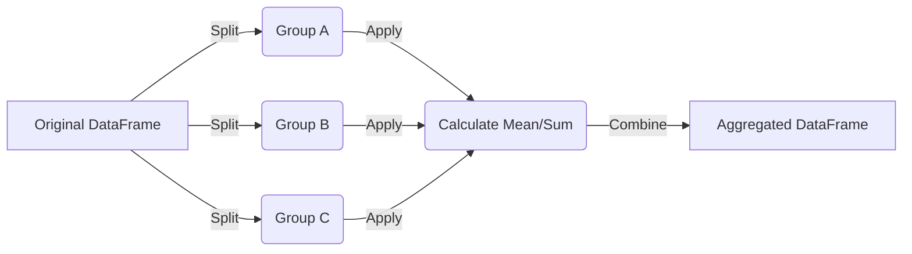

# Day 077: Pandas GroupBy & Aggregation

> **Difficulty:** Intermediate | **Topic:** Data Science | **Reading Time:** 15 mins

---

## 🎯 Learning Objectives
- Understand the Split-Apply-Combine conceptual framework used in data analysis.
- Master the `groupby()` method in Pandas to categorize and group structured data.
- Apply single, multiple, and custom aggregation functions using `agg()` and `transform()`.
- Filter grouped data effectively using the `filter()` method to extract meaningful insights.

---

## 📚 Theory & Concepts

When working with large datasets, raw rows often tell us very little on their own. To extract actionable business or scientific insights, we need to look at data summaries grouped by specific categories—such as total sales by region, average temperature by month, or maximum transaction amounts by user type. 

In Pandas, this is achieved using the **Split-Apply-Combine** paradigm, originally popularized by Hadley Wickham:



1. **Split:** The data is broken down into separate groups based on one or more keys (e.g., columns containing categorical variables like `Department` or `City`).
2. **Apply:** A function (such as `sum()`, `mean()`, `count()`, or a custom lambda function) is computed independently on each group.
3. **Combine:** The results of these operations are aggregated back into a new data structure (usually a DataFrame or Series).

Understanding this lifecycle is fundamental for intermediate data science workflows, allowing you to transition from simple record-keeping to powerful exploratory data analysis (EDA).

---

## 💻 Syntax & Structure

The foundational syntax for grouping and aggregating in Pandas relies on chaining the `.groupby()` method with an aggregation function:

```python
import pandas as pds

# Basic GroupBy and Single Aggregation
df.groupby('category_column')['numeric_column'].mean()

# Multiple Columns Grouped with Multiple Aggregations using a dictionary
df.groupby('category_column').agg(
    total_sales=('sales_column', 'sum'),
    average_price=('price_column', 'mean')
)
```

### Key Methods Overview
- `df.groupby(by)`: Creates a `DataFrameGroupBy` object.
- `.agg(func)` or `.aggregate(func)`: Applies one or more operations over the specified axis.
- `.transform(func)`: Returns a DataFrame with the same shape as the original, where each value is replaced with its corresponding group summary.
- `.filter(func)`: Drops groups that do not satisfy a boolean condition.

---

## 🧪 Code Examples

Below is a complete, runnable Python script that creates a mock sales dataset, groups it by region and product category, and applies various aggregation techniques.

```python
import pandas as pd

# 1. Create a sample dataset
data = {
    'Region': ['North', 'South', 'North', 'East', 'South', 'East', 'North', 'South'],
    'Category': ['Electronics', 'Furniture', 'Electronics', 'Furniture', 'Electronics', 'Electronics', 'Furniture', 'Furniture'],
    'Sales': [1200, 800, 1500, 600, 950, 1100, 700, 850],
    'Units': [5, 2, 6, 3, 4, 5, 3, 4]
}

df = pd.DataFrame(data)
print("--- Original DataFrame ---")
print(df)
print("\n" + "="*40 + "\n")

# 2. Basic GroupBy with a single aggregation function
print("--- Total Sales by Region ---")
region_sales = df.groupby('Region')['Sales'].sum()
print(region_sales)
print("\n" + "="*40 + "\n")

# 3. Grouping by multiple columns
print("--- Mean Sales and Units by Region and Category ---")
multi_group = df.groupby(['Region', 'Category'])[['Sales', 'Units']].mean()
print(multi_group)
print("\n" + "="*40 + "\n")

# 4. Advanced Aggregation using named tuples in .agg()
print("--- Advanced Aggregations (Named Aggregations) ---")
summary_df = df.groupby('Category').agg(
    Total_Revenue=('Sales', 'sum'),
    Average_Units=('Units', 'mean'),
    Max_Sale=('Sales', 'max')
).reset_index()
print(summary_df)
print("\n" + "="*40 + "\n")

# 5. Using Transform to compare individual rows against group metrics
df['Avg_Category_Sales'] = df.groupby('Category')['Sales'].transform('mean')
df['Sales_Diff_From_Mean'] = df['Sales'] - df['Avg_Category_Sales']

print("--- DataFrame with Transform Applied ---")
print(df[['Category', 'Sales', 'Avg_Category_Sales', 'Sales_Diff_From_Mean']])
```

---

## 📊 Expected Output

```text
--- Original DataFrame ---
  Region     Category  Sales  Units
0  North  Electronics   1200      5
1  South    Furniture    800      2
2  North  Electronics   1500      6
3   East    Furniture    600      3
4  South  Electronics    950      4
5   East  Electronics   1100      5
6  North    Furniture    700      3
7  South    Furniture    850      4

========================================

--- Total Sales by Region ---
Region
East     1700
North    3400
South    2600
Name: Sales, dtype: int64

========================================

--- Mean Sales and Units by Region and Category ---
                      Sales  Units
Region Category                   
East   Electronics  1100.00    5.0
       Furniture     600.00    3.0
North  Electronics  1350.00    5.5
       Furniture     700.00    3.0
South  Electronics   950.00    4.0
       Furniture     825.00    3.0

========================================

--- Advanced Aggregations (Named Aggregations) ---
      Category  Total_Revenue  Average_Units  Max_Sale
0  Electronics          4750        4.800000      1500
1    Furniture          2950        3.000000       850

========================================

--- DataFrame with Transform Applied ---
      Category  Sales  Avg_Category_Sales  Sales_Diff_From_Mean
0  Electronics   1200                950.0                 250.0
1    Furniture    800                783.3                  16.7
2  Electronics   1500                950.0                 550.0
3    Furniture    600                783.3                -183.3
4  Electronics    950                950.0                   0.0
5  Electronics   1100                950.0                 150.0
6    Furniture     700               783.3                 -83.3
7    Furniture    850                783.3                  66.7
```

---

## 🌍 Real-World Applications
- **Financial Services:** Aggregating daily transactions by account ID to flag anomalies, calculate rolling balances, or compute monthly spending totals.
- **E-Commerce & Retail:** Grouping customer purchase histories by demographic segments or geographic locations to calculate lifetime value (LTV) and average order value (AOV).
- **IoT and Telemetry:** Summarizing sensor data streams (e.g., hourly or daily average temperatures, peak vibrations) to monitor industrial machine health.
- **Marketing Analytics:** Grouping campaign performance data by channel and creative ID to calculate total conversions, Return on Ad Spend (ROAS), and click-through rates.

---

## 💡 Best Practices
- **Use Named Aggregations:** When using `.agg()`, define explicit column names using keyword arguments (e.g., `total=('col', 'sum')`) to avoid confusing multi-index column headers.
- **Filter Early:** Filter out irrelevant rows *before* running `.groupby()` to optimize memory usage and execution speed.
- **Avoid Custom Python Functions:** Whenever possible, use built-in Pandas or NumPy aggregation methods (`'sum'`, `'mean'`, `'min'`, `'max'`) because they are vectorized and run much faster in C.
- **Common Pitfall:** Forgetting that grouping keys become the index of the resulting DataFrame by default. Use `as_index=False` in `groupby()` or call `.reset_index()` if you need your grouping keys to remain standard columns.

---

## 📝 Summary & Key Takeaways
Today you mastered the core concepts of Pandas GroupBy and aggregation operations. You learned how data moves through the Split-Apply-Combine framework, how to perform both simple and complex multi-column summaries, and how to use `.transform()` to broadcast group statistics back down to individual rows. 

Tomorrow, in **Day 078**, we will expand on these data manipulation techniques as we dive into **Merging, Joining, and Concatenating DataFrames** to combine multiple data sources like a database professional!
