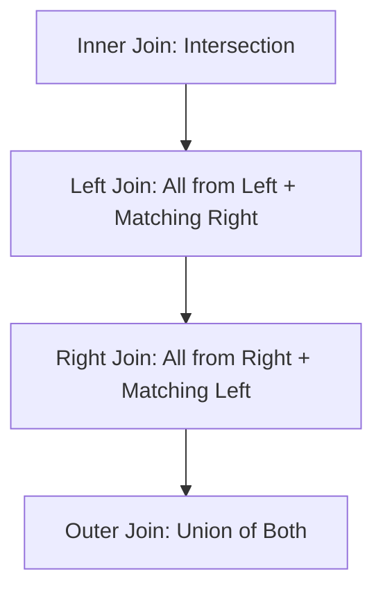

# Day 078: Merging & Joining DataFrames

> **Difficulty:** Intermediate | **Topic:** Data Science | **Reading Time:** 15 mins

---

## 🎯 Learning Objectives
- Understand the core differences between Pandas `merge()`, `join()`, and `concat()` methods.
- Master SQL-style database joins (Inner, Left, Right, Full Outer) within Pandas.
- Handle overlapping column names gracefully using suffixes and custom keys.
- Perform index-based joining and hierarchical multi-index alignment.
- Identify and avoid common data science pitfalls like Cartesian products and unintended data loss.

---

## 📚 Theory & Concepts

In real-world data science workflows, data rarely lives in a single, neat table. Information is typically scattered across multiple databases, CSV files, or API endpoints. To perform meaningful analysis or train machine learning models, you must know how to stitch these fragmented datasets back together. 

In Pandas, combining DataFrames is generally split into two categories:
1. **Concatenation (`concat`)**: Stacking datasets vertically (row-wise) or horizontally (column-wise) based on index alignment.
2. **Merging and Joining (`merge` and `join`)**: Combining datasets relationally based on common columns or indices, analogous to SQL `JOIN` operations.

### Types of Relational Joins
Understanding how matching works between DataFrame `A` (Left) and DataFrame `B` (Right) is critical:



- **Inner Join (`how='inner'`):** Returns only the rows where the matching keys exist in **both** DataFrames. Drops unmatched rows.
- **Left Join (`how='left'`):** Returns all rows from the **left** DataFrame, plus matched rows from the right. Unmatched right values appear as `NaN`.
- **Right Join (`how='right'`):** Returns all rows from the **right** DataFrame, plus matched rows from the left. Unmatched left values appear as `NaN`.
- **Full Outer Join (`how='outer'`):** Returns all rows when there is a match in **either** the left or the right DataFrame. Missing values are filled with `NaN`.

---

## 💻 Syntax & Structure

The primary function for database-style joining in Pandas is `pd.merge()`. DataFrames also feature a built-in `.join()` method optimized for index-based merging.

```python
import pandas as pd

# 1. Standard Database Merge on Columns
merged_df = pd.merge(
    left=df1,
    right=df2,
    how="inner",  # 'inner', 'left', 'right', 'outer'
    on="key_column",  # Column name present in both
)

# 2. Merging on Different Column Names
merged_diff_keys = pd.merge(
    left=df1, right=df2, left_on="id_left", right_on="id_right"
)

# 3. Index-Based Joining
joined_df = df1.join(df2, how="left", lsuffix="_left", rsuffix="_right")
```

---

## 🧪 Code Examples

Let us look at a comprehensive, runnable Python script that simulates merging customer purchase data with customer demographic records.

```python
import pandas as pd

# Create Dataset 1: Customer Transactions
transactions_data = {
    "transaction_id": [101, 102, 103, 104, 105],
    "customer_id": [1, 2, 1, 4, 5],
    "amount": [250.50, 100.00, 45.20, 320.00, 15.75],
}
df_transactions = pd.DataFrame(transactions_data)

# Create Dataset 2: Customer Profiles
customers_data = {
    "customer_id": [1, 2, 3, 4],
    "name": ["Alice", "Bob", "Charlie", "Diana"],
    "city": ["New York", "Chicago", "Boston", "Seattle"],
}
df_customers = pd.DataFrame(customers_data)

print("--- 1. Original DataFrames ---")
print("Transactions:\n", df_transactions)
print("\nCustomers:\n", df_customers)

# Example 1: Inner Join (Only customers who made transactions AND exist in customer table)
inner_merged = pd.merge(df_transactions, df_customers, on="customer_id", how="inner")
print("\n--- 2. Inner Join ---")
print(inner_merged)

# Example 2: Left Join (All transactions, attach customer info if available)
left_merged = pd.merge(df_transactions, df_customers, on="customer_id", how="left")
print("\n--- 3. Left Join (Preserving all Transactions) ---")
print(left_merged)

# Example 3: Outer Join (All transactions and all customers)
outer_merged = pd.merge(df_transactions, df_customers, on="customer_id", how="outer")
print("\n--- 4. Full Outer Join ---")
print(outer_merged)

# Example 4: Handling Overlapping Column Names
# Suppose both tables have a 'status' column
df_transactions["status"] = ["Completed", "Pending", "Completed", "Failed", "Completed"]
df_customers["status"] = ["Active", "Active", "Inactive", "Active"]

overlap_merged = pd.merge(
    df_transactions,
    df_customers,
    on="customer_id",
    how="inner",
    suffixes=("_trans", "_cust"),
)
print("\n--- 5. Handling Overlapping Columns with Suffixes ---")
print(overlap_merged[["transaction_id", "customer_id", "status_trans", "status_cust"]])
```

---

## 📊 Expected Output

```text
--- 1. Original DataFrames ---
Transactions:
   transaction_id  customer_id  amount
0             101            1  250.50
1             102            2  100.00
2             103            1   45.20
3             104            4  320.00
4             105            5   15.75

Customers:
   customer_id     name      city
0           1    Alice  New York
1           2      Bob   Chicago
2           3  Charlie    Boston
3           4    Diana   Seattle

--- 2. Inner Join ---
   transaction_id  customer_id  amount   name      city
0             101            1  250.50  Alice  New York
1             103            1   45.20  Alice  New York
2             102            2  100.00    Bob   Chicago
3             104            4  320.00  Diana   Seattle

--- 3. Left Join (Preserving all Transactions) ---
   transaction_id  customer_id  amount    name      city
0             101            1  250.50   Alice  New York
1             102            2  100.00     Bob   Chicago
2             103            1   45.20   Alice  New York
3             104            4  320.00   Diana   Seattle
4             105            5   15.75     NaN       NaN

--- 4. Full Outer Join ---
   transaction_id  customer_id  amount     name      city
0           101.0            1  250.50    Alice  New York
1           103.0            1   45.20    Alice  New York
2           102.0            2  100.00      Bob   Chicago
3           104.0            4  320.00    Diana   Seattle
4           105.0            5   15.75      NaN       NaN
5             NaN            3     NaN  Charlie    Boston

--- 5. Handling Overlapping Columns with Suffixes ---
   transaction_id  customer_id status_trans status_cust
0             101            1    Completed      Active
1             103            1    Completed      Active
2             102            2      Pending      Active
3             104            4       Failed      Active
```

---

## 🌍 Real-World Applications

- **E-Commerce Analytics:** Merging user session logs with transaction databases and product catalog details to calculate customer lifetime value (LTV) and conversion rates.
- **Financial Services:** Combining credit bureau scores with applicant demographic and loan history tables for automated risk underwriting.
- **Healthcare Research:** Joining patient EHR (Electronic Health Record) clinical measurements with pharmaceutical prescription histories to study longitudinal treatment outcomes.

---

## 💡 Best Practices

- **Validate Cardinality:** Always check your row counts before and after a merge. If your row count unexpectedly explodes, you likely have duplicate keys creating an unintended Cartesian product (many-to-many match).
- **Use `validate` Parameter:** Leverage Pandas' built-in validation argument (e.g., `validate="one-to-many"`) to force safety checks during execution.
- **Explicit Key Declarations:** Always specify `left_on` and `right_on` explicitly if column names differ, or ensure `on` keys have identical data types (e.g., merging an integer ID with a string ID will result in empty datasets).
- **Common Pitfall:** Avoid using `.join()` when you need to join on specific non-index columns. `.join()` defaults to joining on indices; use `pd.merge()` for column-based relational joins.

---

## 📝 Summary & Key Takeaways

Today you mastered merging and joining dataframes—a fundamental pillar of data science pipelines. You learned how to execute SQL-style relational operations in Pandas, resolve naming conflicts using custom suffixes, and manage unmatched data using different join strategies (`inner`, `left`, `right`, `outer`). 

Tomorrow, in **Day 79**, we will explore **Advanced Data Aggregation & GroupBy Operations**, learning how to summarize, transform, and pivot complex datasets efficiently!
