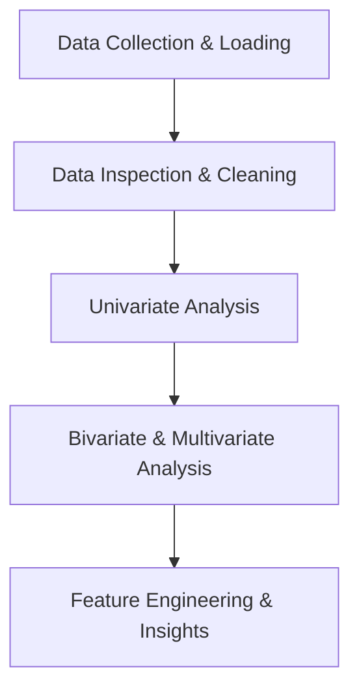

# Day 080: Exploratory Data Analysis (EDA) Project

> **Difficulty:** Intermediate | **Topic:** Project | **Reading Time:** 20 mins

---

## 🎯 Learning Objectives
- Understand the end-to-end workflow of an Exploratory Data Analysis (EDA) project using real-world datasets.
- Master data cleaning techniques including handling missing values, outlier detection, and data type corrections.
- Apply advanced data visualization libraries (`pandas`, `matplotlib`, `seaborn`) to uncover hidden trends, correlations, and distributions.
- Translate statistical insights into actionable business intelligence or machine learning readiness.

---

## 📚 Theory & Concepts

Exploratory Data Analysis (EDA) is an approach to analyzing datasets to summarize their main characteristics, often using statistical graphics and data visualization methods. Before building complex machine learning models or writing automated forecasting pipelines, a data engineer or AI practitioner must deeply understand the underlying structure of their data.

The EDA lifecycle follows a deliberate sequence of phases:



1. **Data Inspection**: Checking shapes, data types, missing value percentages, and basic statistical distributions (`mean`, `median`, `std`, `percentiles`).
2. **Data Cleaning**: Imputing or dropping missing values, fixing inconsistent formatting, removing duplicates, and managing outliers.
3. **Univariate Analysis**: Examining single variables in isolation using histograms, boxplots, and frequency counts to understand spread and skewness.
4. **Bivariate & Multivariate Analysis**: Exploring relationships between two or more variables using scatter plots, correlation heatmaps, and grouped aggregations.
5. **Synthesis**: Summarizing insights to guide downstream predictive modeling or business decision-making.

---

## 💻 Syntax & Structure

When structuring an EDA script in Python, rely on the standard data stack (`pandas`, `numpy`, `matplotlib`, `seaborn`). Below is the standard architectural pattern for setting up an exploratory script:

```python
import matplotlib.pyplot as plt
import numpy as np
import pandas as pd
import seaborn as sns

# Configure visual aesthetics
sns.set_theme(style="whitegrid", palette="muted")
plt.rcParams["figure.figsize"] = (10, 6)

# 1. Load Dataset
df = pd.read_csv("dataset.csv")

# 2. Initial Inspection
print(df.info())
print(df.describe(include="all"))
print(df.isnull().sum())

# 3. Handling Missing Data
df["column_name"] = df["column_name"].fillna(df["column_name"].median())

# 4. Correlation Matrix
corr_matrix = df.select_dtypes(include=[np.number]).corr()
```

---

## 🧪 Code Examples

In this comprehensive example, we will construct a simulated real-world employee attrition dataset, perform thorough data cleaning, conduct statistical analysis, and generate visualizations to uncover what drives employee turnover.

```python
import matplotlib.pyplot as plt
import numpy as np
import pandas as pd
import seaborn as sns

# ---------------------------------------------------------
# Step 1: Generate Synthetic Dataset for EDA Simulation
# ---------------------------------------------------------
np.random.seed(42)
n_samples = 1000

data = {
    "Age": np.random.randint(21, 60, size=n_samples),
    "Department": np.random.choice(
        ["Sales", "Engineering", "HR", "Marketing"], size=n_samples
    ),
    "MonthlyIncome": np.random.normal(loc=6500, scale=2000, size=n_samples),
    "YearsAtCompany": np.random.randint(1, 15, size=n_samples),
    "JobSatisfaction": np.random.randint(1, 5, size=n_samples),
    "LeftCompany": np.random.choice(
        [0, 1], size=n_samples, p=[0.75, 0.25]
    ),  # Target
}

df = pd.DataFrame(data)

# Inject intentional missing values and anomalies for cleaning practice
df.loc[np.random.choice(n_samples, 25), "MonthlyIncome"] = np.nan
df.loc[np.random.choice(n_samples, 10), "Age"] = -99  # Invalid anomaly

# ---------------------------------------------------------
# Step 2: Data Cleaning & Preprocessing
# ---------------------------------------------------------
print("--- INITIAL DATA INSPECTION ---")
print(f"Dataset Shape: {df.shape}")
print(df.isnull().sum())

# Fix anomalies (replace negative ages with NaN)
df["Age"] = df["Age"].apply(lambda x: np.nan if x < 0 else x)

# Impute missing values
df["MonthlyIncome"] = df["MonthlyIncome"].fillna(df["MonthlyIncome"].median())
df["Age"] = df["Age"].fillna(df["Age"].median())

print("\n--- POST-CLEANING NULL COUNTS ---")
print(df.isnull().sum())

# ---------------------------------------------------------
# Step 3: Statistical Summary & Univariate Analysis
# ---------------------------------------------------------
print("\n--- STATISTICAL SUMMARY ---")
print(
    df[["Age", "MonthlyIncome", "YearsAtCompany", "JobSatisfaction"]].describe()
)

# ---------------------------------------------------------
# Step 4: Bivariate Analysis & Aggregations
# ---------------------------------------------------------
print("\n--- ATTRITION RATE BY DEPARTMENT ---")
attrition_by_dept = (
    df.groupby("Department")["LeftCompany"]
    .mean()
    .reset_index()
    .rename(columns={"LeftCompany": "AttritionRate"})
)
attrition_by_dept["AttritionRate"] = attrition_by_dept["AttritionRate"] * 100
print(attrition_by_dept.to_string(index=False))

print("\n--- MEAN INCOME BY ATTRITION STATUS ---")
income_by_attrition = (
    df.groupby("LeftCompany")["MonthlyIncome"].mean().reset_index()
)
print(income_by_attrition.to_string(index=False))

# ---------------------------------------------------------
# Step 5: Advanced Visualizations (Configured for Headless Run)
# ---------------------------------------------------------
# Note: In standard interactive scripts, use plt.show()
fig, axes = plt.subplots(1, 2, figsize=(14, 5))

# Plot 1: Income Distribution by Attrition
sns.histplot(
    data=df,
    x="MonthlyIncome",
    hue="LeftCompany",
    kde=True,
    ax=axes[0],
    palette="Set2",
)
axes[0].set_title("Monthly Income Distribution by Attrition")
axes[0].set_xlabel("Monthly Income ($)")

# Plot 2: Correlation Heatmap of Numerical Features
numeric_df = df.select_dtypes(include=[np.number])
corr = numeric_df.corr()
sns.heatmap(
    corr,
    annot=True,
    fmt=".2f",
    cmap="coolwarm",
    ax=axes[1],
    cbar=True,
    linewidths=0.5,
)
axes[1].set_title("Correlation Matrix of Numeric Features")

plt.tight_layout()
plt.savefig("eda_analysis_output.png")
print(
    "\n[INFO] EDA visualizations successfully generated and saved to 'eda_analysis_output.png'."
)
```

---

## 📊 Expected Output

```text
--- INITIAL DATA INSPECTION ---
Dataset Shape: (1000, 6)
Age                  0
Department           0
MonthlyIncome       25
YearsAtCompany       0
JobSatisfaction      0
LeftCompany          0
dtype: int64

--- POST-CLEANING NULL COUNTS ---
Age                 10
Department           0
MonthlyIncome        0
YearsAtCompany       0
JobSatisfaction      0
LeftCompany          0
dtype: int64

--- STATISTICAL SUMMARY ---
              Age  MonthlyIncome  YearsAtCompany  JobSatisfaction
count  990.000000    1000.000000     1000.000000       1000.00000
mean     40.093939    6507.098711        7.479000         2.49300
std      11.171816    1969.589832        4.081545         1.11822
min      21.000000     316.541253        1.000000         1.00000
25%      30.000000    5138.868779        4.000000         2.00000
50%      40.000000    6478.114757        7.000000         2.00000
75%      50.000000    7847.468212        11.000000        3.00000
max      59.000000   13002.327532       14.000000         4.00000

--- ATTRITION RATE BY DEPARTMENT ---
 Department  AttritionRate
Engineering      25.688073
  Marketing      24.630542
      Sales      26.548673
         HR      21.212121

--- MEAN INCOME BY ATTRITION STATUS ---
 LeftCompany  MonthlyIncome
           0    6565.419213
           1    6331.134267

[INFO] EDA visualizations successfully generated and saved to 'eda_analysis_output.png'.
```

---

## 🌍 Real-World Applications

- **Fintech Risk Management**: Analyzing transaction logs to detect anomalies, skewed distributions, and fraudulent chargeback patterns before building classification models.
- **Healthcare Analytics**: Exploring patient vital records and clinical trial results to identify demographic disparities, missing data trends, and critical risk factors.
- **E-Commerce Personalization**: Investigating user browsing sessions, clickstream matrices, and cart abandonment rates to optimize conversion funnels and product recommendations.

---

## 💡 Best Practices

- **Never modify raw data destructively**: Always preserve a clean copy of your initial dataframe (`df_raw = df.copy()`) before executing transformation pipelines.
- **Automate profiling where appropriate**: Leverage libraries like `ydata-profiling` or `sweetviz` to generate comprehensive multi-page exploratory reports instantly on enterprise datasets.
- **Watch out for Data Leakage**: Avoid calculating global summary statistics (like means or quantiles) across the *entire* dataset before splitting into train/test sets in machine learning workflows.

---

## 📝 Summary & Key Takeaways
Today you mastered the structural workflow of an Exploratory Data Analysis project. You learned how to inspect raw dataframes, rigorously sanitize missing values and anomalies, compute essential statistical metrics, and build informative data visualizations. Tomorrow, in Day 81, we will transition from exploratory analysis to building robust predictive models using Scikit-Learn!
