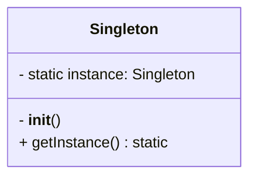
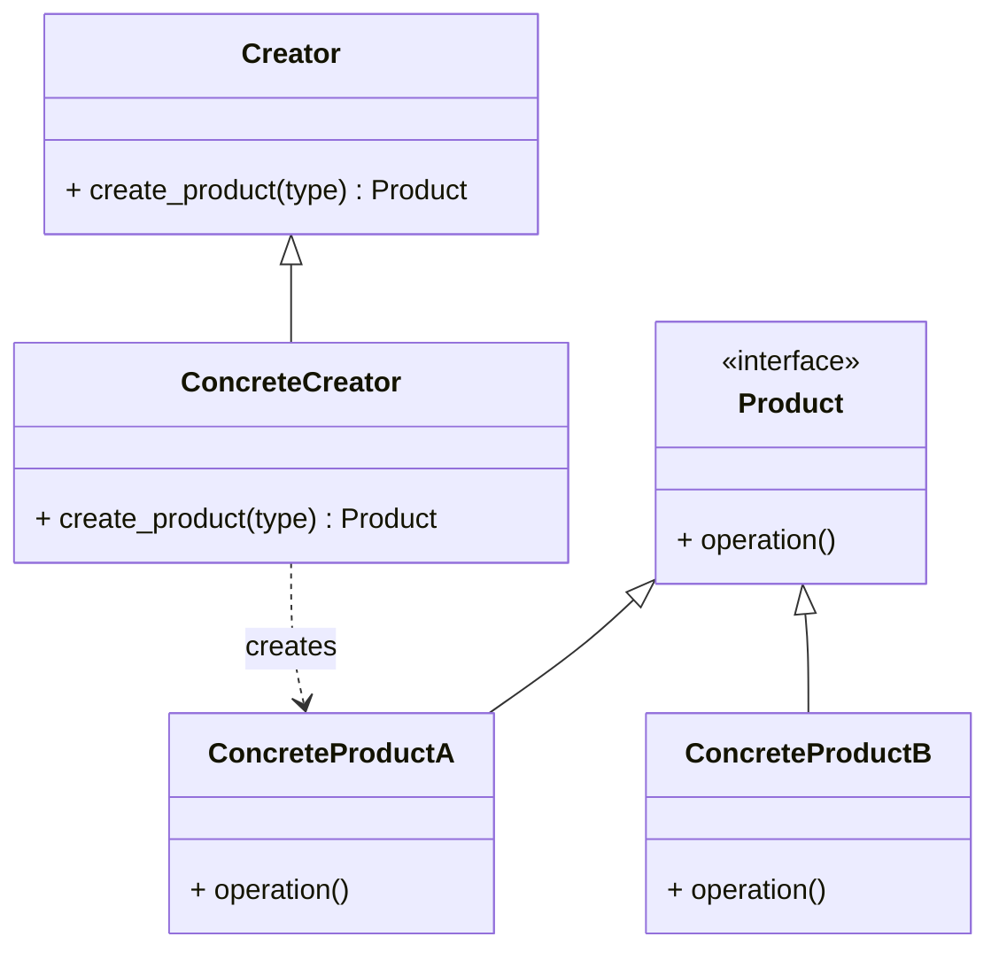

# Day 081: Creational Design Patterns (Factory & Singleton)

> **Difficulty:** Advanced | **Topic:** Design Patterns | **Reading Time:** 15 mins

---

## 🎯 Learning Objectives
- Understand the core principles of design patterns and specifically focus on **Creational Patterns**.
- Master the **Singleton Pattern** to ensure a class has only one instance and provide a global point of access to it in Python.
- Master the **Factory Method Pattern** to handle object creation logic without exposing instantiation logic to the client code.
- Learn how to implement both patterns cleanly using modern Python 3.12 idioms (such as `__new__` and Protocol/ABC typing).
- Recognize when to apply these patterns and when they represent over-engineering.

---

## 📚 Theory & Concepts

In software engineering, **Design Patterns** are typical solutions to commonly occurring problems in software design. They are best practices refined over years by experienced developers. 

**Creational Design Patterns** deal with object creation mechanisms, trying to create objects in a manner suitable to the situation. The basic form of object creation (`MyClass()`) can sometimes lead to design problems or added complexity when code becomes tightly coupled to specific classes. Today we examine two foundational creational patterns: **Singleton** and **Factory**.

### 1. The Singleton Pattern
The Singleton pattern ensures that a class has *only one instance* and provides a global access point to that instance. This is useful when exactly one object is needed to coordinate actions across the system (e.g., a database connection manager, application configuration handler, or logging service).



### 2. The Factory Method Pattern
The Factory Method pattern provides an interface for creating objects in a superclass, but allows subclasses or a dedicated factory function to alter the type of objects that will be created. It decouples the client code from the concrete classes it needs to instantiate.



---

## 💻 Syntax & Structure

Here is how you structure both patterns using modern Python idioms.

### Singleton via `__new__`
In Python, object creation is a two-step process controlled by `__new__` (allocation) and `__init__` (initialization). By overriding `__new__`, we can control whether a new instance is created or an existing one is returned.

```python
class SingletonMeta(type):
    _instances = {}

    def __call__(cls, *args, **kwargs):
        if cls not in cls._instances:
            cls._instances[cls] = super().__call__(*args, **kwargs)
        return cls._instances[cls]

class DatabaseConnection(metaclass=SingletonMeta):
    def __init__(self):
        self.connection = "Connected to DB"
```

### Factory Method Structure
Using an Abstract Base Class (`abc.ABC`) and `@abstractmethod`, we define a clear interface for creators and products.

```python
from abc import ABC, abstractmethod

class Document(ABC):
    @abstractmethod
    def render(self) -> str:
        pass

class PDFDocument(Document):
    def render(self) -> str:
        return "Rendering PDF Document..."

class HTMLDocument(Document):
    def render(self) -> str:
        return "Rendering HTML Document..."

class DocumentFactory(ABC):
    @abstractmethod
    def create_document(self) -> Document:
        pass
```

---

## 🧪 Code Examples

Below is a comprehensive, runnable script demonstrating both the **Singleton** and **Factory Method** design patterns working together in a unified module.

```python
from abc import ABC, abstractmethod
import logging

# Configure basic logging
logging.basicConfig(level=logging.INFO, format="%(asctime)s [%(levelname)s] %(message)s")

# ==========================================
# 1. SINGLETON PATTERN IMPLEMENTATION
# ==========================================
class AppConfig:
    """
    Singleton Configuration Manager.
    Ensures application settings are loaded once and shared globally.
    """
    _instance = None
    _initialized = False

    def __new__(cls, *args, **kwargs):
        if cls._instance is None:
            logging.info("Creating the single instance of AppConfig.")
            cls._instance = super().__new__(cls)
        return cls._instance

    def __init__(self, environment: str = "development"):
        # Prevent re-initialization on subsequent calls
        if not self._initialized:
            self.environment = environment
            self.settings = {"timeout": 30, "debug": True}
            AppConfig._initialized = True
            logging.info(f"AppConfig initialized for environment: {self.environment}")

    def get_setting(self, key: str):
        return self.settings.get(key)

# ==========================================
# 2. FACTORY METHOD PATTERN IMPLEMENTATION
# ==========================================
class Notifier(ABC):
    """Abstract Product Interface"""
    
    @abstractmethod
    def send(self, message: str) -> bool:
        pass

class EmailNotifier(Notifier):
    """Concrete Product: Email"""
    
    def send(self, message: str) -> bool:
        logging.info(f"Sending Email Notification: '{message}'")
        return True

class SMSNotifier(Notifier):
    """Concrete Product: SMS"""
    
    def send(self, message: str) -> bool:
        logging.info(f"Sending SMS Notification: '{message}'")
        return True

class PushNotifier(Notifier):
    """Concrete Product: Mobile Push"""
    
    def send(self, message: str) -> bool:
        logging.info(f"Sending Push Notification: '{message}'")
        return True

class NotifierFactory:
    """Factory Class to instantiate the correct Notifier object"""

    @staticmethod
    def create_notifier(channel: str) -> Notifier:
        channel_lower = channel.strip().lower()
        if channel_lower == "email":
            return EmailNotifier()
        elif channel_lower == "sms":
            return SMSNotifier()
        elif channel_lower == "push":
            return PushNotifier()
        else:
            raise ValueError(f"Unknown notification channel: '{channel}'")

# ==========================================
# DEMONSTRATION & EXECUTION
# ==========================================
if __name__ == "__main__":
    print("--- Testing Singleton Pattern ---")
    config1 = AppConfig(environment="production")
    config2 = AppConfig(environment="staging") # Arguments ignored because instance exists
    
    print(f"Config 1 environment: {config1.environment}")
    print(f"Config 2 environment: {config2.environment}")
    print(f"Are config1 and config2 the exact same object? {config1 is config2}")

    print("\n--- Testing Factory Method Pattern ---")
    # Client code requests objects via the factory without knowing concrete classes
    channels = ["email", "sms", "push"]
    
    for ch in channels:
        notifier = NotifierFactory.create_notifier(ch)
        notifier.send(f"Hello via {ch.upper()}!")
```

---

## 📊 Expected Output

When you run the script above, the console output will look like this:

```text
2026-03-30 10:00:01,012 [INFO] Creating the single instance of AppConfig.
2026-03-30 10:00:01,012 [INFO] AppConfig initialized for environment: development
--- Testing Singleton Pattern ---
Config 1 environment: development
Config 2 environment: development
Are config1 and config2 the exact same object? True

--- Testing Factory Method Pattern ---
2026-03-30 10:00:01,013 [INFO] Sending Email Notification: 'Hello via EMAIL!'
2026-03-30 10:00:01,013 [INFO] Sending SMS Notification: 'Hello via SMS!'
2026-03-30 10:00:01,013 [INFO] Sending Push Notification: 'Hello via PUSH!'
```

---

## 🌍 Real-World Applications

- **Database Connection Pools**: Frameworks like Django and SQLAlchemy utilize Singleton-like patterns or connection managers to prevent exhausting database sockets by opening redundant connections.
- **Cross-Platform UI Toolkits**: Factories are heavily used when building user interfaces where a `Button` factory might return a `WindowsButton` or a `MacButton` depending on the host operating system.
- **Logging & Configuration Engines**: Centralizing application logs or environment variables through a single point of truth prevents race conditions and configuration drift across modules.
- **Payment Gateway Integrations**: A payment factory can dynamically return a `StripePayment`, `PayPalPayment`, or `SquarePayment` object based on user preference or API payloads.

---

## 💡 Best Practices

- **Use Singletons Sparingly**: Singletons act as global state containers. Overusing them makes unit testing difficult because state leaks between tests.
- **Thread Safety**: In multi-threaded Python applications (using `threading`), implement locks (`threading.Lock`) inside your Singleton's `__new__` method to prevent race conditions during instantiation.
- **Keep Factories Simple**: A factory should focus purely on object creation logic. Avoid putting heavy business logic inside factory methods.
- **Common Pitfalls to Avoid**: 
  - Forgetting to reset or handle `__init__` when implementing Singletons (remember that `__init__` runs *every time* `Class()` is called, even if `__new__` returns an existing instance).
  - Hardcoding string lookups in factories without a fallback or extension mechanism (use registry patterns for advanced extensibility).

---

## 📝 Summary & Key Takeaways
- **Design patterns** give developers a shared vocabulary and robust architectural templates to solve recurring design problems.
- The **Singleton Pattern** guarantees a single instance across the application lifecycle, ideal for configuration and connection management.
- The **Factory Method Pattern** decouples object creation from business logic, making systems extensible and adhering to the Open-Closed Principle.
- **Tomorrow's Preview**: On Day 82, we will continue our journey through design patterns by exploring **Structural Patterns (Adapter & Decorator)**!
