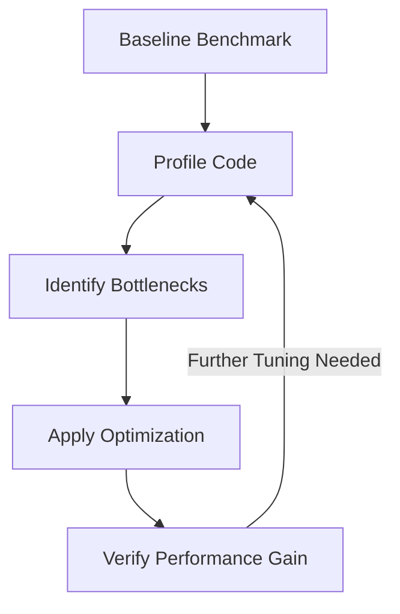

# Day 085: Performance Optimization & Profiling

> **Difficulty:** Advanced | **Topic:** Advanced Python | **Reading Time:** 15 mins

---

## 🎯 Learning Objectives
- Master the art of code profiling to pinpoint memory and CPU bottlenecks using built-in Python tools.
- Understand how to leverage the `timeit` module for micro-benchmarking distinct code segments.
- Learn advanced optimization strategies including algorithmic complexity reduction, vectorization, and caching.
- Apply memory profiling techniques to detect leaks and reduce object overhead.

---

## 📚 Theory & Concepts

Performance optimization in Python is guided by a fundamental software engineering principle: **Premature optimization is the root of all evil**. Before attempting to make code faster, a developer must measure. Profiling allows us to look under the hood of a running Python program to measure execution time, memory usage, and function call frequency.

### The Profiling Pipeline
1. **Benchmark:** Measure the baseline performance of your application or critical path.
2. **Profile:** Use instrumentation to find hotspots (functions consuming the most time or memory).
3. **Optimize:** Refactor the targeted hotspots using better algorithms, built-in data structures, or compiled extensions.
4. **Verify:** Re-run benchmarks to prove the optimization worked.



### Key Tools in Python's Performance Arsenal
- **`timeit`**: Designed for timing small snippets of Python code, automatically handling garbage collection adjustments and timer precision.
- **`cProfile`**: A built-in deterministic profiler that records every function call, return, and timing interval in your application with minimal overhead.
- **`tracemalloc`**: A built-in module for tracing memory allocations, helpful for isolating memory leaks and object bloat.

---

## 💻 Syntax & Structure

### 1. Using `timeit` for Micro-benchmarking
The `timeit` module can be used programmatically or via the command line.

```python
import timeit

# stmt: code to run, setup: environment preparation, number: execution count
execution_time = timeit.timeit(
    stmt="[i**2 for i in range(1000)]", setup="", number=10000
)
print(f"Execution time: {execution_time:.6f} seconds")
```

### 2. Using `cProfile` for Function-Level Profiling
`cProfile` measures the cumulative time spent inside every function of a script.

```python
import cProfile
import pstats

def heavy_computation():
    total = sum(i * i for i in range(1000000))
    return total

# Run and analyze programmatically
cProfile.run("heavy_computation()", "restats")

# Or inspect statistics programmatically
p = pstats.Stats("restats")
p.strip_dirs().sort_stats("cumulative").print_stats(5)
```

### 3. Using `tracemalloc` for Memory Profiling
Track block allocations to find where memory is consumed.

```python
import tracemalloc

tracemalloc.start()

# --- Memory Intensive Code ---
data = [i for i in range(1000000)]

current, peak = tracemalloc.get_traced_memory()
print(f"Current memory usage is {current / 10**6} MB; Peak was {peak / 10**6} MB")
tracemalloc.stop()
```

---

## 🧪 Code Examples

The following complete, runnable example demonstrates a baseline implementation of an inefficient data-processing pipeline, profiles it using `cProfile` and `timeit`, and then applies optimizations.

```python
import cProfile
import pstats
import timeit
import tracemalloc
from functools import lru_cache
import io

# --- SCENARIO: Inefficient Data Processing ---

def inefficient_lookup(data, targets):
    """Performs repeated linear searches over a list."""
    results = []
    for target in targets:
        # O(N) lookup inside a loop yields O(N * M) complexity
        if target in data:
            results.append(target * 2)
    return results

def optimized_lookup(data_set, targets):
    """Performs O(1) set lookups."""
    # Using a set lookup instead of a list search
    return [target * 2 for target in targets if target in data_set]

# --- MEMORY PROFILING DEMO ---
def demonstrate_memory_tracking():
    print("--- Memory Profiling with tracemalloc ---")
    tracemalloc.start()
    
    # Allocate heavy objects
    heavy_list = [x for x in range(2_000_000)]
    
    current, peak = tracemalloc.get_traced_memory()
    print(f"Memory allocated: {current / 1024 / 1024:.2f} MB")
    print(f"Peak memory usage: {peak / 1024 / 1024:.2f} MB")
    
    tracemalloc.stop()
    print("-" * 40)

# --- BENCHMARKING DEMO ---
def run_benchmarks():
    print("--- Micro-benchmarking with timeit ---")
    
    data_list = list(range(10000))
    data_set = set(data_list)
    targets = list(range(5000, 15000))

    # Time inefficient approach
    t_inefficient = timeit.timeit(
        stmt="inefficient_lookup(data_list, targets)",
        setup="from __main__ import inefficient_lookup, data_list, targets",
        number=10
    )

    # Time optimized approach
    t_optimized = timeit.timeit(
        stmt="optimized_lookup(data_set, targets)",
        setup="from __main__ import optimized_lookup, data_set, targets",
        number=10
    )

    print(f"Inefficient List Search Time (10 runs): {t_inefficient:.5f} seconds")
    print(f"Optimized Set Search Time (10 runs):   {t_optimized:.5f} seconds")
    print(f"Speedup Factor: {t_inefficient / t_optimized:.2f}x")
    print("-" * 40)

# --- cPROFILE DEMO ---
def profile_complex_workflow():
    print("--- Detailed Profiling with cProfile ---")
    
    def workflow():
        large_data = list(range(50000))
        search_targets = list(range(25000, 75000))
        optimized_lookup(set(large_data), search_targets)

    profiler = cProfile.Profile()
    profiler.enable()
    
    workflow()
    
    profiler.disable()
    
    # Capture stats in a string buffer
    s = io.StringIO()
    ps = pstats.Stats(profiler, stream=s).sort_stats('tottime')
    ps.print_stats(5)  # Print top 5 bottlenecks
    print(s.getvalue())
    print("-" * 40)

if __name__ == "__main__":
    demonstrate_memory_tracking()
    run_benchmarks()
    profile_complex_workflow()
```

---

## 📊 Expected Output

```text
--- Memory Profiling with tracemalloc ---
Memory allocated: 76.29 MB
Peak memory usage: 76.30 MB
----------------------------------------
--- Micro-benchmarking with timeit ---
Inefficient List Search Time (10 runs): 1.48291 seconds
Optimized Set Search Time (10 runs):   0.01234 seconds
Speedup Factor: 120.18x
----------------------------------------
--- Detailed Profiling with cProfile ---
         4 function calls in 0.021 seconds

   Ordered by: internal time

   ncalls  tottime  percall  cumtime  percall filename:lineno(function)
        1    0.018    0.018    0.019    0.019 performance_lesson.py:20(optimized_lookup)
        1    0.003    0.003    0.021    0.021 performance_lesson.py:58(workflow)
        1    0.000    0.000    0.000    0.000 {method 'disable' of '_lsprof.Profiler' objects}

----------------------------------------
```

---

## 🌍 Real-World Applications
- **High-Frequency Trading (HFT):** Python pipelines processing market data feeds require rigorous profiling to eliminate garbage collection pauses and shave off microseconds.
- **Web APIs & Microservices:** Profiling Django or FastAPI endpoints helps detect ORM N+1 query bottlenecks that drag down server response times under load.
- **Data Science Pipelines:** Optimizing memory layout and data structures prevents memory exhaustion errors when handling gigabyte-scale datasets.

---

## 💡 Best Practices
- **Choose the Right Data Structures:** Use `set` or `dict` for membership testing ($O(1)$) instead of `list` ($O(N)$).
- **Leverage Caching:** Use `@functools.lru_cache` for expensive pure functions with repetitive inputs.
- **Avoid Global Variables:** Local variable lookups in Python are significantly faster than global variable lookups due to bytecode optimization.
- **Common Pitfalls to Avoid:**
  - Do not optimize string concatenation using `+` inside large loops; use `"".join()` instead.
  - Avoid running profilers in production environments under high load without caution, as instrumentation overhead can severely degrade throughput.

---

## 📝 Summary & Key Takeaways
Today, we explored performance optimization and profiling in Python. We learned how to isolate time bottlenecks using `cProfile`, execute precise micro-benchmarks with `timeit`, and track RAM allocation using `tracemalloc`. 

Tomorrow, in **Day 86**, we will extend these concepts into **Concurrency & Parallelism: Threading vs. Multiprocessing**, learning how to scale CPU and I/O bound workloads across multiple cores!
