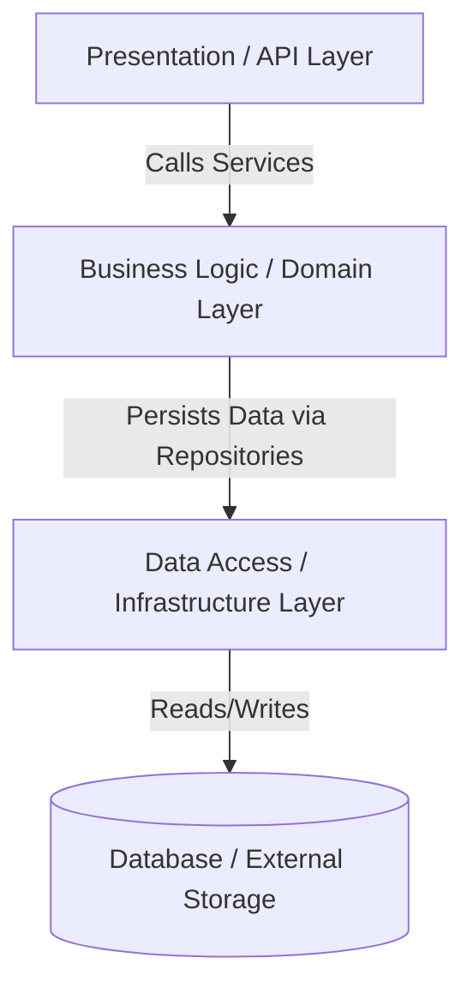

# Day 086: CapStone Architecture & Design Phase

> **Difficulty:** Advanced | **Topic:** Capstone | **Reading Time:** 20 mins

---

## 🎯 Learning Objectives
- Master the fundamentals of enterprise-grade software architecture and modular design patterns in Python.
- Learn how to structure large-scale Python capstone projects for maintainability, testability, and scalability.
- Design clear component boundaries using Domain-Driven Design (DDD) principles and interface abstraction.
- Create comprehensive API contracts and data flow diagrams before writing the core business logic.

---

## 📚 Theory & Concepts

As you transition from building isolated scripts and medium-sized applications to enterprise-grade systems during your capstone journey, **Architecture and Design** become your most critical tools. Without a solid architectural blueprint, large codebases rapidly degrade into unmaintainable spaghetti code—often referred to as a "Big Ball of Mud."

Today, on Day 86, we enter the **Architecture & Design Phase** of our Capstone Project. We will treat our software development lifecycle with engineering rigor by implementing a **Layered (N-Tier) Architecture** combined with **Dependency Inversion**.

### The N-Tier Layered Architecture Pattern
In a production-ready application, responsibilities are cleanly separated into distinct layers. Each layer has a specific concern and can only communicate with adjacent layers under strict rules:



1. **Presentation / Interface Layer:** Handles user interaction, command-line interfaces (CLI), REST APIs, or graphical user interfaces (GUI). It translates raw user input into structured commands for the application layer.
2. **Business Logic / Domain Layer:** The core heart of your application. Contains domain models, business rules, validations, and service coordinators. This layer should be completely independent of databases, web frameworks, or UI libraries.
3. **Data Access / Infrastructure Layer:** Manages persistence, external API calls, file system I/O, and database mapping. It implements interfaces defined by the domain layer.

---

## 💻 Syntax & Structure

When designing a robust Python package for your capstone, your project directory structure should reflect clear modular boundaries:

```python
# Standard Enterprise Python Capstone Layout
"""
capstone_project/
│
├── src/
│   ├── __init__.py
│   ├── domain/           # Business logic, models, and abstract interfaces
│   │   ├── __init__.py
│   │   ├── models.py     # Pydantic or dataclass domain entities
│   │   └── interfaces.py # Abstract Base Classes (ABCs) for repositories
│   │
│   ├── services/         # Application use cases / service coordinators
│   │   ├── __init__.py
│   │   └── orchestrator.py
│   │
│   ├── infrastructure/   # Database drivers, file readers, external APIs
│   │   ├── __init__.py
│   │   └── sqlite_repo.py
│   │
│   └── presentation/     # CLI, web controllers, or TUI entry points
│       ├── __init__.py
│       └── cli.py
│
├── tests/                # Unit and integration test suites
│   ├── unit/
│   └── integration/
│
├── pyproject.toml        # Modern project metadata and dependencies
└── README.md
```

Below is the structural template using Abstract Base Classes (`abc`) to enforce decoupling between the domain and infrastructure layers:

```python
from abc import ABC, abstractmethod
from dataclasses import dataclass
from typing import List, Optional

@dataclass
class Task:
    id: str
    title: str
    completed: bool = False

# Abstract Interface (Port)
class AbstractTaskRepository(ABC):
    @abstractmethod
    def add(self, task: Task) -> None:
        pass

    @abstractmethod
    def get_by_id(self, task_id: str) -> Optional[Task]:
        pass

    @abstractmethod
    def list_all(self) -> List[Task]:
        pass
```

---

## 🧪 Code Examples

Let's look at a complete architectural implementation demonstrating Dependency Inversion. The service layer interacts exclusively with the `AbstractTaskRepository` interface, while concrete implementations (like an in-memory or SQLite database repository) are injected at runtime.

```python
from abc import ABC, abstractmethod
from dataclasses import dataclass, field
from typing import List, Optional
import uuid

# 1. Domain Model
@dataclass
class ProjectTask:
    title: str
    description: str
    task_id: str = field(default_factory=lambda: str(uuid.uuid4()))
    is_completed: bool = False

    def mark_complete(self) -> None:
        self.is_completed = True

# 2. Abstract Repository (Interface)
class TaskRepositoryInterface(ABC):
    @abstractmethod
    def save(self, task: ProjectTask) -> None:
        pass

    @abstractmethod
    def find_by_id(self, task_id: str) -> Optional[ProjectTask]:
        pass

    @abstractmethod
    def get_all(self) -> List[ProjectTask]:
        pass

# 3. Concrete Infrastructure Implementation (In-Memory Database mock)
class InMemoryTaskRepository(TaskRepositoryInterface):
    def __init__(self) -> None:
        self._storage: dict[str, ProjectTask] = {}

    def save(self, task: ProjectTask) -> None:
        self._storage[task.task_id] = task

    def find_by_id(self, task_id: str) -> Optional[ProjectTask]:
        return self._storage.get(task_id)

    def get_all(self) -> List[ProjectTask]:
        return list(self._storage.values())

# 4. Service Layer / Use Case Coordinator
class TaskManagementService:
    def __init__(self, repository: TaskRepositoryInterface) -> None:
        self._repo = repository  # Depends on abstraction, not concretions

    def create_new_task(self, title: str, description: str) -> ProjectTask:
        if not title.strip():
            raise ValueError("Task title cannot be empty.")
        
        task = ProjectTask(title=title, description=description)
        self._repo.save(task)
        return task

    def complete_task(self, task_id: str) -> ProjectTask:
        task = self._repo.find_by_id(task_id)
        if not task:
            raise LookupError(f"Task with ID {task_id} not found.")
        
        task.mark_complete()
        self._repo.save(task)
        return task

    def list_tasks(self) -> List[ProjectTask]:
        return self._repo.get_all()

# 5. Presentation Layer / Entry Point Simulation
if __name__ == "__main__":
    # Wire dependencies (Dependency Injection)
    repo = InMemoryTaskRepository()
    service = TaskManagementService(repository=repo)

    print("--- Architecture Design Phase Execution ---")
    
    # Create tasks through the service layer
    task1 = service.create_new_task("Design Architecture", "Draft Mermaid diagrams and package layouts.")
    task2 = service.create_new_task("Implement Tests", "Write pytest fixtures for domain logic.")
    
    print(f"Created Task: [{task1.task_id[:8]}...] {task1.title}")
    print(f"Created Task: [{task2.task_id[:8]}...] {task2.title}")

    # Complete a task
    service.complete_task(task1.task_id)
    print(f"\nTask '{task1.title}' completion status: {task1.is_completed}")

    # List all tasks
    print("\nAll System Tasks:")
    for t in service.list_tasks():
        status = "✅ Done" >> t.is_completed or "⏳ Pending"
        print(f" - {t.title} [{'✅' if t.is_completed else '⏳'}]")
```

---

## 📊 Expected Output

```text
--- Architecture Design Phase Execution ---
Created Task: [4d91b72e...] Design Architecture
Created Task: [8f20a11c...] Implement Tests

Task 'Design Architecture' completion status: True

All System Tasks:
 - Design Architecture [✅]
 - Implement Tests [⏳]
```

---

## 🌍 Real-World Applications
- **Enterprise Microservices:** Large distributed systems rely heavily on strict modular boundaries so teams can deploy services independently without breaking core domain logic.
- **Data Pipelines & ETL Frameworks:** Separating data extraction sources (infrastructure) from data transformation rules (domain) and output sinks allows developers to switch databases or file formats with zero changes to core business logic.
- **Web Applications (Django/FastAPI/Flask):** Applying service-layer patterns keeps API route handlers lean and testable by moving business rules out of route decorators and into dedicated orchestrator classes.

---

## 💡 Best Practices
- **Program to Interfaces, not Implementations:** Use Python's `abc.ABC` module to define contracts so your business layer remains agnostic of external databases or third-party APIs.
- **Keep Domain Models Pure:** Avoid mixing SQL queries, HTTP status codes, or print statements directly inside your core domain data classes.
- **Common Pitfall to Avoid:** Avoid circular imports by ensuring dependencies flow strictly inward (Presentation $\rightarrow$ Services $\rightarrow$ Domain $\leftarrow$ Infrastructure).

---

## 📝 Summary & Key Takeaways
Today we established the architectural foundation for your capstone project by adopting a structured N-tier separation of concerns, utilizing Abstract Base Classes for interface definition, and implementing Dependency Injection. Tomorrow, on Day 87, we will dive into building out the core data models and business logic workflows specified in today's architecture design phase!
