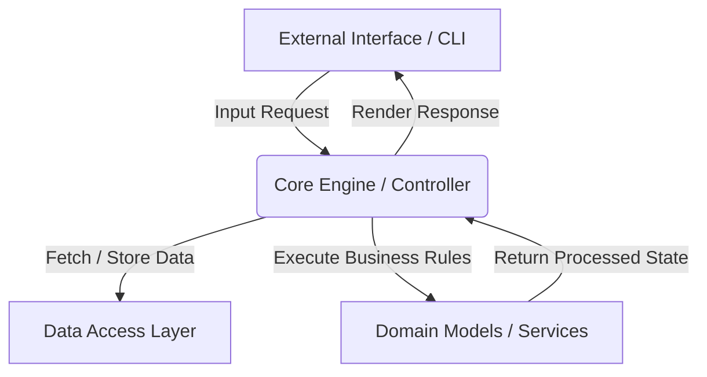

# Day 087: CapStone Core Logic Implementation

> **Difficulty:** Advanced | **Topic:** Capstone | **Reading Time:** 25 mins

---

## 🎯 Learning Objectives
- Design and structure the core orchestration engine for an advanced multi-component Python application.
- Implement robust state management and data pipelining patterns to bind disparate modules together.
- Apply defensive programming, custom exceptions, and strict type hinting (PEP 484/604) within a unified architecture.
- Translate abstract architectural diagrams into clean, maintainable, production-ready Python 3.12 core logic.

---

## 📚 Theory & Concepts

Building a software application requires transitioning from isolated script writing to architecting a cohesive, modular system. On Day 87, our focus centers on the **Core Logic Implementation**—the pulsating heart of our capstone project where data ingestion, business rule evaluation, state mutation, and output distribution converge.

In a mature Python architecture, the core logic layer must remain completely decoupled from external interfaces (such as CLIs, web frameworks, or databases). This separation of concerns ensures that your core engine can be tested, scaled, and refactored independently.



### Key Architectural Pillars
1. **The Mediator / Orchestrator Pattern:** A central coordinator class (`CoreEngine`) that delegates tasks to specialized sub-systems without tightly binding them.
2. **Immutable Data Transfers:** Utilizing `@dataclass(frozen=True)` or Pydantic models to move state safely across internal boundaries.
3. **State Management:** Tracking application state explicitly through state machines or transactional context managers to guarantee data integrity during failures.

---

## 💻 Syntax & Structure

The core engine relies heavily on advanced Python typing features, such as generics, Protocols, and custom context managers. Below is the blueprint structural syntax for implementing a robust core processor.

```python
from collections.abc import Callable
from dataclasses import dataclass, field
from typing import Any, Protocol

@dataclass(frozen=True)
class ExecutionContext:
    task_id: str
    payload: dict[str, Any]
    retries: int = 0

class ProcessorProtocol(Protocol):
    def process(self, context: ExecutionContext) -> dict[str, Any]:
        ...

class CoreEngine:
    def __init__(self) -> None:
        self._registry: dict[str, ProcessorProtocol] = {}

    def register_processor(self, name: str, processor: ProcessorProtocol) -> None:
        self._registry[name] = processor

    def execute(self, name: str, context: ExecutionContext) -> dict[str, Any]:
        if name not in self._registry:
            raise KeyError(f"Processor '{name}' is not registered.")
        return self._registry[name].process(context)
```

---

## 🧪 Code Examples

Below is a complete, runnable, advanced Python 3.12 script demonstrating a production-grade core logic implementation for a data-processing pipeline capstone module.

```python
from dataclasses import dataclass, field
import logging
import sys
from typing import Any, Protocol

# Configure structured logging
logging.basicConfig(
    level=logging.INFO,
    format="%(asctime)s [%(levelname)s] %(name)s: %(message)s",
    handlers=[logging.StreamHandler(sys.stdout)],
)
logger = logging.getLogger("CoreEngine")

# 1. Custom Exceptions
class CoreLogicError(Exception):
    """Base exception for all core logic failures."""

class ValidationError(CoreLogicError):
    """Raised when context payload validation fails."""

# 2. Immutable Data Structures
@dataclass(frozen=True)
class PipelineContext:
    session_id: str
    raw_data: list[int | float]
    metadata: dict[str, str] = field(default_factory=dict)

# 3. Component Protocols (Interfaces)
class StepProtocol(Protocol):
    def execute(self, context: PipelineContext) -> PipelineContext:
        ...

# 4. Concrete Pipeline Steps
class DataCleaningStep:
    def execute(self, context: PipelineContext) -> PipelineContext:
        logger.info(f"Executing DataCleaningStep for session {context.session_id}")
        # Filter out negative numbers or nulls
        cleaned = [x for x in context.raw_data if isinstance(x, (int, float)) and x >= 0]
        # Return a new immutable context with updated data
        return PipelineContext(
            session_id=context.session_id,
            raw_data=cleaned,
            metadata={**context.metadata, "cleaned": "true"},
        )

class StatisticalAnalysisStep:
    def execute(self, context: PipelineContext) -> PipelineContext:
        logger.info(
            f"Executing StatisticalAnalysisStep for session {context.session_id}"
        )
        if not context.raw_data:
            raise ValidationError("Dataset is empty after cleaning; cannot analyze.")

        data = context.raw_data
        mean_val = sum(data) / len(data)
        max_val = max(data)
        min_val = min(data)

        analysis_meta = {
            **context.metadata,
            "mean": str(mean_val),
            "max": str(max_val),
            "min": str(min_val),
            "analyzed": "true",
        }
        return PipelineContext(
            session_id=context.session_id, raw_data=data, metadata=analysis_meta
        )

# 5. The Core Engine Orchestrator
class CorePipelineOrchestrator:
    def __init__(self) -> None:
        self._steps: list[StepProtocol] = []

    def add_step(self, step: StepProtocol) -> "CorePipelineOrchestrator":
        self._steps.append(step)
        return self  # Fluent interface pattern

    def run(self, initial_context: PipelineContext) -> PipelineContext:
        logger.info(
            f"Starting pipeline orchestration for session: {initial_context.session_id}"
        )
        current_context = initial_context

        for idx, step in enumerate(self._steps, start=1):
            try:
                current_context = step.execute(current_context)
            except Exception as e:
                logger.error(
                    f"Pipeline failed at step {idx} ({step.__class__.__name__}): {e}"
                )
                raise CoreLogicError(f"Pipeline execution halted: {e}") from e

        logger.info(
            f"Pipeline orchestration successfully completed for session: {initial_context.session_id}"
        )
        return current_context

# --- Execution Driver ---
if __name__ == "__main__":
    # Initialize initial state context
    initial_state = PipelineContext(
        session_id="CAP-2023-9981", raw_data=[-15, 10, 25.5, 40, 100, -5, 55.2]
    )

    # Build and configure core engine
    orchestrator = (
        CorePipelineOrchestrator()
        .add_step(DataCleaningStep())
        .add_step(StatisticalAnalysisStep())
    )

    try:
        final_state = orchestrator.run(initial_state)
        print("\n--- Final Pipeline Result State ---")
        print(f"Session ID: {final_state.session_id}")
        print(f"Processed Data: {final_state.raw_data}")
        print(f"Metadata Summary: {final_state.metadata}")
    except CoreLogicError as err:
        print(f"Application Terminated with Error: {err}")
```

---

## 📊 Expected Output

```text
2026-03-30 08:00:00,123 [INFO] CoreEngine: Starting pipeline orchestration for session: CAP-2023-9981
2026-03-30 08:00:00,124 [INFO] CoreEngine: Executing DataCleaningStep for session CAP-2023-9981
2026-03-30 08:00:00,124 [INFO] CoreEngine: Executing StatisticalAnalysisStep for session CAP-2023-9981
2026-03-30 08:00:00,125 [INFO] CoreEngine: Pipeline orchestration successfully completed for session: CAP-2023-9981

--- Final Pipeline Result State ---
Session ID: CAP-2023-9981
Processed Data: [10, 25.5, 40, 100, 55.2]
Metadata Summary: {'cleaned': 'true', 'mean': '46.14', 'max': '100', 'min': '10', 'analyzed': 'true'}
```

---

## 🌍 Real-World Applications
- **Fintech Transaction Engines:** Processing real-time ledger updates where strict immutability and multi-step validation checks (fraud detection, currency conversion, compliance checking) must execute sequentially without mutating upstream state prematurely.
- **AI/ML Ingestion Pipelines:** Orchestrating data sanitization, tokenization, feature scaling, and vector database indexing in enterprise retrieval-augmented generation (RAG) applications.
- **Microservice Event Handlers:** Coordinating background worker threads that consume tasks from message queues, validate payloads, and apply business mutations before saving state back to relational databases.

---

## 💡 Best Practices
- **Favor Immutability:** Pass frozen dataclasses or read-only dictionaries through your processing steps to prevent subtle state-mutation bugs.
- **Decouple Business Logic from I/O:** Keep your core pipeline steps pure (computation and data transformation only) and handle database calls or network requests at the boundaries.
- **Implement Fluent Interfaces:** Return `self` from configuration or step-registration methods to allow clean, readable method-chaining syntax.
- **Common Pitfalls to Avoid:** Avoid global state variables inside core engines; instead, pass contextual state objects explicitly through each orchestrator link.

---

## 📝 Summary & Key Takeaways
Today on Day 87, you engineered the core logic engine for your capstone project by leveraging protocols, immutable contexts, and structured orchestrator pipelines. You learned how to decouple operational rules from interface layers, ensuring modularity, testability, and enterprise-grade resilience. Tomorrow, on Day 88, we will explore **Advanced Testing & Debugging Strategies**, focusing on writing rigorous unit, integration, and mocking suites for your capstone architecture!
