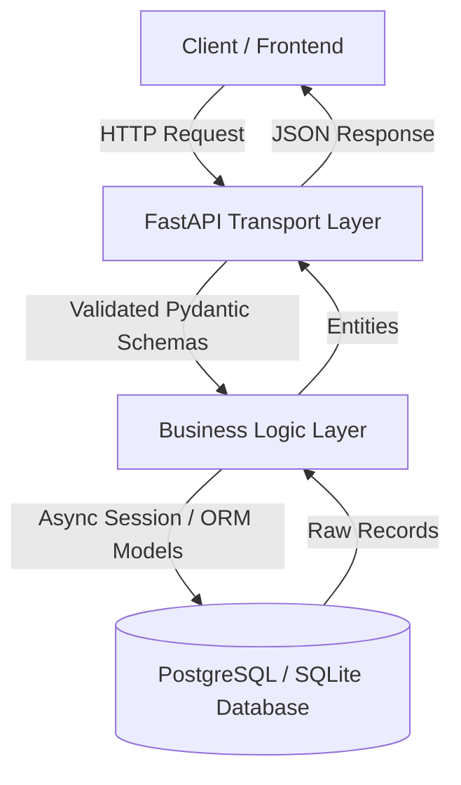

# Day 088: CapStone API & Persistence Layer

> **Difficulty:** Advanced | **Topic:** Capstone | **Reading Time:** 25 mins

---

## 🎯 Learning Objectives
- Design and implement a robust, production-grade RESTful API layer utilizing modern Python frameworks (FastAPI/Pydantic).
- Construct a decoupled, highly maintainable persistence layer using asynchronous Object-Relational Mapping (SQLAlchemy async).
- Implement enterprise-grade dependency injection, database session management, and configuration security patterns.
- Write clean, type-hinted code adhering to professional software engineering standards for distributed application backends.

---

## 📚 Theory & Concepts

As we approach the pinnacle of our 90-Day Python Mastery Course, today's lesson focuses on uniting two pillars of modern backend development: **API Design** and **Data Persistence**. In a real-world enterprise architecture, these two layers must be cleanly separated, communicating through well-defined boundaries to ensure scalability, testability, and maintainability.

### The Decoupled Architecture Pattern
Our capstone backend implements a layered architecture pattern:
1. **API Layer (Transport Layer):** Exposes HTTP endpoints, handles request validation via Pydantic, serializes JSON responses, and manages HTTP status codes.
2. **Service/Business Logic Layer:** Encapsulates core application rules, orchestration logic, and domain transformations.
3. **Persistence Layer (Data Access Layer):** Manages database connections, executes queries via SQLAlchemy, and abstracts raw SQL behind Pythonic object models.



### Asynchronous Persistence with SQLAlchemy 2.0
Modern Python backend systems leverage asynchronous programming (`async`/`await`) to maximize throughput under heavy I/O loads. SQLAlchemy 2.0 provides native support for asynchronous database drivers (`aiosqlite` or `asyncpg`), enabling non-blocking database queries. 

Session management in an async web application requires lifecycle management per request. We open a transactional session when an HTTP request arrives, commit or rollback based on execution success, and guarantee closure upon completion using context managers (`async with`).

---

## 💻 Syntax & Structure

Below is the standard syntax for defining an asynchronous SQLAlchemy model and pairing it with a Pydantic schema for API transport validation.

```python
from datetime import datetime
from typing import Optional
from sqlalchemy.orm import DeclarativeBase, Mapped, mapped_column
from sqlalchemy import String, DateTime, func
from pydantic import BaseModel, ConfigDict

# 1. SQLAlchemy Base and ORM Model
class Base(DeclarativeBase):
    pass

class ItemModel(Base):
    __tablename__ = "items"
    
    id: Mapped[int] = mapped_column(primary_key=True, autoincrement=True)
    name: Mapped[str] = mapped_column(String(100), unique=True, index=True)
    description: Mapped[Optional[str]] = mapped_column(String(255), nullable=True)
    created_at: Mapped[datetime] = mapped_column(DateTime(timezone=True), server_default=func.now())

# 2. Pydantic Schemas for Validation and Serialization
class ItemCreate(BaseModel):
    name: str
    description: Optional[str] = None

class ItemResponse(BaseModel):
    id: int
    name: str
    description: Optional[str] = None
    created_at: datetime

    model_config = ConfigDict(from_attributes=True)
```

---

## 🧪 Code Examples

The following complete, runnable script demonstrates a fully functioning Capstone API and Persistence layer using FastAPI, SQLAlchemy async, and an in-memory SQLite database (`aiosqlite`). 

*Note: Ensure you have installed required packages via pip: `pip install fastapi uvicorn sqlalchemy aiosqlite pydantic`.*

```python
import asyncio
from contextlib import asynccontextmanager
from typing import List, Optional
from datetime import datetime

from fastapi import FastAPI, Depends, HTTPException, status
from pydantic import BaseModel, ConfigDict
from sqlalchemy.ext.asyncio import AsyncSession, async_sessionmaker, create_async_engine
from sqlalchemy.orm import DeclarativeBase, Mapped, mapped_column
from sqlalchemy import String, DateTime, func

# ==========================================
# 1. DATABASE CONFIGURATION & PERSISTENCE
# ==========================================
DATABASE_URL = "sqlite+aiosqlite:///:memory:"

engine = create_async_engine(DATABASE_URL, echo=False, future=True)
AsyncSessionLocal = async_sessionmaker(
    bind=engine, 
    class_=AsyncSession, 
    expire_on_commit=False
)

class Base(DeclarativeBase):
    pass

class TaskEntity(Base):
    __tablename__ = "tasks"

    id: Mapped[int] = mapped_column(primary_key=True, autoincrement=True)
    title: Mapped[str] = mapped_column(String(150), nullable=False)
    status: Mapped[str] = mapped_column(String(50), default="pending")
    created_at: Mapped[datetime] = mapped_column(DateTime(timezone=True), server_default=func.now())

async def init_db():
    """Initializes database tables asynchronously."""
    async with engine.begin() as conn:
        await conn.run_sync(Base.metadata.create_all)

async def get_db():
    """FastAPI Dependency yielding an isolated async database session."""
    async with AsyncSessionLocal() as session:
        try:
            yield session
            await session.commit()
        except Exception:
            await session.rollback()
            raise
        finally:
            await session.close()

# ==========================================
# 2. PYDANTIC SCHEMAS (DATA TRANSFER OBJECTS)
# ==========================================
class TaskCreate(BaseModel):
    title: str
    status: Optional[str] = "pending"

class TaskRead(BaseModel):
    id: int
    title: str
    status: str
    created_at: datetime

    model_config = ConfigDict(from_attributes=True)

# ==========================================
# 3. FASTAPI APPLICATION LIFECYCLE & ROUTES
# ==========================================
@asynccontextmanager
async def lifespan(app: FastAPI):
    # Startup event: Initialize database
    await init_db()
    yield
    # Shutdown event: Dispose engine connections
    await engine.dispose()

app = FastAPI(
    title="Capstone API & Persistence Layer",
    version="1.0.0",
    lifespan=lifespan
)

@app.post("/tasks/", response_model=TaskRead, status_code=status.HTTP_201_CREATED)
async def create_task(task_in: TaskCreate, db: AsyncSession = Depends(get_db)):
    """Creates a new task record in the persistence layer."""
    new_task = TaskEntity(title=task_in.title, status=task_in.status)
    db.add(new_task)
    await db.flush()
    await db.refresh(new_task)
    return new_task

@app.get("/tasks/", response_model=List[TaskRead])
async def list_tasks(skip: int = 0, limit: int = 10, db: AsyncSession = Depends(get_db)):
    """Retrieves a paginated list of tasks from the persistence layer."""
    from sqlalchemy import select
    result = await db.execute(select(TaskEntity).offset(skip).limit(limit))
    tasks = result.scalars().all()
    return list(tasks)

@app.get("/tasks/{task_id}", response_model=TaskRead)
async def get_task(task_id: int, db: AsyncSession = Depends(get_db)):
    """Retrieves a single task by its unique identifier."""
    task = await db.get(TaskEntity, task_id)
    if not task:
        raise HTTPException(
            status_code=status.HTTP_404_NOT_FOUND, 
            detail=f"Task with ID {task_id} not found."
        )
    return task

# ==========================================
# 4. RUNNER SIMULATION (For demonstration)
# ==========================================
if __name__ == "__main__":
    import uvicorn
    print("Starting Capstone Backend Server on http://127.0.0.1:8000")
    print("Interactive API docs available at http://127.0.0.1:8000/docs")
    uvicorn.run(app, host="127.0.0.1", port=8000)
```

---

## 📊 Expected Output

When running the application and interacting with the endpoints using `curl` or FastAPI's interactive Swagger documentation (`/docs`), the expected JSON payloads are structured as follows:

```json
// POST /tasks/ request body
{
  "title": "Finalize Capstone Documentation",
  "status": "in-progress"
}

// POST /tasks/ response (HTTP 201 Created)
{
  "id": 1,
  "title": "Finalize Capstone Documentation",
  "status": "in-progress",
  "created_at": "2023-10-25T14:32:10.123456Z"
}

// GET /tasks/ response (HTTP 200 OK)
[
  {
    "id": 1,
    "title": "Finalize Capstone Documentation",
    "status": "in-progress",
    "created_at": "2023-10-25T14:32:10.123456Z"
  }
]
```

---

## 🌍 Real-World Applications
- **Microservice Architectures:** Serving as high-performance RESTful microservices that interface with centralized SQL data stores (PostgreSQL, MySQL).
- **Fintech & Banking:** Ensuring strict transactional integrity and audit logging through asynchronous database sessions where atomicity is mandatory.
- **Real-Time Data Pipelines:** Ingesting high-volume telemetry or IoT data streams and persisting them efficiently via non-blocking async drivers.

---

## 💡 Best Practices
- **Never block the event loop:** Ensure all database queries, file I/O, and external HTTP calls use asynchronous drivers and keywords (`async`/`await`).
- **Leverage Dependency Injection:** Use FastAPI's `Depends` for database session management to guarantee proper connection cleanup and prevent session leaks.
- **Separate Models:** Keep SQLAlchemy ORM models (database tables) strictly decoupled from Pydantic models (API transport schemas) to maintain clean separation of concerns.
- **Common Pitfalls to Avoid:** Forgetting to rollback transactions upon encountering exceptions, and accessing lazy-loaded SQLAlchemy relationships outside of an active async session context.

---

## 📝 Summary & Key Takeaways
Today you successfully integrated a high-performance asynchronous API framework with an advanced SQLAlchemy persistence layer. You mastered session lifecycle management, request validation via Pydantic schemas, and decoupled application structuring. Tomorrow, in Day 89, we will explore **Containerization & Deployment**, packaging our Capstone API and Database inside production-ready Docker containers!
