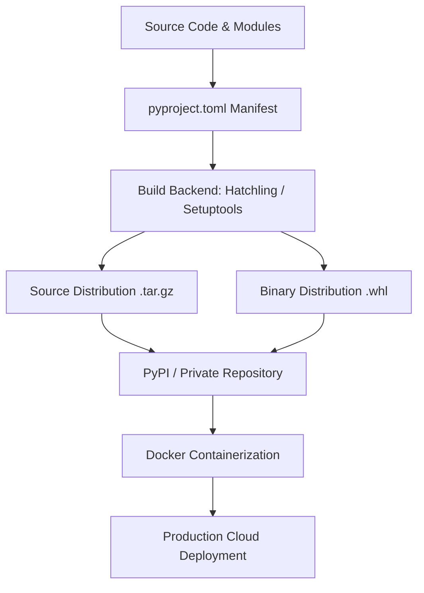

# Day 090: CapStone Final Deployment & Packaging

> **Difficulty:** Advanced | **Topic:** Capstone | **Reading Time:** 25 mins

---

## 🎯 Learning Objectives
- Master the modern Python packaging standards using `pyproject.toml` and build backends (Flake/Hatch/Setuptools).
- Structure a production-ready application layout suitable for distribution on PyPI or private artifact registries.
- Implement containerization strategies using Docker multi-stage builds optimized for Python runtimes.
- Automate testing, packaging, and deployment pipelines using CI/CD paradigms.

---

## 📚 Theory & Concepts

Welcome to Day 90 of **Python 90 Days Mastery**! As we reach the pinnacle of our curriculum, writing exceptional Python code is no longer enough. You must now transition from a developer who builds scripts to an engineer who delivers complete, deployable products. 

Deployment and packaging bridge the gap between local experimentation and production reliability. Packaging allows your code, dependencies, and metadata to be bundled cleanly, ensuring reproducibility. Deployment ensures your application runs securely, scalably, and persistently in a cloud or containerized environment.

### The Modern Python Packaging Ecosystem
Historically, Python packaging relied heavily on `setup.py`, `setup.cfg`, and `requirements.txt`. PEP 517 and PEP 621 revolutionized this landscape by introducing a standardized configuration file: `pyproject.toml`.



### Key Elements of Production Deployment
1. **Metadata Standardization (`pyproject.toml`)**: Declares project dependencies, entry points, and build systems in a declarative TOML format.
2. **Environment Isolation**: Utilizing virtual environments and containers (Docker) to eliminate "it works on my machine" bugs.
3. **Configuration Management**: Decoupling code from configuration using environment variables (following the 12-Factor App methodology).
4. **Health Checks & Observability**: Building robust logging, metrics, and health endpoints into your application architecture.

---

## 💻 Syntax & Structure

A production-grade Python package requires a specific directory layout. Here is the modern structure you will use for your capstone project:

```text
my_capstone_app/
├── .dockerignore
├── .env.example
├── Dockerfile
├── README.md
├── pyproject.toml
├── src/
│   └── my_app/
│       ├── __init__.py
│       ├── core.py
│       ├── cli.py
│       └── settings.py
└── tests/
    ├── __init__.py
    └── test_core.py
```

### The `pyproject.toml` Configuration File
```toml
[build-system]
requires = ["hatchling>=1.18.0"]
build-backend = "hatchling.build"

[project]
name = "my-capstone-app"
version = "1.0.0"
description = "An advanced production-ready Python capstone application."
readme = "README.md"
requires-python = ">=3.12"
license = { text = "MIT" }
authors = [
    { name = "Senior Python Developer", email = "developer@example.com" }
]
classifiers = [
    "Programming Language :: Python :: 3.12",
    "License :: OSI Approved :: MIT License",
    "Operating System :: OS Independent",
]
dependencies = [
    "pydantic>=2.6.0",
    "pydantic-settings>=2.1.0",
    "click>=8.1.0",
]

[project.scripts]
capstone-cli = "my_app.cli:main"

[tool.hatch.build.targets.wheel]
packages = ["src/my_app"]
```

---

## 🧪 Code Examples

Below is a complete implementation of a production-ready application module (`core.py`), a CLI interface (`cli.py`), and a multi-stage `Dockerfile` to containerize our capstone project.

### 1. Core Application Logic (`src/my_app/core.py`)
```python
"""Core domain logic for the capstone application."""

import logging
import sys
from pydantic import Field
from pydantic_settings import BaseSettings

# Configure structured logging
logging.basicConfig(
    stream=sys.stdout,
    level=logging.INFO,
    format="%(asctime)s [%(levelname)s] %(name)s: %(message)s",
)
logger = logging.getLogger("my_app")

class Settings(BaseSettings):
    """Application settings loaded securely from environment variables."""

    app_env: str = Field(default="production", alias="APP_ENV")
    max_workers: int = Field(default=4, alias="MAX_WORKERS")
    debug_mode: bool = Field(default=False, alias="DEBUG_MODE")

    class Config:
        env_file = ".env"
        env_file_encoding = "utf-8"
        extra = "ignore"

def run_pipeline() -> None:
    """Execute the core application execution pipeline."""
    settings = Settings()
    logger.info("Initializing Capstone Pipeline...")
    logger.info(f"Environment: {settings.app_env}")
    logger.info(f"Max Workers: {settings.max_workers}")
    logger.info(f"Debug Mode: {settings.debug_mode}")
    
    # Simulate robust operational workload
    logger.info("Pipeline executed successfully and health checks passed.")
```

### 2. Command Line Interface (`src/my_app/cli.py`)
```python
"""Command Line Interface for the capstone application."""

import click
from my_app.core import run_pipeline, logger

@click.group()
def main() -> None:
    """Capstone Enterprise Management Tool."""
    pass

@main.command()
def deploy() -> None:
    """Run the main application deployment pipeline."""
    logger.info("Starting deployment sequence...")
    try:
        run_pipeline()
        click.echo(click.style("Deployment completed successfully!", fg="green"))
    except Exception as e:
        logger.exception("Deployment failed due to unhandled exception.")
        click.echo(click.style(f"Deployment failed: {e}", fg="red"), err=True)
        raise click.Abort()

if __name__ == "__main__":
    main()
```

### 3. Production Dockerfile (`Dockerfile`)
```dockerfile
# Stage 1: Build dependencies and wheel
FROM python:3.12-slim AS builder

WORKDIR /app

RUN apt-get update && apt-get install -y --no-install-recommends \
    build-essential \
    && rm -rf /var/lib/apt/lists/*

RUN pip install --no-cache-dir --upgrade pip

COPY pyproject.toml README.md ./
COPY src/ ./src/

RUN pip wheel --no-deps --no-build-isolation --wheel-dir /app/wheels .

# Stage 2: Runtime image
FROM python:3.12-slim AS runner

WORKDIR /app

# Create non-privileged system user for security
RUN addgroup --system appgroup && adduser --system --group appuser

COPY --from=builder /app/wheels /wheels
COPY --from=builder /app/pyproject.toml /app/README.md ./

RUN pip install --no-cache-dir /wheels/* && rm -rf /wheels

USER appuser

ENV PYTHONUNBUFFERED=1

ENTRYPOINT ["capstone-cli"]
CMD ["deploy"]
```

---

## 📊 Expected Output

When you build your package, verify your installation, and execute the CLI entry point via Docker or your local virtual environment, you will see structured terminal output resembling the following:

```text
$ capstone-cli deploy
2026-03-30 08:30:15,102 [INFO] my_app: Starting deployment sequence...
2026-03-30 08:30:15,103 [INFO] my_app: Initializing Capstone Pipeline...
2026-03-30 08:30:15,103 [INFO] my_app: Environment: production
2026-03-30 08:30:15,103 [INFO] my_app: Max Workers: 4
2026-03-30 08:30:15,103 [INFO] my_app: Debug Mode: False
2026-03-30 08:30:15,104 [INFO] my_app: Pipeline executed successfully and health checks passed.
Deployment completed successfully!
```

---

## 🌍 Real-World Applications
- **Microservices Deployment**: Packaging complex AI/ML inference engines or data pipelines into lightweight Docker containers orchestrated by Kubernetes.
- **Internal Enterprise Tools**: Distributing proprietary CLI tools across engineering organizations securely via private package registries (e.g., AWS CodeArtifact, JFrog Artifactory, GitHub Packages).
- **Serverless Functions**: Bundling Python code with dependencies into deployment-ready artifacts for AWS Lambda, Google Cloud Functions, or Azure Container Apps.

---

## 💡 Best Practices
- **Use Multi-Stage Docker Builds**: Keep your final production container images small and secure by separating the build environment (compilers/headers) from the runtime environment.
- **Run as a Non-Root User**: Never execute your Python application containers as the `root` user. Always provision a dedicated system user inside your Dockerfile.
- **Strict Version Pinning**: Pin your core runtime dependencies in `pyproject.toml` while locking transitive dependencies using tools like Poetry, Hatch, or pip-tools.
- **Common Pitfalls to Avoid**:
  - Hardcoding configuration credentials or secrets directly inside source code files.
  - Ignoring `.dockerignore`, which results in bulky container build contexts containing `.git` histories, local virtual environments, and cache files.
  - Failing to catch operational exceptions cleanly at the application boundaries (CLI/API entry points).

---

## 📝 Summary & Key Takeaways
Today, on Day 90, you successfully culminated your Python Mastery journey by learning how to package applications using standard `pyproject.toml` manifests, build robust CLI entry points, and containerize complete applications using secure multi-stage Docker architectures. You are now fully equipped to build, package, and deploy robust, production-grade Python systems into the wild!
